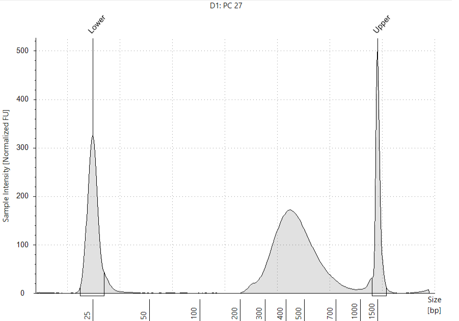

```{r setup, include=FALSE}
library(ggplot2)
library(ggrepel)
library(tidyr)
library(dplyr)
library(Seurat)
library(rmarkdown)
library(DropletUtils)
library(patchwork)
library(RColorBrewer)
setwd("/media/nguyen/Data1/github/bulahwoo/pc27/data/04_dropseq/")

`%ni%` <- Negate(`%in%`)

ggp_title <- expression(italic(P.)~italic(californicus)~"testes (PC_27)")

ggp_theme_bw_square_01 <-
  theme_bw() +
  theme(axis.line = element_blank(),
        axis.title = element_text(color="black"),
        axis.text = element_text(color="black"),
        panel.grid.major = element_blank(),
        panel.grid.minor = element_blank(),
        panel.background = element_blank(),
        panel.border = element_rect(color="black", linewidth = 0.5), aspect.ratio = 1)

ggp_theme_bw_square_02 <-
  ggp_theme_bw_square_01 +
  theme(legend.title = element_text(size=10),
        legend.background=element_blank(),
        legend.justification=c(1, 0.85))
```

## Genome assembly and annotation

The _P. californicus_ genome was sequenced in [Petr Nguyen's lab](https://www.entu.cas.cz/en/departments/department-of-ecology-and-conservation-biology/laboratory-of-evolutionary-genetics/) using Oxford Nanopore technology and assembled with [Flye](https://github.com/mikolmogorov/Flye). Annotation of the genome was performed with [BRAKER3](https://github.com/Gaius-Augustus/BRAKER). The RNA-seq data utilized include the publicly accessible [SRR1021622](https://www.ncbi.nlm.nih.gov/sra/?term=SRR1021622) and additional data provided by [Michal Zurovec](https://www.entu.cas.cz/en/staff/profile/269-michalzurovec/). Mitochondrial genome was identified by aligning the genome assembly against the mt genomes of _Bombyx mori_ and _Yponomeuta evonymella_ using [minimap2](https://github.com/lh3/minimap2). The annotation of mt genome was carried out with [mitos2](https://usegalaxy.org.au/root?tool_id=toolshed.g2.bx.psu.edu/repos/iuc/mitos2/mitos2/2.1.9+galaxy0) on the Galaxy platform.

## Library preparation

The scRNA-seq library was prepared with the RNAdia 2.0 kit (Dolomite Bio), following the manufacturer's instructions. Approximately 8,000 cells were captured, and the size distribution of the library was examined using the Bioanalyzer system.

```{r bioanalyzer, echo=FALSE, fig.cap="Size distribution assessed by Bioanalyzer", out.width = '60%', fig.align = 'center'}

```

## Quality control checks on raw reads

[FastQC](https://www.bioinformatics.babraham.ac.uk/projects/fastqc/) was used for quality check. Output can be found [here](../shared/fastqc/pc27_read1/fastqc.md) and [here](../shared/fastqc/pc27_read2/fastqc.md).

## Drop-seq protocol

The digital expression matrix using the Drop-seq core computational protocol developed by the McCarroll Lab (https://github.com/broadinstitute/Drop-seq). Briefly, cell barcodes (CBs) and unique molecular identifiers (UMIs) were identified from
raw reads. Reads with CBs/UMIs of low quality bases were removed, and 5' primer and 3' polyA sequences were trimmed. The reads were then aligned to the reference genome using STAR aligner. Substitution and indel errors in barcodes were repaired before the digital expression matrix was created. 

```{bash, engine.opts='-l', echo=FALSE, comment=""}
cat /media/nguyen/Data1/mao/scseq/select_polyt/dropseq_original/sh_dropseq_original.sh
```

## Knee-plot analysis

In the dot plot, the x-axis represents the cell barcodes (organized by the number of reads, arranged from highest to lowest), and the y-axis shows the cumulative fraction of uniquely mapped reads. The transition from beads sampling cellular RNA to beads sampling ambient RNA is marked by the inflection point ([Macosko et al., 2015](http://dx.doi.org/10.1016/j.cell.2015.05.002)).

```{r knee-plot, warning=FALSE}
pc27=read.table("/media/nguyen/Data1/mao/scseq/select_polyt/dropseq_original/cell_readcounts.txt.gz", header=F, stringsAsFactors=F)
csum_pc27=cumsum(pc27$V1)
df_pc27 <- cbind.data.frame(xvalue=1:length(csum_pc27), yvalue=csum_pc27/max(csum_pc27))
ggplot(df_pc27, aes(xvalue, yvalue)) +
  geom_point(size=0.1, color="cornflowerblue") + scale_x_continuous(limits = c(0,100000))+
  #geom_hline(aes(yintercept=df_pc27 %>% filter(xvalue==8000) %>% pull(yvalue)), color="brown", linetype=2)+
  #geom_vline(aes(xintercept=8000), color="orange", linetype=3)+
  #annotate("text", x=15000, y=0.25, label="(8000, 0.2998)")+ # 0.2998019
  labs(title=expression(italic(P.)~italic(californicus)~"PC27"), x="Cell barcodes sorted by number of reads [descending]", y="Cumulative fraction of reads") +
  theme_bw() +
  theme(axis.line = element_blank(),
        axis.title = element_text(color="black"),
        axis.text = element_text(color="black"),
        panel.grid.major = element_blank(),
        panel.grid.minor = element_blank(),
        panel.background = element_blank(),
        panel.border = element_rect(linewidth = 1, color="black"), aspect.ratio = 1)
```

No obvious knee point can be inferred.

## DropletUtils analysis

We used [DropletUtils](https://doi.org/doi:10.18129/B9.bioc.DropletUtils) to identify the knee and inflection points. Here the x-axis indicates the cell barcodes (organized by the number of reads, arranged from highest to lowest) and the y-axis the total UMI count for each barcode.

```{r barcodeRanks, warning=FALSE}
dge <- read.table("/media/nguyen/Data1/mao/scseq/select_polyt/dropseq_original/dge_t20.txt.gz", header = TRUE, row.names = 1, stringsAsFactors = FALSE)
br.out <- barcodeRanks(dge)
o <- order(br.out$rank)
metadata(br.out) # knee and inflection are values of br.out$total (y-axis)
knee <- metadata(br.out)$knee %>% round()
inflection <- metadata(br.out)$inflection %>% round()
# which br.out$rank value (x-axis) corresponds to knee value (y-axis)
knee_rank <- br.out %>% as_tibble() %>% filter(total==knee) %>% arrange(rank) %>% dplyr::slice(1) %>% pull(rank)
# which br.out$rank value (x-axis) corresponds to inflection value (y-axis)
inflection_rank <- br.out %>% as_tibble() %>% filter(total==inflection) %>% arrange(rank) %>% dplyr::slice(1) %>% pull(rank)
ggplot()+
  geom_point(aes(x=br.out$rank, y=br.out$total+1), color="grey50", size=0.5, alpha=0.5)+
  geom_line(aes(x=br.out$rank[o],y=br.out$fitted[o]), color="magenta")+
  geom_hline(aes(yintercept=knee), color="dodgerblue", linetype=2)+
  geom_hline(aes(yintercept=inflection), color="brown", linetype=2)+
  geom_vline(aes(xintercept=knee_rank), color="orange", linetype=3)+
  geom_vline(aes(xintercept=inflection_rank), color="orange", linetype=3)+
  annotate("text", x=11, y=1100, label=paste0("(", knee_rank, ", ", knee, ")"))+
  annotate("text", x=1100, y=110, label=paste0("(", inflection_rank, ", ", inflection, ")"))+
  #scale_x_continuous(trans='log10', limits=c(1, 10^(floor(log10(inflection_rank)) + 2)), breaks=c(10^(1:(floor(log10(inflection_rank)) + 2))), labels = scales::number)+
  #scale_y_continuous(trans='log10', limits=c(1, 10^(floor(log10(knee)) + 2)), breaks=c(10^(1:(floor(log10(knee)) + 2))), labels = scales::number)+
  scale_x_continuous(limits=c(1, 50000), breaks=c(1,10,100,1000,10000, 40000), trans='log10', labels = scales::number)+
  scale_y_continuous(limits=c(1, 5000), breaks=c(1, 10, 50, 100, 500, 1000, 4000), trans='log10', labels = scales::number)+
  labs(title=ggp_title,
       x="Cell barcodes sorted by number of counts [descending]",
       y="Total UMI count for each barcode") +
  ggp_theme_bw_square_01
```

We used DropletUtils::emptyDrops() to identify the empty droplets.

```{r emptyDrops1}
set.seed(100)
e.out <- emptyDrops(dge, niters=50000)
is.cell <- e.out$FDR <= 0.01
sum(is.cell, na.rm=TRUE)
```

In total 1587 cells are retained.

```{r emptyDrops2}
table(Limited=e.out$Limited, Significant=is.cell)
```

The zero in the above table indicates no entry with false positives frequency above the threshold 0.01 (Significant FALSE) can be achieved by increasing the number of permutations (Limited TRUE). So the parameter _niters=50000_ is good.

```{r emptyDrops3}
dge <- dge[,which(e.out$FDR<=0.01)]
ggplot(e.out %>% as.data.frame() %>% filter(!is.na(LogProb)) %>% mutate(FDR_fill=ifelse(FDR>0.01, "cornflowerblue", "orange")))+
  geom_point(aes(x=Total, y=-LogProb, color=FDR_fill), size=1, alpha=0.5)+
  scale_color_manual(values=c("cornflowerblue", "orange"), labels=c('FDR > 0.01', 'FDR <= 0.01'))+
  labs(title=ggp_title,
       x="Total UMI count",
       y="-Log Probability") +
  theme_bw() +
  theme(axis.line = element_blank(),
        axis.title = element_text(color="black"),
        axis.text = element_text(color="black"),
        legend.title = element_blank(),
        legend.position = "inside",
        legend.position.inside = c(0.8, 0.2),
        panel.grid.major = element_blank(),
        panel.grid.minor = element_blank(),
        panel.background = element_blank(),
        panel.border = element_rect(linewidth = 1, color="black"), aspect.ratio = 1)
```

The retained droplets (orange color) should have large UMI counts and/or large negative log probabilities.

## Analysis using Seurat

[Seurat v5](https://satijalab.org/seurat) was used to analyze the data.

