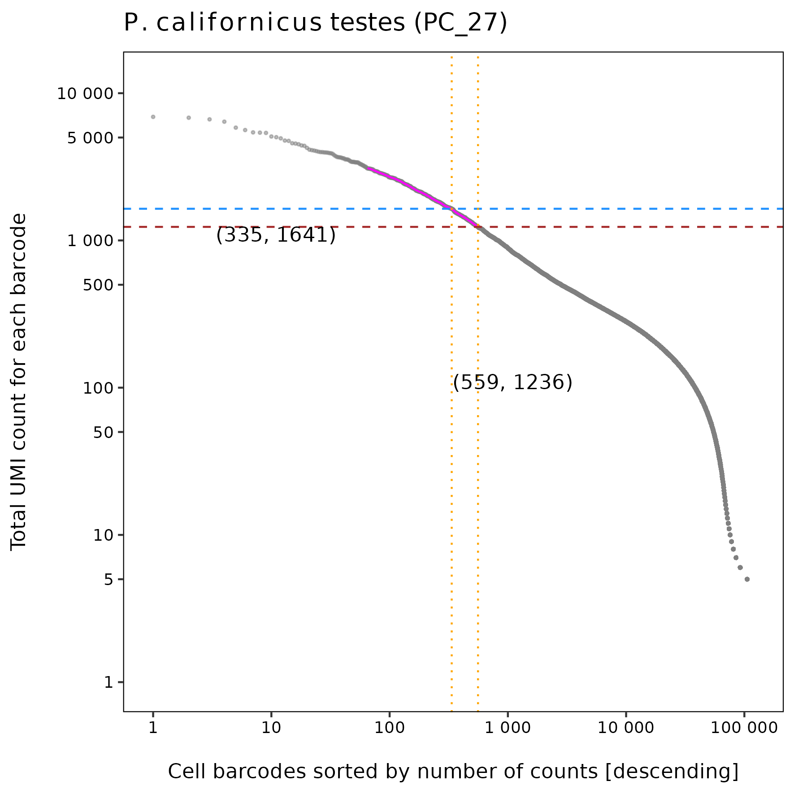
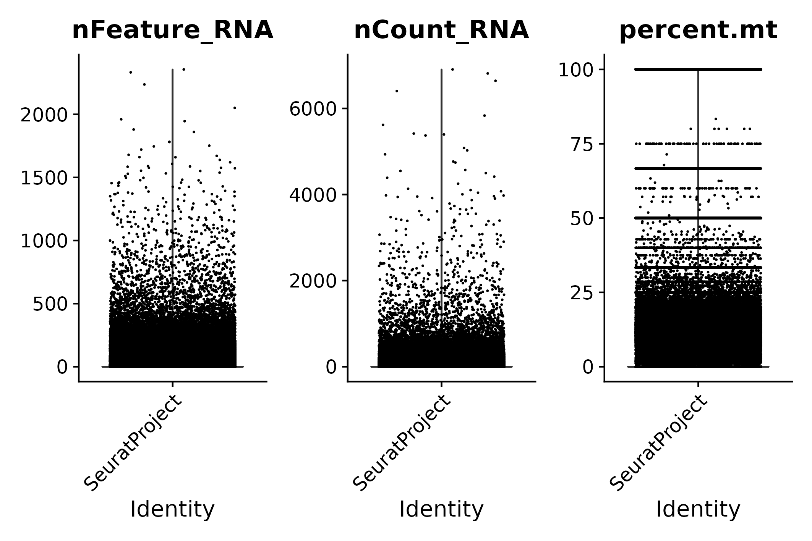
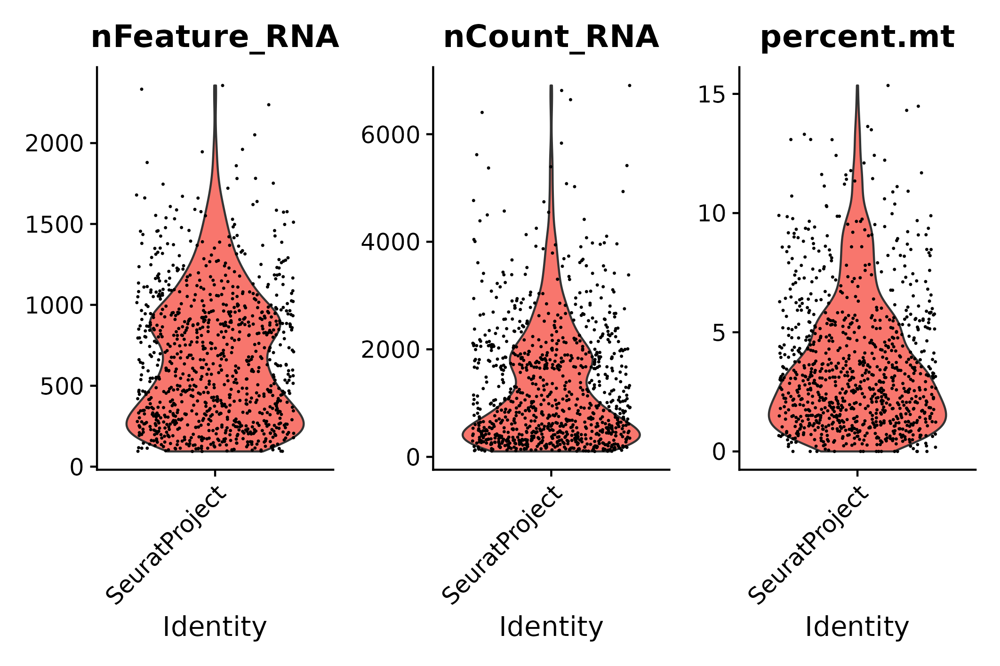
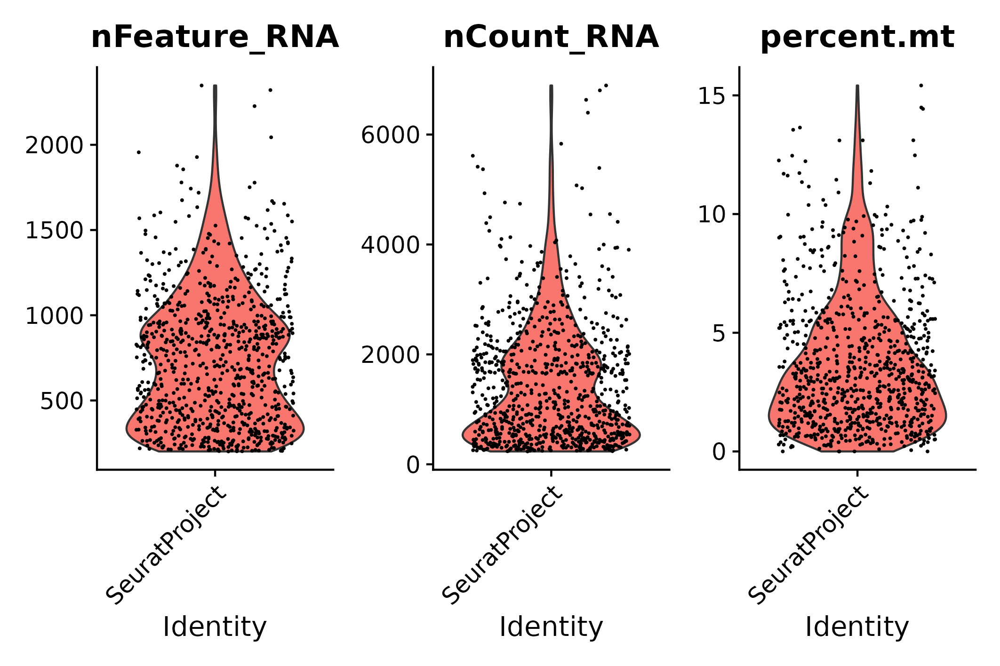
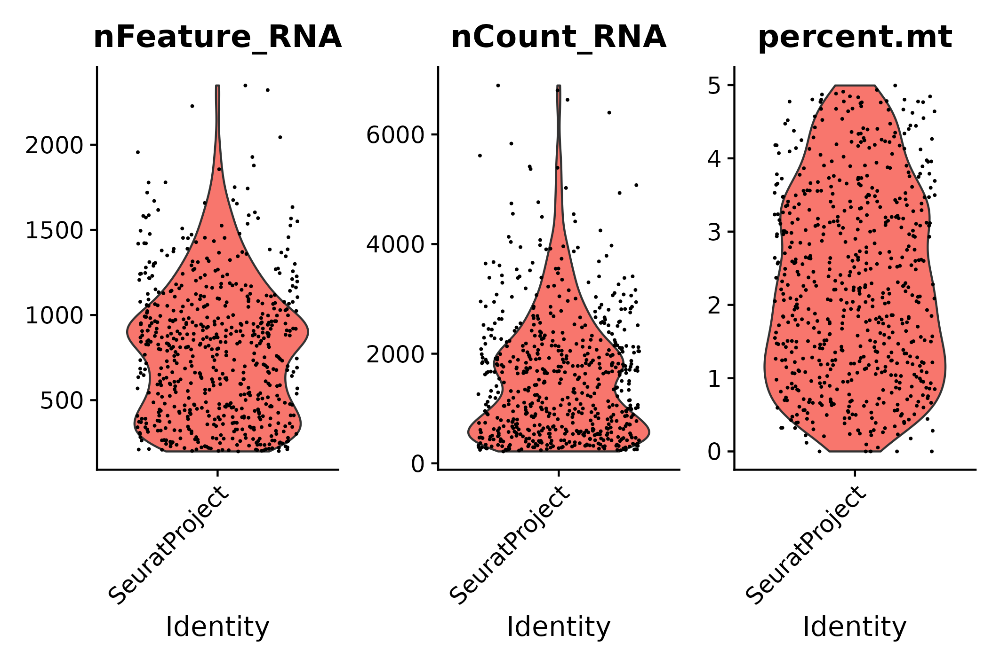
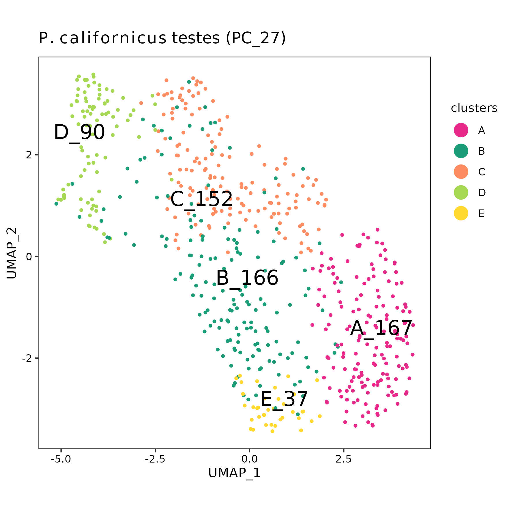

pc27 analysis using STARsolo raw matrix
================
Andrea Elizabeth Acurio Armas, Bulah Wu, Petr Nguyen  
October 15, 2024

### FastQC

Output can be found [here (read
1)](../shared/fastqc/pc27_read1/fastqc.md) and [here (read
2)](../shared/fastqc/pc27_read2/fastqc.md).

 

### barcodeRanks()

barcodeRanks() output

 

### emptyDrops()

|       | FALSE | TRUE |
|:------|------:|-----:|
| FALSE | 36941 |  318 |
| TRUE  |     0 |  635 |

953 cells are identified.

 

### vlnplot()

- The raw matrix
  

  
  

  pre-emptydrops
  

  

|  | Gene | Cell | Mean UMI/Cell | Median UMI/Cell | Mean Gene/Cell | Median Gene/Cell |
|:---|---:|---:|---:|---:|---:|---:|
| Raw | 11320 | 1277682 | 10.53559 | 1 | 7.912049 | 1 |

 

- After emptyDrops()
  

  
  

  post-emptydrops
  

  

|  | Gene | Cell | Mean UMI/Cell | Median UMI/Cell | Mean Gene/Cell | Median Gene/Cell |
|:---|---:|---:|---:|---:|---:|---:|
| emptyDrops | 11320 | 953 | 1287.112 | 920 | 659.4848 | 595 |

 

- STEP 1: filter genes detected in \< 3 cells
  

  
  

  seurat filter step 1
  

  

|       | Gene | Cell | Mean UMI/Cell | Median UMI/Cell | Mean Gene/Cell | Median Gene/Cell |
|:------|-----:|-----:|--------------:|----------------:|---------------:|-----------------:|
| Step1 | 6920 |  953 |      1285.474 |             919 |       657.8835 |              594 |

 

- STEP 2: filter cells that contain \< 200 genes detected
  

  
  

  seurat filter step 2
  

  

|       | Gene | Cell | Mean UMI/Cell | Median UMI/Cell | Mean Gene/Cell | Median Gene/Cell |
|:------|-----:|-----:|--------------:|----------------:|---------------:|-----------------:|
| Step2 | 6875 |  839 |      1436.646 |            1123 |       727.5542 |              688 |

 

- STEP 3.1: following STEP 2, filter cells that contain ≤ 200 genes or ≥
  2500 genes detected
  

  
  

  seurat filter step 3.1
  

  

|  | Gene | Cell | Mean UMI/Cell | Median UMI/Cell | Mean Gene/Cell | Median Gene/Cell |
|:---|---:|---:|---:|---:|---:|---:|
| Step3.1 | 6875 | 836 | 1440.894 | 1128.5 | 729.4533 | 690 |

 

- STEP 3.2: following STEP 2, filter cells that contain ≥ 5%
  mitochondrial counts
  

  
  

  seurat filter step 3.2
  

  

|  | Gene | Cell | Mean UMI/Cell | Median UMI/Cell | Mean Gene/Cell | Median Gene/Cell |
|:---|---:|---:|---:|---:|---:|---:|
| Step3.2 | 6875 | 613 | 1588.168 | 1385 | 789.0261 | 799 |

 

- STEP 3: following STEP 2, filter cells that contain ≤ 200 genes or ≥
  2500 genes detected, and filter cells that contain ≥ 5% mitochondrial
  counts
  

  
  

  seurat filter step 3
  

  

|       | Gene | Cell | Mean UMI/Cell | Median UMI/Cell | Mean Gene/Cell | Median Gene/Cell |
|:------|-----:|-----:|--------------:|----------------:|---------------:|-----------------:|
| Step3 | 6875 |  612 |      1590.408 |          1387.5 |       789.9902 |            799.5 |

 

- Summary

|  | Gene | Cell | Mean UMI/Cell | Median UMI/Cell | Mean Gene/Cell | Median Gene/Cell |
|:---|---:|---:|---:|---:|---:|---:|
| Raw | 11320 | 1277682 | 10.53559 | 1.0 | 7.912049 | 1.0 |
| emptyDrops | 11320 | 953 | 1287.11228 | 920.0 | 659.484785 | 595.0 |
| Step1 | 6920 | 953 | 1285.47429 | 919.0 | 657.883526 | 594.0 |
| Step2 | 6875 | 839 | 1436.64601 | 1123.0 | 727.554231 | 688.0 |
| Step3.1 | 6875 | 836 | 1440.89354 | 1128.5 | 729.453349 | 690.0 |
| Step3.2 | 6875 | 613 | 1588.16803 | 1385.0 | 789.026101 | 799.0 |
| Step3 | 6875 | 612 | 1590.40850 | 1387.5 | 789.990196 | 799.5 |

 

### UMAP

umap

 
