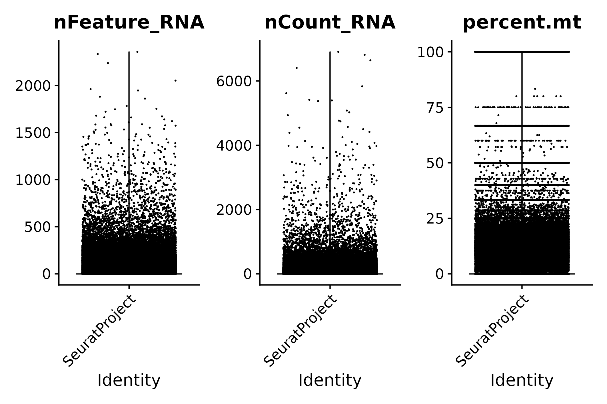
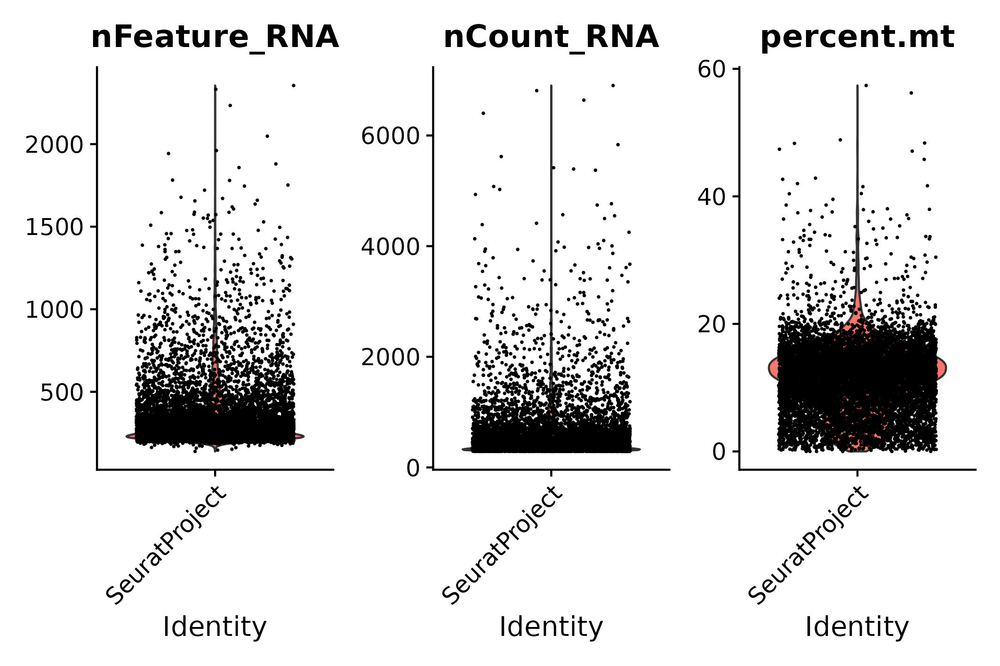
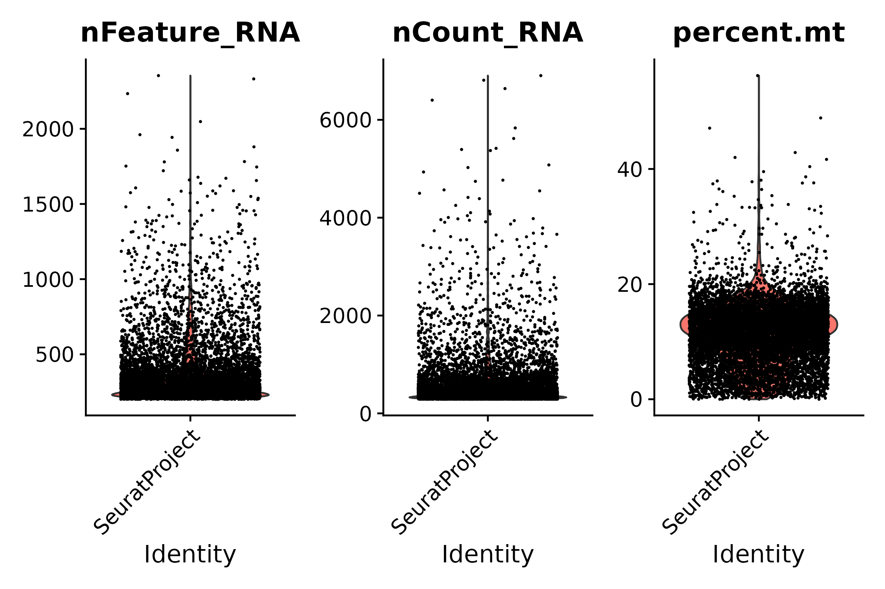
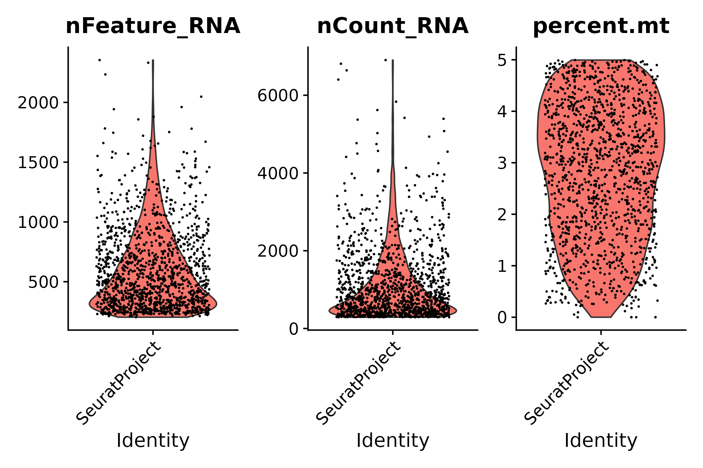
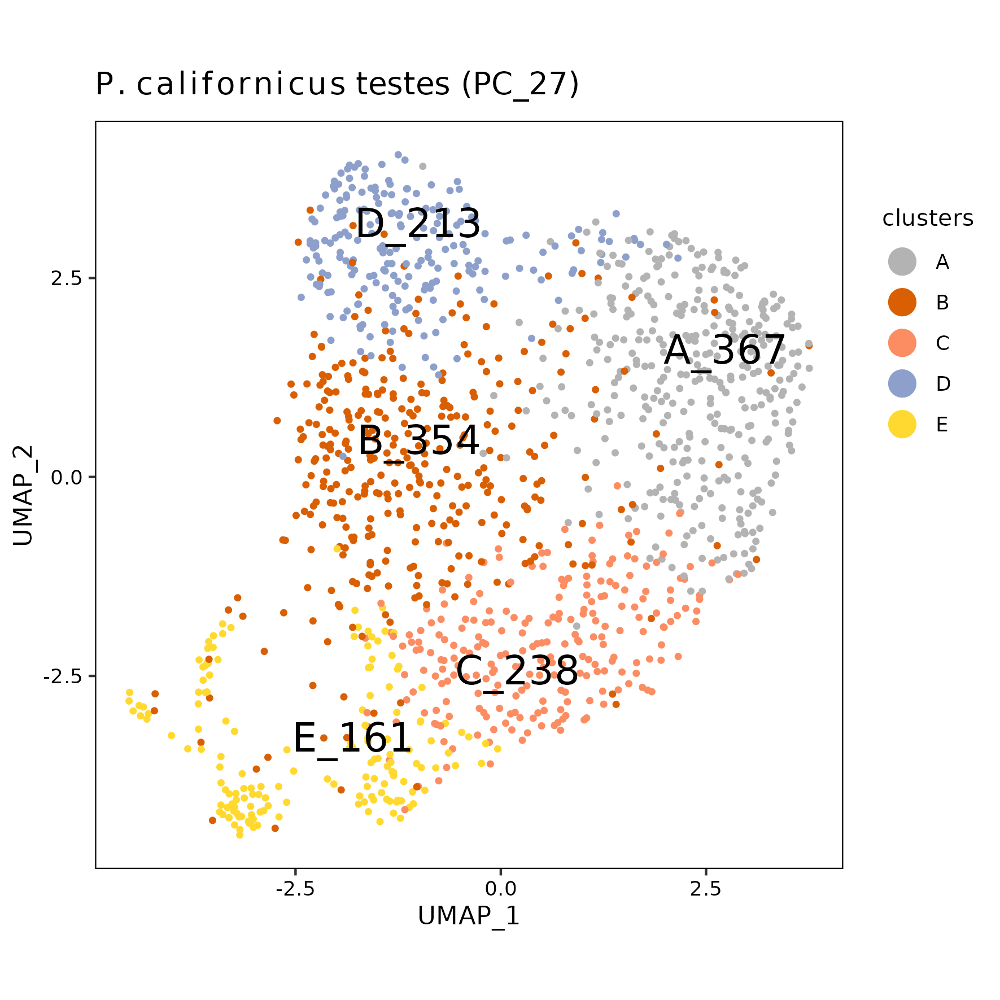

pc27 analysis using STARsolo filtered matrix
================
Andrea Elizabeth Acurio Armas, Bulah Wu, Petr Nguyen  
October 23, 2024

### FastQC

Output can be found [here (read
1)](../shared/fastqc/pc27_read1/fastqc.md) and [here (read
2)](../shared/fastqc/pc27_read2/fastqc.md).

 

### barcodeRanks()

This is a filtered matrix processed by `STARsolo` using `emptyDrops()`.

 

### emptyDrops()

This is a filtered matrix processed by `STARsolo` using `emptyDrops()`.

 

### vlnplot()

- The raw matrix: this is exactly the raw matrix shown in [pc27 analysis
  using STARsolo raw matrix](../05_starsoloRaw/05_starsoloRaw.md).
  

  
  

  pre-emptydrops
  

  

|  | Gene | Cell | Mean UMI/Cell | Median UMI/Cell | Mean Gene/Cell | Median Gene/Cell |
|:---|---:|---:|---:|---:|---:|---:|
| Raw | 11320 | 1277682 | 10.53559 | 1 | 7.912049 | 1 |

 

- After emptyDrops()
  

  
  

  post-emptydrops
  

  

|  | Gene | Cell | Mean UMI/Cell | Median UMI/Cell | Mean Gene/Cell | Median Gene/Cell |
|:---|---:|---:|---:|---:|---:|---:|
| emptyDrops | 11320 | 9341 | 551.5654 | 395 | 340.8436 | 272 |

 

- STEP 1: filter genes detected in \< 3 cells
  

  
  

  seurat filter step 1
  

  

|       | Gene | Cell | Mean UMI/Cell | Median UMI/Cell | Mean Gene/Cell | Median Gene/Cell |
|:------|-----:|-----:|--------------:|----------------:|---------------:|-----------------:|
| Step1 | 7760 | 9341 |      551.4311 |             395 |       340.7104 |              272 |

 

- STEP 2: filter cells that contain \< 200 genes detected
  

  
  

  seurat filter step 2
  

  

|       | Gene | Cell | Mean UMI/Cell | Median UMI/Cell | Mean Gene/Cell | Median Gene/Cell |
|:------|-----:|-----:|--------------:|----------------:|---------------:|-----------------:|
| Step2 | 7755 | 9182 |      555.6982 |             398 |       343.2944 |              273 |

 

- STEP 3.1: following STEP 2, filter cells that contain ≤ 200 genes or ≥
  2500 genes detected
  

  
  

  seurat filter step 3.1
  

  

|  | Gene | Cell | Mean UMI/Cell | Median UMI/Cell | Mean Gene/Cell | Median Gene/Cell |
|:---|---:|---:|---:|---:|---:|---:|
| Step3.1 | 7755 | 9156 | 556.4211 | 399 | 343.7013 | 274 |

 

- STEP 3.2: following STEP 2, filter cells that contain ≥ 5%
  mitochondrial counts
  

  
  

  seurat filter step 3.2
  

  

|  | Gene | Cell | Mean UMI/Cell | Median UMI/Cell | Mean Gene/Cell | Median Gene/Cell |
|:---|---:|---:|---:|---:|---:|---:|
| Step3.2 | 7755 | 1333 | 1116.962 | 797 | 602.8477 | 507 |

 

- STEP 3: following STEP 2, filter cells that contain ≤ 200 genes or ≥
  2500 genes detected, and filter cells that contain ≥ 5% mitochondrial
  counts
  

  
  

  seurat filter step 3
  

  

|       | Gene | Cell | Mean UMI/Cell | Median UMI/Cell | Mean Gene/Cell | Median Gene/Cell |
|:------|-----:|-----:|--------------:|----------------:|---------------:|-----------------:|
| Step3 | 7755 | 1333 |      1116.962 |             797 |       602.8477 |              507 |

 

- Summary

|  | Gene | Cell | Mean UMI/Cell | Median UMI/Cell | Mean Gene/Cell | Median Gene/Cell |
|:---|---:|---:|---:|---:|---:|---:|
| Raw | 11320 | 1277682 | 10.53559 | 1 | 7.912049 | 1 |
| emptyDrops | 11320 | 9341 | 551.56536 | 395 | 340.843593 | 272 |
| Step1 | 7760 | 9341 | 551.43111 | 395 | 340.710416 | 272 |
| Step2 | 7755 | 9182 | 555.69821 | 398 | 343.294380 | 273 |
| Step3.1 | 7755 | 9156 | 556.42114 | 399 | 343.701289 | 274 |
| Step3.2 | 7755 | 1333 | 1116.96249 | 797 | 602.847712 | 507 |
| Step3 | 7755 | 1333 | 1116.96249 | 797 | 602.847712 | 507 |

 

- STARsolo summary

This summary is generated by `STARsolo`.

| Measurement                                 | Value     |
|:--------------------------------------------|:----------|
| Number of Reads                             | 438346872 |
| Reads With Valid Barcodes                   | 1         |
| Sequencing Saturation                       | 0.384967  |
| Q30 Bases in CB+UMI                         | -nan      |
| Q30 Bases in RNA read                       | 0.871028  |
| Reads Mapped to Genome (Unique+Multiple)    | 0.665917  |
| Reads Mapped to Genome (Unique)             | 0.61345   |
| Reads Mapped to Gene (Unique+Multiple Gene) | NoMulti   |
| Reads Mapped to Gene (Unique Gene)          | 0.0499304 |
| Estimated Number of Cells                   | 9341      |
| Unique Reads in Cells Mapped to Gene        | 8712527   |
| Fraction of Unique Reads in Cells           | 0.398071  |
| Mean Reads per Cell                         | 932       |
| Median Reads per Cell                       | 649       |
| UMIs in Cells                               | 5152172   |
| Mean UMI per Cell                           | 551       |
| Median UMI per Cell                         | 395       |
| Mean Gene per Cell                          | 340       |
| Median Gene per Cell                        | 272       |
| Total Gene Detected                         | 8691      |

 

### UMAP

umap

 
