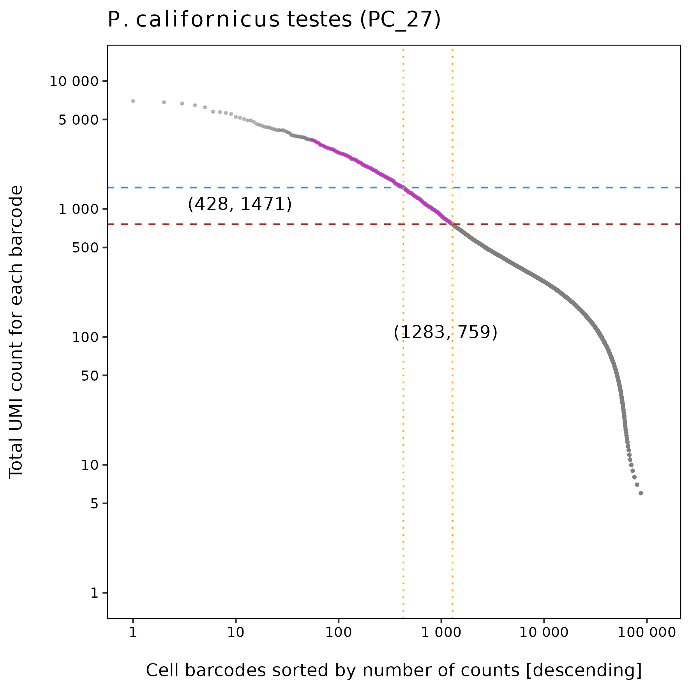
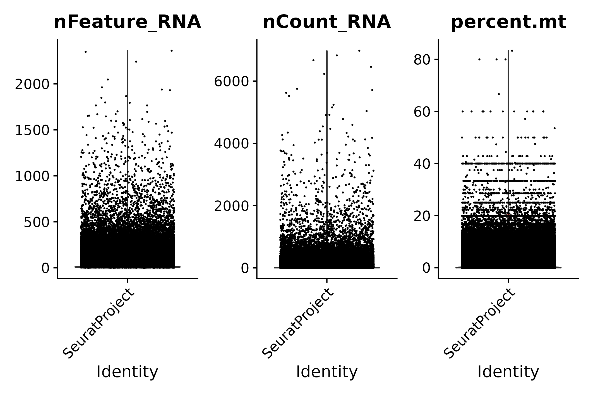
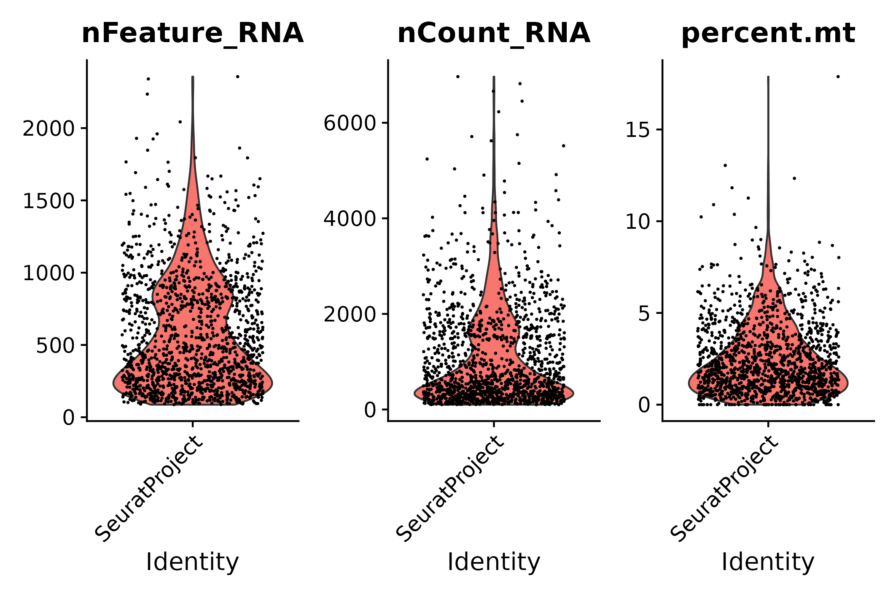
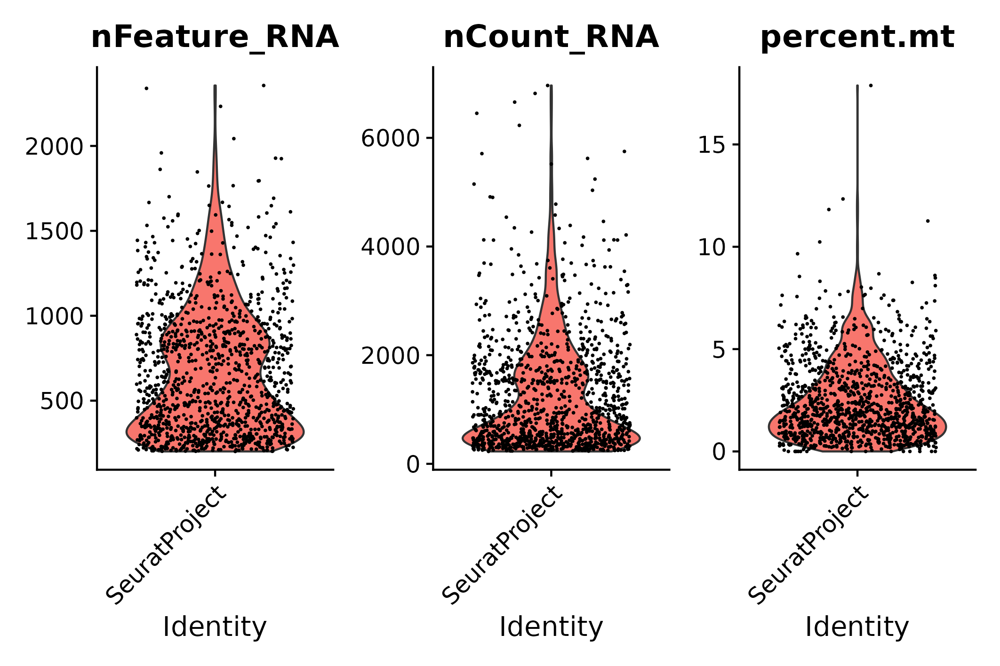
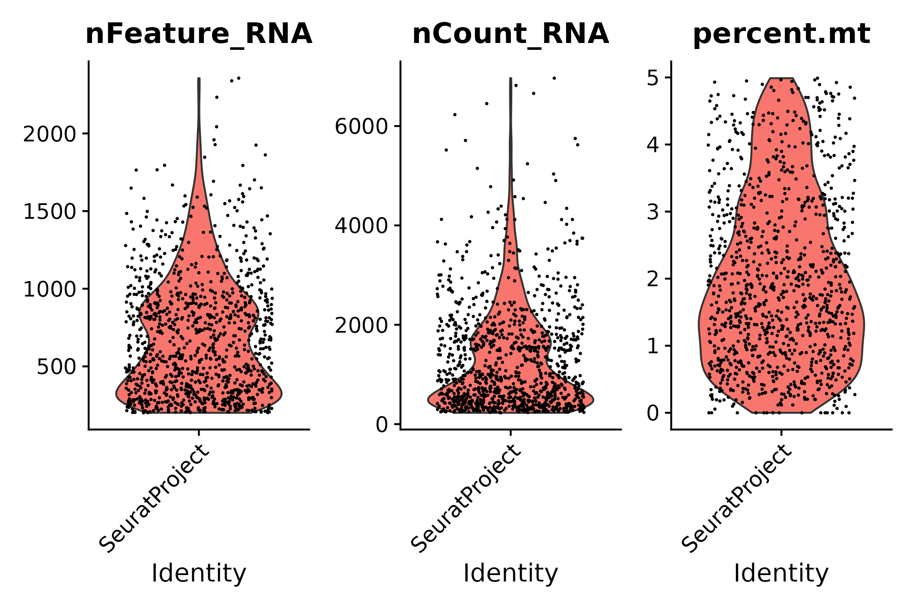
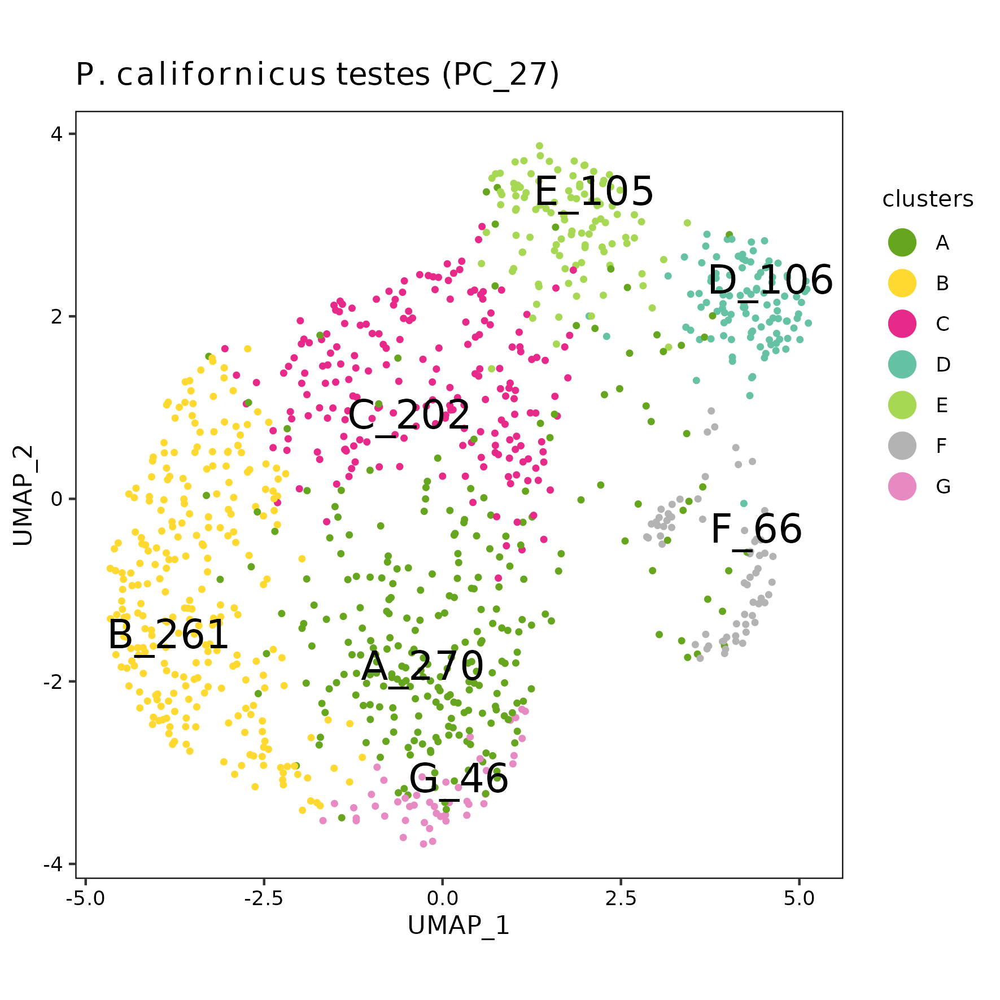

pc27 analysis using Drop-seq core computational protocol (T5)
================
Andrea Elizabeth Acurio Armas, Bulah Wu, Petr Nguyen  
October 15, 2024

### FastQC

Output can be found [here (read
1)](../shared/fastqc/pc27_read1/fastqc.md) and [here (read
2)](../shared/fastqc/pc27_read2/fastqc.md).

 

### barcodeRanks()

The raw matrix is extracted by selecting cells that have ≥ 5 UMI.

barcodeRanks() output

 

### emptyDrops()

|       | FALSE | TRUE |
|:------|------:|-----:|
| FALSE | 34290 |  600 |
| TRUE  |     0 |  832 |

1432 cells are identified.

 

### vlnplot()

- The raw matrix
  

  
  

  pre-emptydrops
  

  

|     | Gene |  Cell | Mean UMI/Cell | Median UMI/Cell | Mean Gene/Cell | Median Gene/Cell |
|:----|-----:|------:|--------------:|----------------:|---------------:|-----------------:|
| Raw | 9098 | 91980 |      123.0419 |              65 |       92.28746 |               59 |

 

- After emptyDrops()
  

  
  

  post-emptydrops
  

  

|  | Gene | Cell | Mean UMI/Cell | Median UMI/Cell | Mean Gene/Cell | Median Gene/Cell |
|:---|---:|---:|---:|---:|---:|---:|
| emptyDrops | 9098 | 1432 | 1071.435 | 669.5 | 574.2381 | 466.5 |

 

- STEP 1: filter genes detected in \< 3 cells
  

  
  

  seurat filter step 1
  

  

|       | Gene | Cell | Mean UMI/Cell | Median UMI/Cell | Mean Gene/Cell | Median Gene/Cell |
|:------|-----:|-----:|--------------:|----------------:|---------------:|-----------------:|
| Step1 | 7118 | 1432 |      1070.455 |           668.5 |       573.2786 |              466 |

 

- STEP 2: filter cells that contain \< 200 genes detected
  

  
  

  seurat filter step 2
  

  

|       | Gene | Cell | Mean UMI/Cell | Median UMI/Cell | Mean Gene/Cell | Median Gene/Cell |
|:------|-----:|-----:|--------------:|----------------:|---------------:|-----------------:|
| Step2 | 7055 | 1190 |      1253.254 |           894.5 |       660.1454 |              573 |

 

- STEP 3.1: following STEP 2, filter cells that contain ≤ 200 genes or ≥
  2500 genes detected
  

  
  

  seurat filter step 3.1
  

  

|  | Gene | Cell | Mean UMI/Cell | Median UMI/Cell | Mean Gene/Cell | Median Gene/Cell |
|:---|---:|---:|---:|---:|---:|---:|
| Step3.1 | 7055 | 1187 | 1255.782 | 900 | 661.3083 | 574 |

 

- STEP 3.2: following STEP 2, filter cells that contain ≥ 5%
  mitochondrial counts
  

  
  

  seurat filter step 3.2
  

  

|  | Gene | Cell | Mean UMI/Cell | Median UMI/Cell | Mean Gene/Cell | Median Gene/Cell |
|:---|---:|---:|---:|---:|---:|---:|
| Step3.2 | 7055 | 1059 | 1320.153 | 974 | 687.6374 | 619 |

 

- STEP 3: following STEP 2, filter cells that contain ≤ 200 genes or ≥
  2500 genes detected, and filter cells that contain ≥ 5% mitochondrial
  counts
  

  
  

  seurat filter step 3
  

  

|       | Gene | Cell | Mean UMI/Cell | Median UMI/Cell | Mean Gene/Cell | Median Gene/Cell |
|:------|-----:|-----:|--------------:|----------------:|---------------:|-----------------:|
| Step3 | 7055 | 1056 |      1323.185 |             976 |       689.0227 |            620.5 |

 

- Summary

|  | Gene | Cell | Mean UMI/Cell | Median UMI/Cell | Mean Gene/Cell | Median Gene/Cell |
|:---|---:|---:|---:|---:|---:|---:|
| Raw | 9098 | 91980 | 123.0419 | 65.0 | 92.28746 | 59.0 |
| emptyDrops | 9098 | 1432 | 1071.4351 | 669.5 | 574.23813 | 466.5 |
| Step1 | 7118 | 1432 | 1070.4546 | 668.5 | 573.27863 | 466.0 |
| Step2 | 7055 | 1190 | 1253.2538 | 894.5 | 660.14538 | 573.0 |
| Step3.1 | 7055 | 1187 | 1255.7818 | 900.0 | 661.30834 | 574.0 |
| Step3.2 | 7055 | 1059 | 1320.1530 | 974.0 | 687.63739 | 619.0 |
| Step3 | 7055 | 1056 | 1323.1847 | 976.0 | 689.02273 | 620.5 |

 

### UMAP

umap

 
