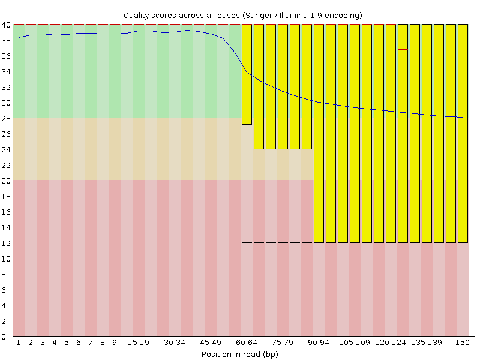
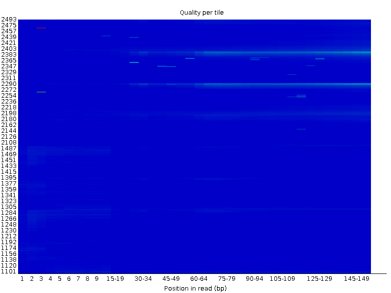
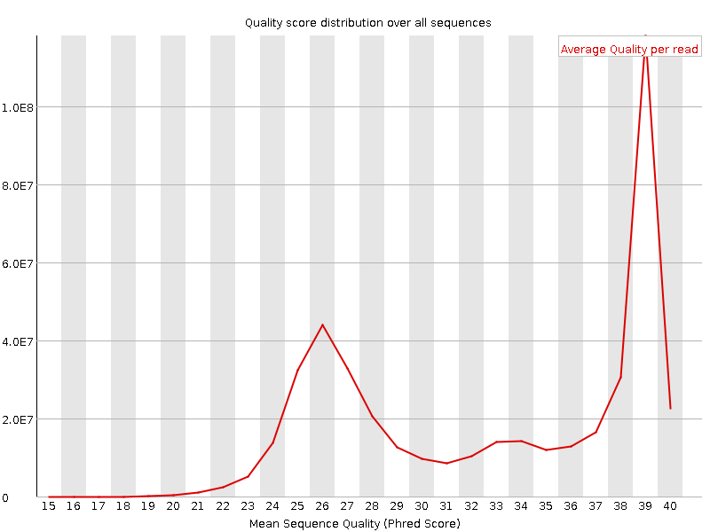
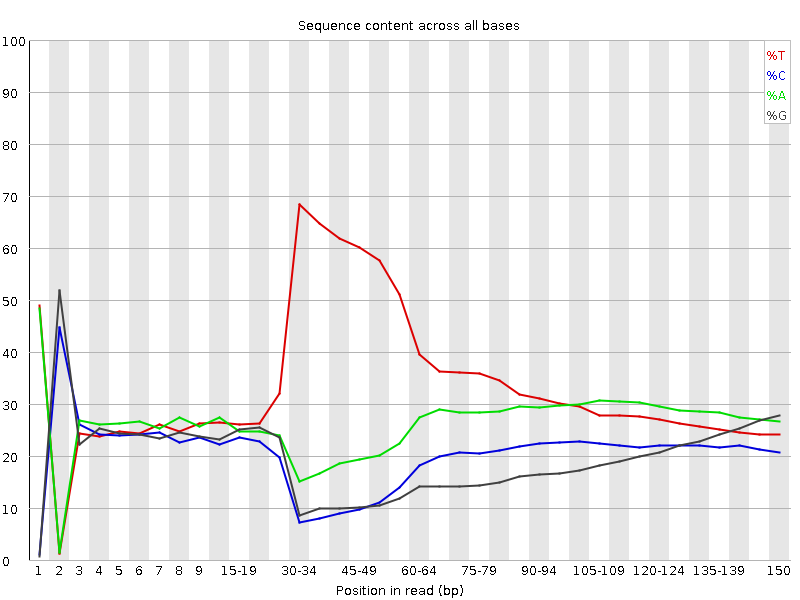
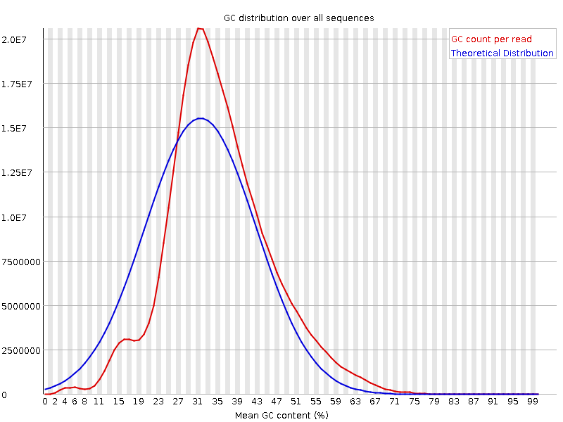
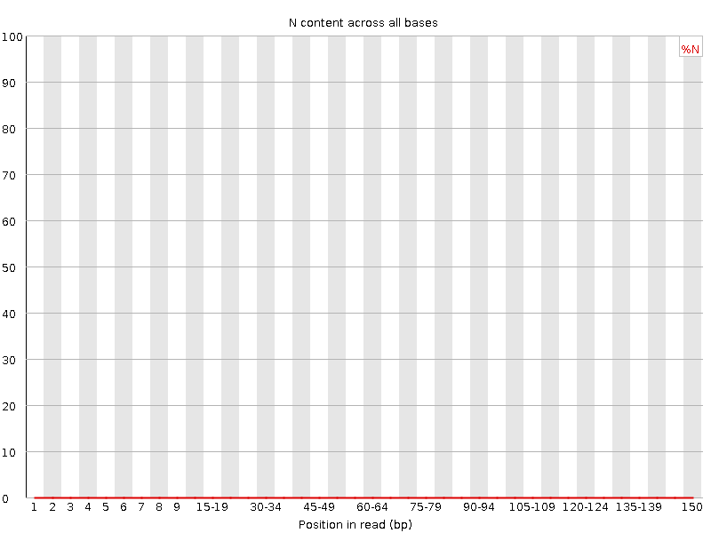
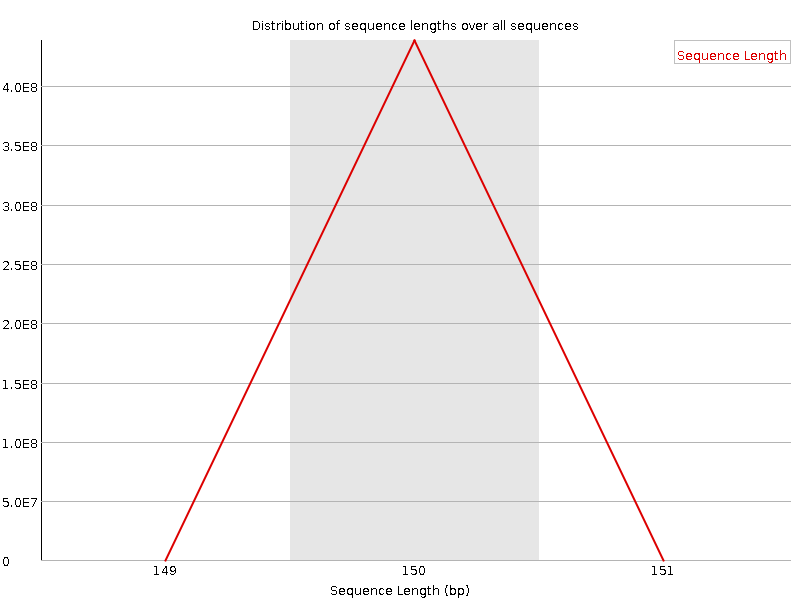
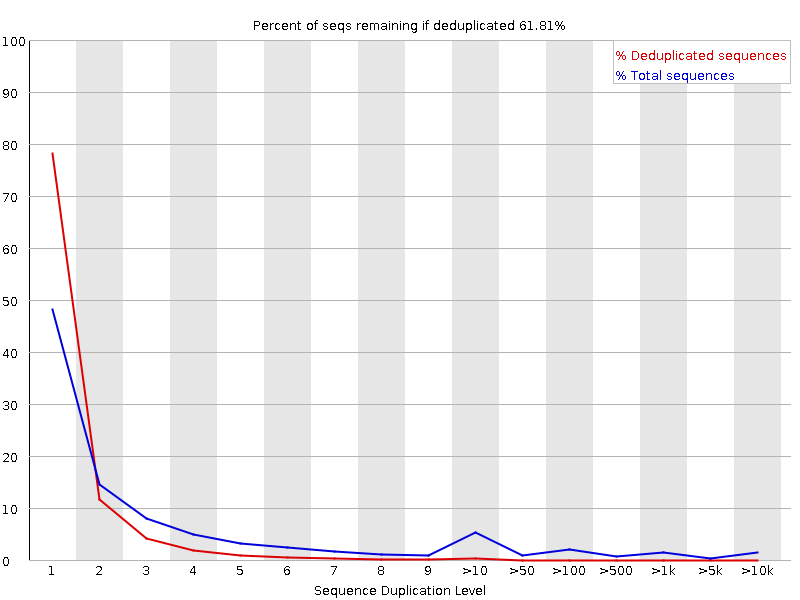
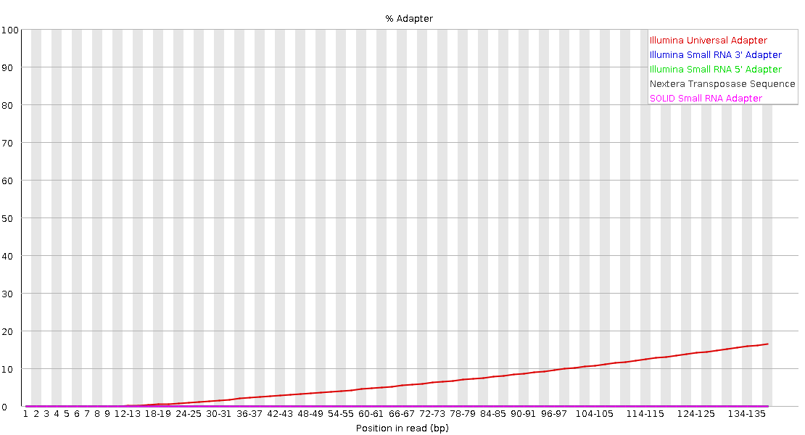

# __FastQC Report__

## __Basic Statistics__

| Measure | Value |
| --- | --- |
| Filename | read1.fq.gz |
| File type | Conventional base calls |
| Encoding | Sanger / Illumina 1.9 |
| Total Sequences | 438346872 |
| Sequences flagged as poor quality | 0 |
| Sequence length | 150 |
| %GC | 37 |

## Per base sequence quality

## Per tile sequence quality

## Per sequence quality scores

## Per base sequence content

## Per sequence GC content

## Per base N content

## Sequence Length Distribution

## Sequence Duplication Levels

## Overrepresented sequences

No overrepresented sequences

## Adapter Content

