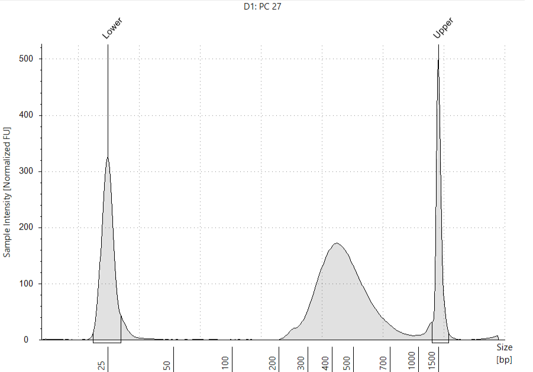

```{r setup, include=FALSE}
library(ggplot2)
library(ggrepel)
library(tidyr)
library(dplyr)
library(Seurat)
library(rmarkdown)
library(DropletUtils)
library(patchwork)
library(RColorBrewer)
setwd("/media/nguyen/Data1/github/bulahwoo/scRNAseq_Phymatopus_californicus")
```


## Genome assembly and annotation

The _P. californicus_ genome was sequenced in [Petr Nguyen's lab](https://www.entu.cas.cz/en/departments/department-of-ecology-and-conservation-biology/laboratory-of-evolutionary-genetics/) using Oxford Nanopore technology and assembled with [Flye](https://github.com/mikolmogorov/Flye). Annotation of the genome was performed with [BRAKER3](https://github.com/Gaius-Augustus/BRAKER). The RNA-seq data utilized include the publicly accessible [SRR1021622](https://www.ncbi.nlm.nih.gov/sra/?term=SRR1021622) and additional data provided by [Michal Zurovec](https://www.entu.cas.cz/en/staff/profile/269-michalzurovec/). Mitochondrial genome was identified by aligning the genome assembly against the mt genomes of _Bombyx mori_ and _Yponomeuta evonymella_ using [minimap2](https://github.com/lh3/minimap2). The annotation of mt genome was carried out with [mitos2](https://usegalaxy.org.au/root?tool_id=toolshed.g2.bx.psu.edu/repos/iuc/mitos2/mitos2/2.1.9+galaxy0) on the Galaxy platform.

## Library preparation

The scRNA-seq library was prepared with the RNAdia 2.0 kit (Dolomite Bio), following the manufacturer's instructions. Approximately 8,000 cells were captured, and the size distribution of the library was examined using the Bioanalyzer system.

```{r bioanalyzer, echo=FALSE, fig.cap="Size distribution assessed by Bioanalyzer", out.width = '60%', fig.align = 'center'}

```

## Quality control checks on raw reads

[FastQC](https://www.bioinformatics.babraham.ac.uk/projects/fastqc/) was used for quality check. Output can be found [here](fastqc/pc27_read1/fastqc.md) and [here](fastqc/pc27_read2/fastqc.md).

## Drop-seq protocol

The digital expression matrix using the Drop-seq core computational protocol developed by the McCarroll Lab (https://github.com/broadinstitute/Drop-seq). Briefly, cell barcodes (CBs) and unique molecular identifiers (UMIs) were identified from
raw reads. Reads with CBs/UMIs of low quality bases were removed, and 5' primer and 3' polyA sequences were trimmed. The reads were then aligned to the reference genome using STAR aligner. Substitution and indel errors in barcodes were repaired before the digital expression matrix was created. 

```{bash, engine.opts='-l', echo=FALSE, comment=""}
cat /media/nguyen/Data1/mao/scseq/dropseq/pc27mito/sh_dropseq_pc27mito.sh
```

## Knee-plot analysis

In the dot plot, the x-axis represents the cell barcodes (organized by the number of reads, arranged from highest to lowest), and the y-axis shows the cumulative fraction of uniquely mapped reads. The transition from beads sampling cellular RNA to beads sampling ambient RNA is marked by the inflection point ([Macosko et al., 2015](http://dx.doi.org/10.1016/j.cell.2015.05.002)).

```{r knee-plot, warning=FALSE}
pc27=read.table("/media/nguyen/Data1/mao/scseq/dropseq/pc27mito/cell_readcounts.txt.gz", header=F, stringsAsFactors=F)
csum_pc27=cumsum(pc27$V1)
df_pc27 <- cbind.data.frame(xvalue=1:length(csum_pc27), yvalue=csum_pc27/max(csum_pc27))
ggplot(df_pc27, aes(xvalue, yvalue)) +
  geom_point(size=0.1, color="cornflowerblue") + scale_x_continuous(limits = c(0,50000))+
  geom_hline(aes(yintercept=df_pc27 %>% filter(xvalue==8000) %>% pull(yvalue)), color="brown", linetype=2)+
  geom_vline(aes(xintercept=8000), color="orange", linetype=3)+
  annotate("text", x=15000, y=0.25, label="(8000, 0.2998)")+ # 0.2998019
  labs(title=expression(italic(P.)~italic(californicus)~"PC27"), x="Cell barcodes sorted by number of reads [descending]", y="Cumulative fraction of reads") +
  theme_bw() +
  theme(axis.line = element_blank(),
        axis.title = element_text(color="black"),
        axis.text = element_text(color="black"),
        panel.grid.major = element_blank(),
        panel.grid.minor = element_blank(),
        panel.background = element_blank(),
        panel.border = element_rect(linewidth = 1, color="black"), aspect.ratio = 1)
```

The plot indicates the top 8000 cells contribute nearly 30% of the total uniquely mapped reads.

## DropletUtils analysis

[Nikos Konstantinides](https://konstantinides-lab.com) suggested using [DropletUtils](https://doi.org/doi:10.18129/B9.bioc.DropletUtils) to identify the knee and inflection points. Here the x-axis indicates the cell barcodes (organized by the number of reads, arranged from highest to lowest) and the y-axis the total UMI count for each barcode.

```{r barcodeRanks, warning=FALSE}
mtx_pc27 <- read.table("/media/nguyen/Data1/mao/scseq/dropseq/pc27mito/dge_c8k.txt.gz", header = TRUE, row.names = 1, colClasses =c("character", rep("numeric", 8000)))
br.out <- barcodeRanks(mtx_pc27)
o <- order(br.out$rank)
# metadata(br.out)$knee: 298
# metadata(br.out)$inflection : 134
# which(br.out$total==298)[1]
min_rank <- br.out$rank[which(br.out$total==298)[1]] # 5916.5
# which(br.out$total==134)[1]
max_rank <- br.out$rank[which(br.out$total==134)[1]] # 7494
ggplot()+
  geom_point(aes(x=br.out$rank, y=br.out$total+1), color="grey50", size=0.5, alpha=0.5)+
  geom_line(aes(x=br.out$rank[o],y=br.out$fitted[o]), color="magenta")+
  geom_hline(aes(yintercept=metadata(br.out)$knee), color="dodgerblue", linetype=2)+
  geom_hline(aes(yintercept=metadata(br.out)$inflection), color="brown", linetype=2)+
  geom_vline(aes(xintercept=min_rank), color="orange", linetype=3)+
  geom_vline(aes(xintercept=max_rank), color="orange", linetype=3)+
  annotate("text", x=2000, y=500, label="(5916.5, 298)")+
  annotate("text", x=20000, y=70, label="(7494, 134)")+
  scale_x_continuous(limits=c(1,50000), trans='log10', breaks = c(1,10,100,1000,10000,10000),labels = scales::number)+
  scale_y_continuous(limits=c(1,50000), trans='log10', breaks = c(1,10,100,1000,10000,10000),labels = scales::number)+
  labs(title=expression(italic(P.)~italic(californicus)~"PC27"),
       x="Cell barcodes sorted by number of counts [descending]",
       y="Total UMI count for each barcode") +
  theme_bw() +
  theme(axis.line = element_blank(),
        axis.title = element_text(color="black"),
        axis.text = element_text(color="black"),
        panel.grid.major = element_blank(),
        panel.grid.minor = element_blank(),
        panel.background = element_blank(),
        panel.border = element_rect(linewidth = 1, color="black"), aspect.ratio = 1)
```

Cells below the knee point (5916.5) are considered empty droplets.

Subset the SingleCellExperiment object to discard the empty droplets.

```{r emptyDrops1}
set.seed(100)
e.out <- emptyDrops(mtx_pc27, niters=10000)
is.cell <- e.out$FDR <= 0.001
sum(is.cell, na.rm=TRUE)
```

In total 5919 cells are retained.

```{r emptyDrops2}
table(Limited=e.out$Limited, Significant=is.cell)
```

The zero in the above table indicates no entry with false positives frequency above the threshold 0.001 (Significant FALSE) can be achieved by increasing the number of permutations (Limited TRUE). So the parameter _niters=10000_ is good.

```{r emptyDrops3}
mtx_pc27 <- mtx_pc27[,which(e.out$FDR<=0.001)]
ggplot(e.out %>% as.data.frame() %>% filter(!is.na(LogProb)) %>% mutate(FDR_fill=ifelse(FDR>0.001, "cornflowerblue", "orange")))+
  geom_point(aes(x=Total, y=-LogProb, color=FDR_fill), size=1, alpha=0.5)+
  scale_color_manual(values=c("cornflowerblue", "orange"), labels=c('FDR > 0.001', 'FDR <= 0.001'))+
  labs(title=expression(italic(P.)~italic(californicus)~"PC27"),
       x="Total UMI count",
       y="-Log Probability") +
  theme_bw() +
  theme(axis.line = element_blank(),
        axis.title = element_text(color="black"),
        axis.text = element_text(color="black"),
        legend.title = element_blank(),
        legend.position = "inside",
        legend.position.inside = c(0.8, 0.2),
        panel.grid.major = element_blank(),
        panel.grid.minor = element_blank(),
        panel.background = element_blank(),
        panel.border = element_rect(linewidth = 1, color="black"), aspect.ratio = 1)
```

The retained droplets (orange color) should have large UMI counts and/or large negative log probabilities.

## Analysis using Seurat

[Seurat v5](https://satijalab.org/seurat) was used to analyze the data.

First we filtered the data by dropping (1) features detected in less than 3 cells or (2) cells with feature counts less than 200.

```{r prefilter, warning=FALSE, message=FALSE}
so_pc27_pre <- CreateSeuratObject(counts = mtx_pc27, min.cells = 3, min.features = 200, project = "pc27") %>%
               PercentageFeatureSet(pattern = "^agat|^rrn", col.name = "percent.mt")
```

The diagnostic plots below show the total number of unique molecules in each cell (left), the total number of unique genes in each cell (middle), and the percentage of reads mapped to the mitochondrial genome (right).

```{r violin1, echo=FALSE, fig.width=12, fig.height=4}
df_violin_pre <- data.frame(nCount=so_pc27_pre@meta.data$nCount_RNA,
                            nFeature=so_pc27_pre@meta.data$nFeature_RNA,
                            percentMT=so_pc27_pre@meta.data$percent.mt)

pre1 <-
ggplot(df_violin_pre) +
  geom_jitter(aes(x="",y=nCount), position = position_jitter(seed = 1, width = 0.5), size=0.3, color="cornflowerblue", alpha=0.5) +
  geom_violin(aes(x="", y=nCount), fill="orange", color="orange", alpha=0.5) +
  labs(x="PC_27",
       y="Number of molecules detected") +
  #scale_y_continuous(breaks = seq(0,7000,500)) +
  theme_bw() +
  theme(axis.line = element_blank(),
        axis.title = element_text(color="black"),
        axis.text = element_text(color="black"),
        panel.grid.major = element_blank(),
        panel.grid.minor = element_blank(),
        panel.background = element_blank(),
        panel.border = element_rect(linewidth = 1, color="black"), aspect.ratio = 1)

pre2 <-
ggplot(df_violin_pre) +
  geom_jitter(aes(x="",y=nFeature), position = position_jitter(seed = 1, width = 0.5), size=0.3, color="cornflowerblue", alpha=0.5) +
  geom_violin(aes(x="", y=nFeature), fill="orange", color="orange", alpha=0.5) +
  labs(x="PC_27",
       y="Number of genes detected") +
  #scale_y_continuous(breaks = seq(0,2400,200)) +
  theme_bw() +
  theme(axis.line = element_blank(),
        axis.title = element_text(color="black"),
        axis.text = element_text(color="black"),
        panel.grid.major = element_blank(),
        panel.grid.minor = element_blank(),
        panel.background = element_blank(),
        panel.border = element_rect(linewidth = 1, color="black"), aspect.ratio = 1)

pre3 <-
ggplot(df_violin_pre) +
  geom_jitter(aes(x="",y=percentMT), position = position_jitter(seed = 1, width = 0.5), size=0.3, color="cornflowerblue", alpha=0.5) +
  geom_violin(aes(x="", y=percentMT), fill="orange", color="orange", alpha=0.5) +
  labs(x="PC_27",
       y="Reads mapped to Mt genes (%)") +
  #scale_y_continuous(breaks = seq(0,10,2)) +
  theme_bw() +
  theme(axis.line = element_blank(),
        axis.title = element_text(color="black"),
        axis.text = element_text(color="black"),
        panel.grid.major = element_blank(),
        panel.grid.minor = element_blank(),
        panel.background = element_blank(),
        panel.border = element_rect(linewidth = 1, color="black"), aspect.ratio = 1)

pre1 + pre2 + pre3
```

We further filtered cells (1) with feature counts larger than 2500 or less than 200 or (2) with mitochondrial counts larger than 5%.

```{r postfilter, warning=FALSE, message=FALSE}
so_pc27 <- CreateSeuratObject(counts = mtx_pc27, min.cells = 3, min.features = 200, project = "pc27") %>%
           PercentageFeatureSet(pattern = "^agat|^rrn", col.name = "percent.mt") %>%
           subset(subset = nFeature_RNA > 200 & nFeature_RNA < 2500 & percent.mt < 5)
```

We checked the diagnostic plots after filtering.

```{r violin2, echo=FALSE, fig.width=12, fig.height=4}
df_violin <- data.frame(nCount=so_pc27@meta.data$nCount_RNA,
                        nFeature=so_pc27@meta.data$nFeature_RNA,
                        percentMT=so_pc27@meta.data$percent.mt)

post1 <-
ggplot(df_violin) +
  geom_jitter(aes(x="",y=nCount), position = position_jitter(seed = 1, width = 0.5), size=0.3, color="cornflowerblue", alpha=0.5) +
  geom_violin(aes(x="", y=nCount), fill="orange", color="orange", alpha=0.5) +
  labs(x="PC_27",
       y="Number of molecules detected") +
  #scale_y_continuous(breaks = seq(0,7000,500)) +
  theme_bw() +
  theme(axis.line = element_blank(),
        axis.title = element_text(color="black"),
        axis.text = element_text(color="black"),
        panel.grid.major = element_blank(),
        panel.grid.minor = element_blank(),
        panel.background = element_blank(),
        panel.border = element_rect(linewidth = 1, color="black"), aspect.ratio = 1)

post2 <-
ggplot(df_violin) +
  geom_jitter(aes(x="",y=nFeature), position = position_jitter(seed = 1, width = 0.5), size=0.3, color="cornflowerblue", alpha=0.5) +
  geom_violin(aes(x="", y=nFeature), fill="orange", color="orange", alpha=0.5) +
  labs(x="PC_27",
       y="Number of genes detected") +
  #scale_y_continuous(breaks = seq(0,2400,200)) +
  theme_bw() +
  theme(axis.line = element_blank(),
        axis.title = element_text(color="black"),
        axis.text = element_text(color="black"),
        panel.grid.major = element_blank(),
        panel.grid.minor = element_blank(),
        panel.background = element_blank(),
        panel.border = element_rect(linewidth = 1, color="black"), aspect.ratio = 1)

post3 <-
ggplot(df_violin) +
  geom_jitter(aes(x="",y=percentMT), position = position_jitter(seed = 1, width = 0.5), size=0.3, color="cornflowerblue", alpha=0.5) +
  geom_violin(aes(x="", y=percentMT), fill="orange", color="orange", alpha=0.5) +
  labs(x="PC_27",
       y="Reads mapped to Mt genes (%)") +
  #scale_y_continuous(breaks = seq(0,10,2)) +
  theme_bw() +
  theme(axis.line = element_blank(),
        axis.title = element_text(color="black"),
        axis.text = element_text(color="black"),
        panel.grid.major = element_blank(),
        panel.grid.minor = element_blank(),
        panel.background = element_blank(),
        panel.border = element_rect(linewidth = 1, color="black"), aspect.ratio = 1)

post1 + post2 + post3
```

UMAP clustering of data from 5903 cells revealed 12 cell clusters.

```{r umap, warning=FALSE, message=FALSE}
so_pc27 <- CreateSeuratObject(counts = mtx_pc27, min.cells = 3, min.features = 200, project = "pc27") %>%
           PercentageFeatureSet(pattern = "^agat|^rrn", col.name = "percent.mt") %>%
           subset(subset = nFeature_RNA > 200 & nFeature_RNA < 2500 & percent.mt < 5) %>%
           SCTransform(vars.to.regress = "percent.mt") %>%
           RunPCA() %>%
           FindNeighbors(dims = 1:30) %>%
           RunUMAP(dims = 1:30) %>%
           FindClusters()
df_umap <- so_pc27@reductions$umap@cell.embeddings %>% as.data.frame() %>% cbind(color=so_pc27@meta.data$seurat_clusters)
#length(unique(df_umap$color))
my_color <- c(brewer.pal(name="Set2", n=8),brewer.pal(name="Dark2", n=8))[c(1,3,2,4,5,6,7,8,12,14,15,16)]

ggplot(df_umap) +
  geom_point(aes(x=umap_1, y=umap_2, color=color), size=0.8) +
  geom_text_repel(data=df_umap %>% group_by(color) %>% summarise(q1=quantile(umap_1, 0.5), q2=quantile(umap_2, 0.5)),
                  aes(x=q1, y=q2, label = LETTERS[1:12]), size=8) +
  labs(title=expression(italic(P.)~italic(californicus)~"PC27"),
       x="UMAP_1",
       y="UMAP_2") +
  scale_color_manual(values = my_color, name="clusters", labels=LETTERS[1:12]) +
  guides(color = guide_legend(override.aes = list(size = 5))) +
  theme_bw() +
  theme(axis.line = element_blank(),
        axis.title = element_text(color="black"),
        axis.text = element_text(color="black"),
        legend.title = element_text(size=10),
        legend.background=element_blank(),
        legend.justification=c(1, 0.85),
        panel.grid.major = element_blank(),
        panel.grid.minor = element_blank(),
        panel.background = element_blank(),
        panel.border = element_rect(linewidth = 1, color="black"), aspect.ratio = 1)
```

Genes differentially expressed among each cluster were selected as marker genes.

```{r marker01, warning=FALSE, message=FALSE}
so_pc27.markers <- FindAllMarkers(so_pc27, only.pos = TRUE, logfc.threshold = 0.25)
so_pc27.markers %>% arrange(desc(avg_log2FC)) %>% group_by(cluster) %>% dplyr::slice(1:3) %>% as.data.frame()
```

The above table shows, in each cluster, three genes with largest average log2 fold-change value (avg_log2FC). We can visualize the marker gene expression (from left to right: top1, top2, top3).

```{r marker02, echo=FALSE, fig.width=16, fig.height=4}
default_top1_markers_list <- so_pc27.markers %>% arrange(desc(avg_log2FC)) %>% group_by(cluster) %>% dplyr::slice(1:1) %>% pull(gene)
default_top2_markers_list <- so_pc27.markers %>% arrange(desc(avg_log2FC)) %>% group_by(cluster) %>% dplyr::slice(2:2) %>% pull(gene)
default_top3_markers_list <- so_pc27.markers %>% arrange(desc(avg_log2FC)) %>% group_by(cluster) %>% dplyr::slice(3:3) %>% pull(gene)
dtop1 <- VlnPlot(so_pc27, features=default_top1_markers_list, pt.size=0.2, stack=T, flip=T) + NoLegend()
dtop2 <- VlnPlot(so_pc27, features=default_top2_markers_list, pt.size=0.2, stack=T, flip=T) + NoLegend()
dtop3 <- VlnPlot(so_pc27, features=default_top3_markers_list, pt.size=0.2, stack=T, flip=T) + NoLegend()
dtop1 + dtop2 + dtop3
```

We noticed the high adjusted _P_-value (p_val_adj) for marker genes in cluster 0, 1 and 2, so we filtered genes with p_val_adj >= 0.05

```{r marker03}
so_pc27.markers %>% filter(p_val_adj < 0.05) %>% arrange(desc(avg_log2FC)) %>% group_by(cluster) %>% dplyr::slice(1:3) %>% as.data.frame()
```

We can visualize the marker gene expression with filtered data.

```{r marker04, echo=FALSE, fig.width=16, fig.height=4}
filtered_top1_markers_list <- so_pc27.markers %>% filter(p_val_adj < 0.05) %>% arrange(desc(avg_log2FC)) %>% group_by(cluster) %>% dplyr::slice(1:1) %>% pull(gene)
filtered_top2_markers_list <- so_pc27.markers %>% filter(p_val_adj < 0.05) %>% arrange(desc(avg_log2FC)) %>% group_by(cluster) %>% dplyr::slice(2:2) %>% pull(gene)
filtered_top3_markers_list <- so_pc27.markers %>% filter(p_val_adj < 0.05) %>% arrange(desc(avg_log2FC)) %>% group_by(cluster) %>% dplyr::slice(3:3) %>% pull(gene)
ftop1 <- VlnPlot(so_pc27, features=filtered_top1_markers_list, pt.size=0.2, stack=T, flip=T) + NoLegend()
ftop2 <- VlnPlot(so_pc27, features=filtered_top2_markers_list, pt.size=0.2, stack=T, flip=T) + NoLegend()
ftop3 <- VlnPlot(so_pc27, features=filtered_top3_markers_list, pt.size=0.2, stack=T, flip=T) + NoLegend()
ftop1 + ftop2 + ftop3
```

The below table shows top10 marker genes in each cluster with inferred gene names derived from annotated reference genomes _Bombyx mori_, _Danaus plexippus_, and _Plutella xylostella_.

```{r marker05}
selected_markers <- so_pc27.markers %>% filter(p_val_adj < 0.05) %>% arrange(desc(avg_log2FC)) %>% group_by(cluster) %>% dplyr::slice(1:10)
gene_name <- read.delim("/media/nguyen/Data1/mao/braker3/phymatopus_californicus/genome_mao/annotation/gene_name/anno_combo_mito", header = F)
selected_markers %>% inner_join(gene_name, by=join_by(gene == V1)) %>% select(!c(V2,V3,V5,V6,V7,V8)) %>% rename(V4="Bombyx_mori") %>% as.data.frame()
```

## Session info

```{r sessioninfo, echo=FALSE}
sessionInfo()
```
