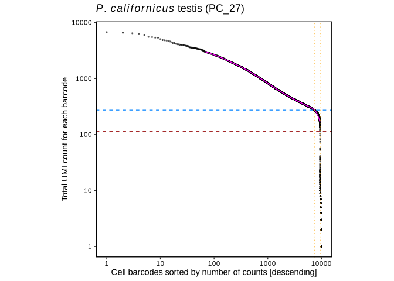
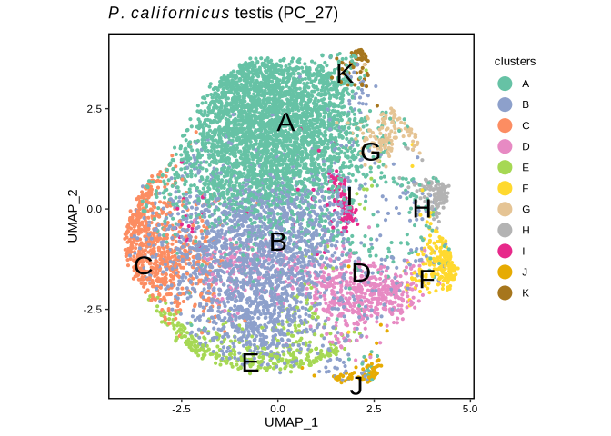

Single-cell RNA sequencing in *P. californicus*
================
Bulah Wu
July 11, 2024

## Drop-seq protocol

We generated the digital expression matrix using the Drop-seq protocol
developed by the McCarroll Lab
(<https://github.com/broadinstitute/Drop-seq>). Here are the programs
used:

    #!/bin/bash
    #PBS -N pc27mito
    #PBS -l select=1:ncpus=16:mem=140gb:scratch_ssd=800gb
    #PBS -l walltime=24:00:00
    #PBS -m ae

    #export TMPDIR=$SCRATCHDIR
    DATADIR=/auto/plzen1/home/bulah/mao/scseq/dropseq/pc27mito
    echo "||| $HOSTNAME $SCRATCHDIR ||| (pc27mito) ||| ssh $HOSTNAME \"scp -rp bulah@$HOSTNAME:$SCRATCHDIR/* \$HOSTNAME:\$SCRATCHDIR\" |||" >> $DATADIR/jobid

    module add mambaforge picard star samtools
    mamba activate /auto/plzen1/home/bulah/.conda/envs/openjdk2201

    export ID=pc27mito
    export ASSEMBLY=/auto/plzen1/home/bulah/mao/braker3/phymatopus_californicus/genome_mao/repeatmodeler/phycal_genome_masked2.fa
    export ANNOTATION=/auto/plzen1/home/bulah/mao/braker3/phymatopus_californicus/genome_mao/braker3/phycal_mito.gtf
    export READ1=/auto/plzen1/home/bulah/mao/scseq/X201SC24042690-Z01-F001/X201SC24042690-Z01-F001/01.RawData/PC_27/PC_27_1.fq.gz
    export READ2=/auto/plzen1/home/bulah/mao/scseq/X201SC24042690-Z01-F001/X201SC24042690-Z01-F001/01.RawData/PC_27/PC_27_2.fq.gz

    mkdir -p $SCRATCHDIR/dropseq/genome $SCRATCHDIR/dropseq/project_${ID}/{tmp,raw,output_${ID}}
    export DROPSEQDIR=$SCRATCHDIR/dropseq
     export GENOMEDIR=$DROPSEQDIR/genome
     export WORKDIR=$DROPSEQDIR/project_${ID}
      export TMPDIR=$WORKDIR/tmp
      export RAWDIR=$WORKDIR/raw
      export OUTPUTDIR=$WORKDIR/output_${ID}
    export PATH=$PATH:$DROPSEQDIR/dropseq-3.0.1

    cd $DROPSEQDIR

    if [ ! -d "$DROPSEQDIR"/dropseq-3.0.1 ]; then
      wget https://github.com/broadinstitute/Drop-seq/releases/download/v3.0.1/dropseq-3.0.1.zip
      unzip dropseq-3.0.1.zip
      rm -rf dropseq-3.0.1.zip
    fi

    if [ ! -f "$GENOMEDIR"/genome.fa ]; then
      cp -rp $ASSEMBLY $GENOMEDIR/genome.fa
      STAR --runMode genomeGenerate --genomeDir $GENOMEDIR --genomeFastaFiles $GENOMEDIR/genome.fa --genomeSAindexNbases 13 --runThreadN $PBS_NCPUS
    fi

    if [ ! -f "$GENOMEDIR"/genome.gtf ]; then
      cp -rp $ANNOTATION $GENOMEDIR/genome.gtf
    fi

    if [ ! -f "$GENOMEDIR"/genome.dict ]; then
      picard CreateSequenceDictionary -R $GENOMEDIR/genome.fa --TMP_DIR $TMPDIR
    fi

    cp -rp $READ1 $RAWDIR/read1.fq.gz
    cp -rp $READ2 $RAWDIR/read2.fq.gz

    picard FastqToSam -F1 $RAWDIR/read1.fq.gz -F2 $RAWDIR/read2.fq.gz -O $OUTPUTDIR/unaligned.bam -SM ${ID} --TMP_DIR $TMPDIR

    TagBamWithReadSequenceExtended -SUMMARY $OUTPUTDIR/unaligned_tagged_Cellular.bam_summary.txt -BASE_RANGE 3-14 -BASE_QUALITY 10 -BARCODED_READ 1 -DISCARD_READ false -TAG_NAME XC \
    -NUM_BASES_BELOW_QUALITY 1 -INPUT $OUTPUTDIR/unaligned.bam -OUTPUT $OUTPUTDIR/unaligned_tagged_Cell.bam -TMP_DIR $TMPDIR

    TagBamWithReadSequenceExtended -SUMMARY $OUTPUTDIR/unaligned_tagged_Molecular.bam_summary.txt -BASE_RANGE 15-28 -BASE_QUALITY 10 -BARCODED_READ 1 -DISCARD_READ true -TAG_NAME XM \
    -NUM_BASES_BELOW_QUALITY 1 -INPUT $OUTPUTDIR/unaligned_tagged_Cell.bam -OUTPUT $OUTPUTDIR/unaligned_tagged_CellMolecular.bam -TMP_DIR $TMPDIR

    FilterBam -TAG_REJECT XQ -INPUT $OUTPUTDIR/unaligned_tagged_CellMolecular.bam -OUTPUT $OUTPUTDIR/unaligned_tagged_filtered.bam -SUMMARY $OUTPUTDIR/unaligned_tagged_filtered.bam_summary.txt -TMP_DIR $TMPDIR

    TrimStartingSequence -OUTPUT_SUMMARY $OUTPUTDIR/adapter_trimming_report.txt -SEQUENCE AAGCAGTGGTATCAACGCAGAGTGAATGGG -MISMATCHES 0 -NUM_BASES 5 -INPUT $OUTPUTDIR/unaligned_tagged_filtered.bam -OUTPUT $OUTPUTDIR/unaligned_tagged_trimmed_smart.bam -TMP_DIR $TMPDIR

    PolyATrimmer -OUTPUT $OUTPUTDIR/unaligned_mc_tagged_polyA_filtered.bam -OUTPUT_SUMMARY $OUTPUTDIR/polyA_trimming_report.txt -MISMATCHES 0 -NUM_BASES 6 -NEW true -INPUT $OUTPUTDIR/unaligned_tagged_trimmed_smart.bam -TMP_DIR $TMPDIR

    picard SamToFastq --INPUT $OUTPUTDIR/unaligned_mc_tagged_polyA_filtered.bam --FASTQ $OUTPUTDIR/unaligned_mc_tagged_polyA_filtered.fastq --TMP_DIR $TMPDIR

    STAR --genomeDir $GENOMEDIR --outFileNamePrefix $OUTPUTDIR/star --readFilesIn $OUTPUTDIR/unaligned_mc_tagged_polyA_filtered.fastq --runThreadN $PBS_NCPUS

    picard SortSam --INPUT $OUTPUTDIR/starAligned.out.sam --OUTPUT $OUTPUTDIR/aligned.sorted.bam --SORT_ORDER queryname --TMP_DIR $TMPDIR

    picard MergeBamAlignment --REFERENCE_SEQUENCE $GENOMEDIR/genome.fa --UNMAPPED_BAM $OUTPUTDIR/unaligned_mc_tagged_polyA_filtered.bam --ALIGNED_BAM $OUTPUTDIR/aligned.sorted.bam \
    --INCLUDE_SECONDARY_ALIGNMENTS false --PAIRED_RUN false --CLIP_ADAPTERS false --OUTPUT $OUTPUTDIR/merged.bam --TMP_DIR $TMPDIR

    TagReadWithGeneFunction -INPUT $OUTPUTDIR/merged.bam -OUTPUT $OUTPUTDIR/function_tagged.bam -ANNOTATIONS_FILE $GENOMEDIR/genome.gtf -TMP_DIR $TMPDIR

    DetectBeadSubstitutionErrors -INPUT $OUTPUTDIR/function_tagged.bam -OUTPUT $OUTPUTDIR/substitution_repaired.bam -MIN_UMIS_PER_CELL 20 -OUTPUT_REPORT $OUTPUTDIR/substitution_error_report.txt -NUM_THREADS $PBS_NCPUS -TMP_DIR $TMPDIR

    DetectBeadSynthesisErrors -INPUT $OUTPUTDIR/substitution_repaired.bam -MIN_UMIS_PER_CELL 20 -OUTPUT_STATS $OUTPUTDIR/synthesis_error_stats.txt -SUMMARY $OUTPUTDIR/synthesis_error_summary.txt \
    -PRIMER_SEQUENCE AAGCAGTGGTATCAACGCAGAGTAC -REPORT $OUTPUTDIR/synthesis_error_report.txt -CREATE_INDEX true -OUTPUT $OUTPUTDIR/final.bam -NUM_THREADS $PBS_NCPUS -TMP_DIR $TMPDIR

    DigitalExpression -INPUT $OUTPUTDIR/final.bam -OUTPUT $OUTPUTDIR/dge_c10k.txt.gz -SUMMARY $OUTPUTDIR/dge_c10k.summary.txt -NUM_CORE_BARCODES 10000 -TMP_DIR $TMPDIR

    DigitalExpression -INPUT $OUTPUTDIR/final.bam -OUTPUT $OUTPUTDIR/dge_t20.txt.gz -SUMMARY $OUTPUTDIR/dge_t20.summary.txt -MIN_NUM_TRANSCRIPTS_PER_CELL 20 -TMP_DIR $TMPDIR

    BamTagHistogram -INPUT $OUTPUTDIR/final.bam -OUTPUT $OUTPUTDIR/cell_readcounts.txt.gz -TAG XC -TMP_DIR $TMPDIR

    GatherMolecularBarcodeDistributionByGene -INPUT $OUTPUTDIR/final.bam -OUTPUT $OUTPUTDIR/gmbd.txt.gz -NUM_CORE_BARCODES 10000 -TMP_DIR $TMPDIR

## Knee-plot analysis

The y axis indicates the “cumulative fraction of uniquely mapped reads.”

``` r
pc27=read.table("/media/nguyen/Data1/mao/scseq/dropseq/pc27mito/cell_readcounts.txt.gz", header=F, stringsAsFactors=F)
csum_pc27=cumsum(pc27$V1)
df_pc27 <- cbind.data.frame(xvalue=1:length(csum_pc27), yvalue=csum_pc27/max(csum_pc27))
ggplot(df_pc27, aes(xvalue, yvalue)) +
  geom_point(size=0.1, color="cornflowerblue") + scale_x_continuous(limits = c(0,50000))+
  #geom_hline(aes(yintercept=df_pc27 %>% filter(xvalue==10000) %>% pull(yvalue)), color="brown", linetype=2)+
  geom_hline(aes(yintercept=df_pc27 %>% filter(xvalue==8000) %>% pull(yvalue)), color="brown", linetype=2)+
  #geom_vline(aes(xintercept=10000), color="orange", linetype=3)+
  geom_vline(aes(xintercept=8000), color="orange", linetype=3)+
  labs(title=expression(italic(P.)~italic(californicus)~"testis (PC_27)"), x="Cell barcodes sorted by number of reads [descending]", y="Cumulative fraction of reads") +
  theme_bw() +
  theme(axis.line = element_blank(),
        axis.title = element_text(color="black"),
        axis.text = element_text(color="black"),
        panel.grid.major = element_blank(),
        panel.grid.minor = element_blank(),
        panel.background = element_blank(),
        panel.border = element_rect(linewidth = 1, color="black"), aspect.ratio = 1)
```

    ## Warning: Removed 10781382 rows containing missing values or values outside the scale
    ## range (`geom_point()`).

<!-- -->

## DropletUtils analysis

[Nikos Konstantinides](https://konstantinides-lab.com) suggested using
[DropletUtils](https://doi.org/doi:10.18129/B9.bioc.DropletUtils) to
identify the knee and inflection points. The y axis indicates the “total
UMI count for each barcode.”

``` r
for_row_names <- read.table("/media/nguyen/Data1/mao/scseq/dropseq/pc27mito/dge_c10k.txt.gz", header=T, stringsAsFactors=F)$GENE
m_pc27 <- read.table("/media/nguyen/Data1/mao/scseq/dropseq/pc27mito/dge_c10k.txt.gz", header=T, stringsAsFactors=F, row.names = for_row_names)[,-1]
br.out <- barcodeRanks(m_pc27)
o <- order(br.out$rank)
# metadata(br.out)$knee: 273
# metadata(br.out)$inflection : 114
which(br.out$total==273)[1]
```

    ## [1] 3905

``` r
min_rank <- br.out$rank[3905] # 7321
which(br.out$total==114)[1]
```

    ## [1] 7873

``` r
max_rank <- br.out$rank[7873] # 9401
ggplot()+
  geom_point(aes(x=br.out$rank, y=br.out$total+1), size=0.5, alpha=0.5)+
  geom_line(aes(x=br.out$rank[o],y=br.out$fitted[o]), color="magenta")+
  geom_hline(aes(yintercept=metadata(br.out)$knee), color="dodgerblue", linetype=2)+
  geom_hline(aes(yintercept=metadata(br.out)$inflection), color="brown", linetype=2)+
  geom_vline(aes(xintercept=min_rank), color="orange", linetype=3)+
  geom_vline(aes(xintercept=max_rank), color="orange", linetype=3)+
  scale_x_continuous(trans='log10')+scale_y_continuous(trans='log10')+
  labs(title=expression(italic(P.)~italic(californicus)~"testis (PC_27)"),
       x="Cell barcodes sorted by number of counts [descending]",
       y="Total UMI count for each barcode") +
  theme_bw() +
  theme(axis.line = element_blank(),
        axis.title = element_text(color="black"),
        axis.text = element_text(color="black"),
        panel.grid.major = element_blank(),
        panel.grid.minor = element_blank(),
        panel.background = element_blank(),
        panel.border = element_rect(linewidth = 1, color="black"), aspect.ratio = 1)
```

    ## Warning: Removed 666 rows containing missing values or values outside the scale range
    ## (`geom_line()`).

<!-- -->

## UMAP plot

We used [Seurat](https://satijalab.org/seurat) to generate the UMAP
plot.

``` r
mtx_pc27 <- read.table("/media/nguyen/Data1/mao/scseq/dropseq/pc27mito/dge_c10k.txt.gz", header = TRUE, row.names = 1, colClasses =c("character", rep("numeric", 10000)))
so_pc27 <- CreateSeuratObject(counts = mtx_pc27, min.cells = 3, min.features = 200, project = "pc27") %>%
           PercentageFeatureSet(pattern = "^agat|^rrn", col.name = "percent.mt") %>%
           SCTransform(vars.to.regress = "percent.mt") %>%
           RunPCA() %>%
           FindNeighbors(dims = 1:30) %>%
           RunUMAP(dims = 1:30) %>%
           FindClusters()
```

    ## Warning: Data is of class data.frame. Coercing to dgCMatrix.

    ## Running SCTransform on assay: RNA

    ## Running SCTransform on layer: counts

    ## vst.flavor='v2' set. Using model with fixed slope and excluding poisson genes.

    ## Variance stabilizing transformation of count matrix of size 7198 by 8132

    ## Model formula is y ~ log_umi

    ## Get Negative Binomial regression parameters per gene

    ## Using 2000 genes, 5000 cells

    ## Found 292 outliers - those will be ignored in fitting/regularization step

    ## Second step: Get residuals using fitted parameters for 7198 genes

    ## Computing corrected count matrix for 7198 genes

    ## Calculating gene attributes

    ## Wall clock passed: Time difference of 13.09247 secs

    ## Determine variable features

    ## Regressing out percent.mt

    ## Centering data matrix

    ## Getting residuals for block 1(of 2) for counts dataset

    ## Getting residuals for block 2(of 2) for counts dataset

    ## Regressing out percent.mt

    ## Centering data matrix

    ## Finished calculating residuals for counts

    ## Set default assay to SCT

    ## PC_ 1 
    ## Positive:  g3155, g2094, g6920, g1964, g4193, g8306, g3342, g3576, g7429, g5533 
    ##     g555, g4988, g5745, g909, g1325, g10069, g3565, g7784, g8118, g10589 
    ##     g3672, g4282, g5147, g8785, g2312, g4966, g1213, g4042, g4152, g472 
    ## Negative:  g4390, g87, g9883, g7516, g2726, g9063, g11091, g2727, g5936, g5394 
    ##     g9461, g7372, g8857, g8050, g9143, g1076, g9462, g5552, g8903, g7775 
    ##     g383, g7898, g4473, g136, g8503, g3273, g5827, g3481, g11041, g8221 
    ## PC_ 2 
    ## Positive:  g9364, g1677, g9462, g7603, g5339, g7000, g7661, g9461, g2452, g4537 
    ##     g1809, g8050, g9362, g2094, g2896, g6722, g9218, g3748, g7862, g669 
    ##     g11112, g7745, g3565, g6673, g6796, g1617, g2606, g1524, g10409, g4488 
    ## Negative:  g9213, g3342, g4042, g6920, g802, g10636, g5530, g9779, g4177, g9143 
    ##     g2229, g3528, g9917, g3716, g8873, g8453, g1805, g1645, g4390, g3567 
    ##     g9927, g5140, g8558, g10896, g451, g2859, g6073, g7729, g751, g5708 
    ## PC_ 3 
    ## Positive:  g9364, g4537, g8306, g6920, g7603, g3565, g9362, g9218, g7661, g5838 
    ##     g9213, g2000, g2896, g2094, g9235, g11028, g887, g6464, g6883, g4591 
    ##     g9128, g4042, g3955, g10597, g5176, g7429, g8988, g9143, g4745, g3513 
    ## Negative:  g3155, g658, g668, g7729, g10589, g8118, g4988, g5576, g1853, g747 
    ##     g743, g10176, g1325, g4320, g8687, g7235, g10737, g4576, g6964, g2673 
    ##     g5299, g4171, g1397, g2030, g7045, g8867, g1173, g6249, g1068, g1969 
    ## PC_ 4 
    ## Positive:  g9364, g7603, g9218, g1677, g6478, g9362, g4537, g7661, g2896, g2000 
    ##     g658, g887, g743, g9128, g6883, g9735, g5838, g896, g1173, g6464 
    ##     g5576, g9235, g6972, g3513, g4576, g668, g9969, g5176, g10597, g7447 
    ## Negative:  g3576, g2094, g1964, g5533, g11243, g4193, g7784, g6929, g814, g8785 
    ##     g2312, g3194, g472, g573, g6800, g5745, g6665, g620, g2611, g10425 
    ##     g518, g2726, g4772, g6078, g6511, g8780, g2494, g87, g8857, g555 
    ## PC_ 5 
    ## Positive:  g5827, g6920, g3342, g9364, g4118, g9461, g7661, g9143, g2452, g4988 
    ##     g5622, g9462, g7603, g9213, g4042, g3567, g9362, g5339, g6144, g1809 
    ##     g3098, g4773, g6649, g4193, g5530, g9324, g5140, g898, g743, g5858 
    ## Negative:  g9218, g2094, g2896, g1677, g887, g9063, g9235, g10409, g87, g9128 
    ##     g4390, g9735, g11041, g6673, g9813, g9917, g6756, g10642, g1805, g8221 
    ##     g6101, g3955, g7516, g5877, g5898, g2201, g2727, g5859, g8306, g1173

    ## Computing nearest neighbor graph

    ## Computing SNN

    ## Warning: The default method for RunUMAP has changed from calling Python UMAP via reticulate to the R-native UWOT using the cosine metric
    ## To use Python UMAP via reticulate, set umap.method to 'umap-learn' and metric to 'correlation'
    ## This message will be shown once per session

    ## 18:14:01 UMAP embedding parameters a = 0.9922 b = 1.112

    ## 18:14:01 Read 8132 rows and found 30 numeric columns

    ## 18:14:01 Using Annoy for neighbor search, n_neighbors = 30

    ## 18:14:01 Building Annoy index with metric = cosine, n_trees = 50

    ## 0%   10   20   30   40   50   60   70   80   90   100%

    ## [----|----|----|----|----|----|----|----|----|----|

    ## **************************************************|
    ## 18:14:01 Writing NN index file to temp file /tmp/RtmpBysXN9/file593d761949c7
    ## 18:14:01 Searching Annoy index using 1 thread, search_k = 3000
    ## 18:14:02 Annoy recall = 100%
    ## 18:14:04 Commencing smooth kNN distance calibration using 1 thread with target n_neighbors = 30
    ## 18:14:06 Initializing from normalized Laplacian + noise (using RSpectra)
    ## 18:14:06 Commencing optimization for 500 epochs, with 341956 positive edges
    ## 18:14:12 Optimization finished

    ## Modularity Optimizer version 1.3.0 by Ludo Waltman and Nees Jan van Eck
    ## 
    ## Number of nodes: 8132
    ## Number of edges: 192767
    ## 
    ## Running Louvain algorithm...
    ## Maximum modularity in 10 random starts: 0.7238
    ## Number of communities: 11
    ## Elapsed time: 0 seconds

``` r
df_umap <- so_pc27@reductions$umap@cell.embeddings %>% as.data.frame() %>% cbind(color=so_pc27@meta.data$seurat_clusters)
my_color <- c(brewer.pal(name="Set2", n=8),brewer.pal(name="Dark2", n=8))[c(1,3,2,4,5:8,12,14,15)]
ggplot(df_umap) +
  geom_point(aes(x=umap_1, y=umap_2, color=color), size=0.8) +
  geom_text_repel(data=df_umap %>% group_by(color) %>% summarise(q1=quantile(umap_1, 0.5), q2=quantile(umap_2, 0.5)),
                  aes(x=q1, y=q2, label = LETTERS[1:11]), size=8) +
  labs(title=expression(italic(P.)~italic(californicus)~"testis (PC_27)"),
       x="UMAP_1",
       y="UMAP_2") +
  #scale_color_brewer(palette = "Set2", name="clusters", labels=LETTERS[1:11]) +
  scale_color_manual(values = my_color, name="clusters", labels=LETTERS[1:11]) +
  guides(color = guide_legend(override.aes = list(size = 5))) +
  theme_bw() +
  theme(axis.line = element_blank(),
        axis.title = element_text(color="black"),
        axis.text = element_text(color="black"),
        legend.title = element_text(size=10),
        legend.background=element_blank(),
        legend.justification=c(1, 0.85),
        panel.grid.major = element_blank(),
        panel.grid.minor = element_blank(),
        panel.background = element_blank(),
        panel.border = element_rect(linewidth = 1, color="black"), aspect.ratio = 1)
```

<!-- -->

## Session info

    ## R version 4.3.3 (2024-02-29)
    ## Platform: x86_64-conda-linux-gnu (64-bit)
    ## Running under: Ubuntu 22.04.4 LTS
    ## 
    ## Matrix products: default
    ## BLAS/LAPACK: /home/nguyen/miniforge-pypy3/envs/seurat510/lib/libopenblasp-r0.3.27.so;  LAPACK version 3.12.0
    ## 
    ## locale:
    ##  [1] LC_CTYPE=en_US.UTF-8       LC_NUMERIC=C              
    ##  [3] LC_TIME=en_GB.UTF-8        LC_COLLATE=en_US.UTF-8    
    ##  [5] LC_MONETARY=en_GB.UTF-8    LC_MESSAGES=en_US.UTF-8   
    ##  [7] LC_PAPER=en_GB.UTF-8       LC_NAME=C                 
    ##  [9] LC_ADDRESS=C               LC_TELEPHONE=C            
    ## [11] LC_MEASUREMENT=en_GB.UTF-8 LC_IDENTIFICATION=C       
    ## 
    ## time zone: Europe/Prague
    ## tzcode source: system (glibc)
    ## 
    ## attached base packages:
    ## [1] stats4    stats     graphics  grDevices utils     datasets  methods  
    ## [8] base     
    ## 
    ## other attached packages:
    ##  [1] RColorBrewer_1.1-3          patchwork_1.2.0            
    ##  [3] DropletUtils_1.22.0         SingleCellExperiment_1.24.0
    ##  [5] SummarizedExperiment_1.32.0 Biobase_2.62.0             
    ##  [7] GenomicRanges_1.54.1        GenomeInfoDb_1.38.8        
    ##  [9] IRanges_2.36.0              S4Vectors_0.40.2           
    ## [11] BiocGenerics_0.48.1         MatrixGenerics_1.14.0      
    ## [13] matrixStats_1.3.0           rmarkdown_2.27             
    ## [15] Seurat_5.1.0                SeuratObject_5.0.2         
    ## [17] sp_2.1-4                    dplyr_1.1.4                
    ## [19] tidyr_1.3.1                 ggrepel_0.9.5              
    ## [21] ggplot2_3.5.1              
    ## 
    ## loaded via a namespace (and not attached):
    ##   [1] RcppAnnoy_0.0.22          splines_4.3.3            
    ##   [3] later_1.3.2               bitops_1.0-7             
    ##   [5] tibble_3.2.1              R.oo_1.26.0              
    ##   [7] polyclip_1.10-6           fastDummies_1.7.3        
    ##   [9] lifecycle_1.0.4           edgeR_4.0.16             
    ##  [11] globals_0.16.3            lattice_0.22-6           
    ##  [13] MASS_7.3-60               magrittr_2.0.3           
    ##  [15] limma_3.58.1              plotly_4.10.4            
    ##  [17] yaml_2.3.9                httpuv_1.6.15            
    ##  [19] glmGamPoi_1.14.3          sctransform_0.4.1        
    ##  [21] spam_2.10-0               spatstat.sparse_3.1-0    
    ##  [23] reticulate_1.38.0         cowplot_1.1.3            
    ##  [25] pbapply_1.7-2             abind_1.4-5              
    ##  [27] zlibbioc_1.48.2           Rtsne_0.17               
    ##  [29] purrr_1.0.2               R.utils_2.12.3           
    ##  [31] RCurl_1.98-1.14           GenomeInfoDbData_1.2.11  
    ##  [33] irlba_2.3.5.1             listenv_0.9.1            
    ##  [35] spatstat.utils_3.0-5      goftest_1.2-3            
    ##  [37] RSpectra_0.16-1           spatstat.random_3.2-3    
    ##  [39] dqrng_0.4.1               fitdistrplus_1.1-11      
    ##  [41] parallelly_1.37.1         DelayedMatrixStats_1.24.0
    ##  [43] leiden_0.4.3.1            codetools_0.2-20         
    ##  [45] DelayedArray_0.28.0       scuttle_1.12.0           
    ##  [47] tidyselect_1.2.1          farver_2.1.2             
    ##  [49] spatstat.explore_3.2-7    jsonlite_1.8.8           
    ##  [51] progressr_0.14.0          ggridges_0.5.6           
    ##  [53] survival_3.7-0            tools_4.3.3              
    ##  [55] ica_1.0-3                 Rcpp_1.0.12              
    ##  [57] glue_1.7.0                gridExtra_2.3            
    ##  [59] SparseArray_1.2.4         xfun_0.45                
    ##  [61] HDF5Array_1.30.1          withr_3.0.0              
    ##  [63] fastmap_1.2.0             rhdf5filters_1.14.1      
    ##  [65] fansi_1.0.6               digest_0.6.36            
    ##  [67] R6_2.5.1                  mime_0.12                
    ##  [69] colorspace_2.1-0          scattermore_1.2          
    ##  [71] tensor_1.5                spatstat.data_3.1-2      
    ##  [73] R.methodsS3_1.8.2         utf8_1.2.4               
    ##  [75] generics_0.1.3            data.table_1.15.4        
    ##  [77] httr_1.4.7                htmlwidgets_1.6.4        
    ##  [79] S4Arrays_1.2.1            uwot_0.2.2               
    ##  [81] pkgconfig_2.0.3           gtable_0.3.5             
    ##  [83] lmtest_0.9-40             XVector_0.42.0           
    ##  [85] htmltools_0.5.8.1         dotCall64_1.1-1          
    ##  [87] scales_1.3.0              png_0.1-8                
    ##  [89] knitr_1.48                reshape2_1.4.4           
    ##  [91] nlme_3.1-165              zoo_1.8-12               
    ##  [93] rhdf5_2.46.1              stringr_1.5.1            
    ##  [95] KernSmooth_2.23-24        parallel_4.3.3           
    ##  [97] miniUI_0.1.1.1            pillar_1.9.0             
    ##  [99] grid_4.3.3                vctrs_0.6.5              
    ## [101] RANN_2.6.1                promises_1.3.0           
    ## [103] beachmat_2.18.1           xtable_1.8-4             
    ## [105] cluster_2.1.6             evaluate_0.24.0          
    ## [107] cli_3.6.3                 locfit_1.5-9.10          
    ## [109] compiler_4.3.3            rlang_1.1.4              
    ## [111] crayon_1.5.3              future.apply_1.11.2      
    ## [113] labeling_0.4.3            plyr_1.8.9               
    ## [115] stringi_1.8.4             viridisLite_0.4.2        
    ## [117] deldir_2.0-4              BiocParallel_1.36.0      
    ## [119] munsell_0.5.1             lazyeval_0.2.2           
    ## [121] spatstat.geom_3.2-9       Matrix_1.6-5             
    ## [123] RcppHNSW_0.6.0            sparseMatrixStats_1.14.0 
    ## [125] future_1.33.2             Rhdf5lib_1.24.2          
    ## [127] statmod_1.5.0             shiny_1.8.1.1            
    ## [129] highr_0.11                ROCR_1.0-11              
    ## [131] igraph_2.0.3
