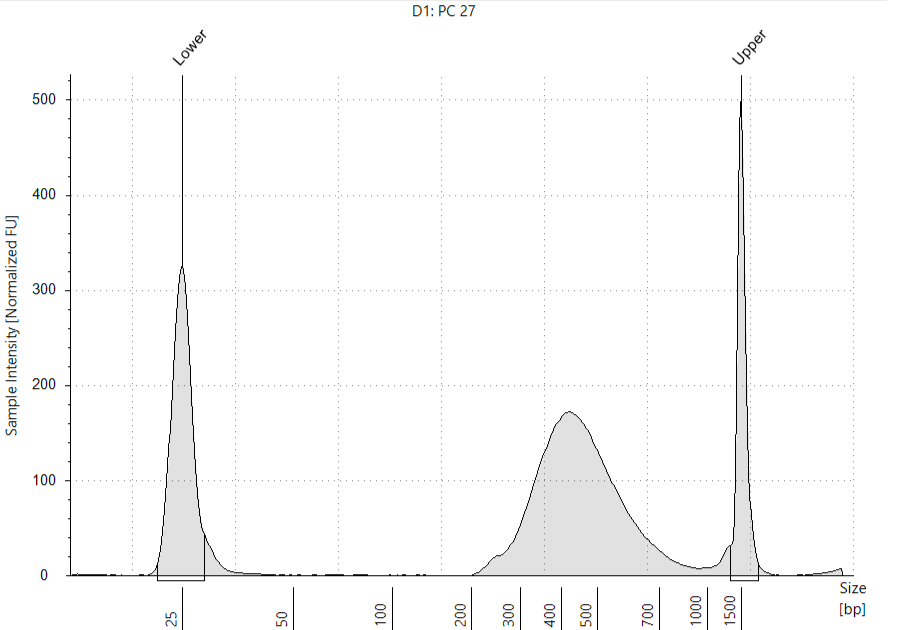

Single-cell RNA sequencing of *Phymatopus californicus* sample PC27
================
Andrea Elizabeth Acurio Armas, Bulah Wu, Petr Nguyen  
July 24, 2024

## Genome assembly and annotation

The *P. californicus* genome was sequenced in [Petr Nguyen’s
lab](https://www.entu.cas.cz/en/departments/department-of-ecology-and-conservation-biology/laboratory-of-evolutionary-genetics/)
using Oxford Nanopore technology and assembled with
[Flye](https://github.com/mikolmogorov/Flye). Annotation of the genome
was performed with [BRAKER3](https://github.com/Gaius-Augustus/BRAKER).
The RNA-seq data utilized include the publicly accessible
[SRR1021622](https://www.ncbi.nlm.nih.gov/sra/?term=SRR1021622) and
additional data provided by [Michal
Zurovec](https://www.entu.cas.cz/en/staff/profile/269-michalzurovec/).
Mitochondrial genome was identified by aligning the genome assembly
against the mt genomes of *Bombyx mori* and *Yponomeuta evonymella*
using [minimap2](https://github.com/lh3/minimap2). The annotation of mt
genome was carried out with
[mitos2](https://usegalaxy.org.au/root?tool_id=toolshed.g2.bx.psu.edu/repos/iuc/mitos2/mitos2/2.1.9+galaxy0)
on the Galaxy platform.

## Library preparation

The scRNA-seq library was prepared with the RNAdia 2.0 kit (Dolomite
Bio), following the manufacturer’s instructions. Approximately 8,000
cells were captured, and the size distribution of the library was
examined using the Bioanalyzer system.

<div class="figure" style="text-align: center">


<p class="caption">
Size distribution assessed by Bioanalyzer
</p>

</div>

## Quality control checks on raw reads

[FastQC](https://www.bioinformatics.babraham.ac.uk/projects/fastqc/) was
used for quality check. Output can be found
[here](fastqc/pc27_read1/fastqc.md) and
[here](fastqc/pc27_read2/fastqc.md).

## Drop-seq protocol

The digital expression matrix using the Drop-seq core computational
protocol developed by the McCarroll Lab
(<https://github.com/broadinstitute/Drop-seq>). Briefly, cell barcodes
(CBs) and unique molecular identifiers (UMIs) were identified from raw
reads. Reads with CBs/UMIs of low quality bases were removed, and 5’
primer and 3’ polyA sequences were trimmed. The reads were then aligned
to the reference genome using STAR aligner. Substitution and indel
errors in barcodes were repaired before the digital expression matrix
was created.

    #!/bin/bash
    #PBS -N pc27mito
    #PBS -l select=1:ncpus=16:mem=140gb:scratch_ssd=800gb
    #PBS -l walltime=24:00:00
    #PBS -m ae

    #export TMPDIR=$SCRATCHDIR
    DATADIR=/auto/plzen1/home/bulah/mao/scseq/dropseq/pc27mito
    echo "||| $HOSTNAME $SCRATCHDIR ||| (pc27mito) ||| ssh $HOSTNAME \"scp -rp bulah@$HOSTNAME:$SCRATCHDIR/* \$HOSTNAME:\$SCRATCHDIR\" |||" >> $DATADIR/jobid

    module add mambaforge picard star samtools
    mamba activate /auto/plzen1/home/bulah/.conda/envs/openjdk2201

    export ID=pc27mito
    export ASSEMBLY=/auto/plzen1/home/bulah/mao/braker3/phymatopus_californicus/genome_mao/repeatmodeler/phycal_genome_masked2.fa
    export ANNOTATION=/auto/plzen1/home/bulah/mao/braker3/phymatopus_californicus/genome_mao/braker3/phycal_mito.gtf
    export READ1=/auto/plzen1/home/bulah/mao/scseq/X201SC24042690-Z01-F001/X201SC24042690-Z01-F001/01.RawData/PC_27/PC_27_1.fq.gz
    export READ2=/auto/plzen1/home/bulah/mao/scseq/X201SC24042690-Z01-F001/X201SC24042690-Z01-F001/01.RawData/PC_27/PC_27_2.fq.gz

    mkdir -p $SCRATCHDIR/dropseq/genome $SCRATCHDIR/dropseq/project_${ID}/{tmp,raw,output_${ID}}
    export DROPSEQDIR=$SCRATCHDIR/dropseq
     export GENOMEDIR=$DROPSEQDIR/genome
     export WORKDIR=$DROPSEQDIR/project_${ID}
      export TMPDIR=$WORKDIR/tmp
      export RAWDIR=$WORKDIR/raw
      export OUTPUTDIR=$WORKDIR/output_${ID}
    export PATH=$PATH:$DROPSEQDIR/dropseq-3.0.1

    cd $DROPSEQDIR

    if [ ! -d "$DROPSEQDIR"/dropseq-3.0.1 ]; then
      wget https://github.com/broadinstitute/Drop-seq/releases/download/v3.0.1/dropseq-3.0.1.zip
      unzip dropseq-3.0.1.zip
      rm -rf dropseq-3.0.1.zip
    fi

    if [ ! -f "$GENOMEDIR"/genome.fa ]; then
      cp -rp $ASSEMBLY $GENOMEDIR/genome.fa
      STAR --runMode genomeGenerate --genomeDir $GENOMEDIR --genomeFastaFiles $GENOMEDIR/genome.fa --genomeSAindexNbases 13 --runThreadN $PBS_NCPUS
    fi

    if [ ! -f "$GENOMEDIR"/genome.gtf ]; then
      cp -rp $ANNOTATION $GENOMEDIR/genome.gtf
    fi

    if [ ! -f "$GENOMEDIR"/genome.dict ]; then
      picard CreateSequenceDictionary -R $GENOMEDIR/genome.fa --TMP_DIR $TMPDIR
    fi

    cp -rp $READ1 $RAWDIR/read1.fq.gz
    cp -rp $READ2 $RAWDIR/read2.fq.gz

    picard FastqToSam -F1 $RAWDIR/read1.fq.gz -F2 $RAWDIR/read2.fq.gz -O $OUTPUTDIR/unaligned.bam -SM ${ID} --TMP_DIR $TMPDIR

    TagBamWithReadSequenceExtended -SUMMARY $OUTPUTDIR/unaligned_tagged_Cellular.bam_summary.txt -BASE_RANGE 3-14 -BASE_QUALITY 10 -BARCODED_READ 1 -DISCARD_READ false -TAG_NAME XC \
    -NUM_BASES_BELOW_QUALITY 1 -INPUT $OUTPUTDIR/unaligned.bam -OUTPUT $OUTPUTDIR/unaligned_tagged_Cell.bam -TMP_DIR $TMPDIR

    TagBamWithReadSequenceExtended -SUMMARY $OUTPUTDIR/unaligned_tagged_Molecular.bam_summary.txt -BASE_RANGE 15-28 -BASE_QUALITY 10 -BARCODED_READ 1 -DISCARD_READ true -TAG_NAME XM \
    -NUM_BASES_BELOW_QUALITY 1 -INPUT $OUTPUTDIR/unaligned_tagged_Cell.bam -OUTPUT $OUTPUTDIR/unaligned_tagged_CellMolecular.bam -TMP_DIR $TMPDIR

    FilterBam -TAG_REJECT XQ -INPUT $OUTPUTDIR/unaligned_tagged_CellMolecular.bam -OUTPUT $OUTPUTDIR/unaligned_tagged_filtered.bam -SUMMARY $OUTPUTDIR/unaligned_tagged_filtered.bam_summary.txt -TMP_DIR $TMPDIR

    TrimStartingSequence -OUTPUT_SUMMARY $OUTPUTDIR/adapter_trimming_report.txt -SEQUENCE AAGCAGTGGTATCAACGCAGAGTGAATGGG -MISMATCHES 0 -NUM_BASES 5 -INPUT $OUTPUTDIR/unaligned_tagged_filtered.bam -OUTPUT $OUTPUTDIR/unaligned_tagged_trimmed_smart.bam -TMP_DIR $TMPDIR

    PolyATrimmer -OUTPUT $OUTPUTDIR/unaligned_mc_tagged_polyA_filtered.bam -OUTPUT_SUMMARY $OUTPUTDIR/polyA_trimming_report.txt -MISMATCHES 0 -NUM_BASES 6 -NEW true -INPUT $OUTPUTDIR/unaligned_tagged_trimmed_smart.bam -TMP_DIR $TMPDIR

    picard SamToFastq --INPUT $OUTPUTDIR/unaligned_mc_tagged_polyA_filtered.bam --FASTQ $OUTPUTDIR/unaligned_mc_tagged_polyA_filtered.fastq --TMP_DIR $TMPDIR

    STAR --genomeDir $GENOMEDIR --outFileNamePrefix $OUTPUTDIR/star --readFilesIn $OUTPUTDIR/unaligned_mc_tagged_polyA_filtered.fastq --runThreadN $PBS_NCPUS

    picard SortSam --INPUT $OUTPUTDIR/starAligned.out.sam --OUTPUT $OUTPUTDIR/aligned.sorted.bam --SORT_ORDER queryname --TMP_DIR $TMPDIR

    picard MergeBamAlignment --REFERENCE_SEQUENCE $GENOMEDIR/genome.fa --UNMAPPED_BAM $OUTPUTDIR/unaligned_mc_tagged_polyA_filtered.bam --ALIGNED_BAM $OUTPUTDIR/aligned.sorted.bam \
    --INCLUDE_SECONDARY_ALIGNMENTS false --PAIRED_RUN false --CLIP_ADAPTERS false --OUTPUT $OUTPUTDIR/merged.bam --TMP_DIR $TMPDIR

    TagReadWithGeneFunction -INPUT $OUTPUTDIR/merged.bam -OUTPUT $OUTPUTDIR/function_tagged.bam -ANNOTATIONS_FILE $GENOMEDIR/genome.gtf -TMP_DIR $TMPDIR

    DetectBeadSubstitutionErrors -INPUT $OUTPUTDIR/function_tagged.bam -OUTPUT $OUTPUTDIR/substitution_repaired.bam -MIN_UMIS_PER_CELL 20 -OUTPUT_REPORT $OUTPUTDIR/substitution_error_report.txt -NUM_THREADS $PBS_NCPUS -TMP_DIR $TMPDIR

    DetectBeadSynthesisErrors -INPUT $OUTPUTDIR/substitution_repaired.bam -MIN_UMIS_PER_CELL 20 -OUTPUT_STATS $OUTPUTDIR/synthesis_error_stats.txt -SUMMARY $OUTPUTDIR/synthesis_error_summary.txt \
    -PRIMER_SEQUENCE AAGCAGTGGTATCAACGCAGAGTAC -REPORT $OUTPUTDIR/synthesis_error_report.txt -CREATE_INDEX true -OUTPUT $OUTPUTDIR/final.bam -NUM_THREADS $PBS_NCPUS -TMP_DIR $TMPDIR

    DigitalExpression -INPUT $OUTPUTDIR/final.bam -OUTPUT $OUTPUTDIR/dge_c10k.txt.gz -SUMMARY $OUTPUTDIR/dge_c10k.summary.txt -NUM_CORE_BARCODES 10000 -TMP_DIR $TMPDIR

    DigitalExpression -INPUT $OUTPUTDIR/final.bam -OUTPUT $OUTPUTDIR/dge_t20.txt.gz -SUMMARY $OUTPUTDIR/dge_t20.summary.txt -MIN_NUM_TRANSCRIPTS_PER_CELL 20 -TMP_DIR $TMPDIR

    BamTagHistogram -INPUT $OUTPUTDIR/final.bam -OUTPUT $OUTPUTDIR/cell_readcounts.txt.gz -TAG XC -TMP_DIR $TMPDIR

    GatherMolecularBarcodeDistributionByGene -INPUT $OUTPUTDIR/final.bam -OUTPUT $OUTPUTDIR/gmbd.txt.gz -NUM_CORE_BARCODES 10000 -TMP_DIR $TMPDIR

## Knee-plot analysis

In the dot plot, the x-axis represents the cell barcodes (organized by
the number of reads, arranged from highest to lowest), and the y-axis
shows the cumulative fraction of uniquely mapped reads. The transition
from beads sampling cellular RNA to beads sampling ambient RNA is marked
by the inflection point ([Macosko et al.,
2015](http://dx.doi.org/10.1016/j.cell.2015.05.002)).

``` r
pc27=read.table("/media/nguyen/Data1/mao/scseq/dropseq/pc27mito/cell_readcounts.txt.gz", header=F, stringsAsFactors=F)
csum_pc27=cumsum(pc27$V1)
df_pc27 <- cbind.data.frame(xvalue=1:length(csum_pc27), yvalue=csum_pc27/max(csum_pc27))
ggplot(df_pc27, aes(xvalue, yvalue)) +
  geom_point(size=0.1, color="cornflowerblue") + scale_x_continuous(limits = c(0,50000))+
  geom_hline(aes(yintercept=df_pc27 %>% filter(xvalue==8000) %>% pull(yvalue)), color="brown", linetype=2)+
  geom_vline(aes(xintercept=8000), color="orange", linetype=3)+
  annotate("text", x=15000, y=0.25, label="(8000, 0.2998)")+ # 0.2998019
  labs(title=expression(italic(P.)~italic(californicus)~"PC27"), x="Cell barcodes sorted by number of reads [descending]", y="Cumulative fraction of reads") +
  theme_bw() +
  theme(axis.line = element_blank(),
        axis.title = element_text(color="black"),
        axis.text = element_text(color="black"),
        panel.grid.major = element_blank(),
        panel.grid.minor = element_blank(),
        panel.background = element_blank(),
        panel.border = element_rect(linewidth = 1, color="black"), aspect.ratio = 1)
```

<!-- -->

The plot indicates the top 8000 cells contribute nearly 30% of the total
uniquely mapped reads.

## DropletUtils analysis

[Nikos Konstantinides](https://konstantinides-lab.com) suggested using
[DropletUtils](https://doi.org/doi:10.18129/B9.bioc.DropletUtils) to
identify the knee and inflection points. Here the x-axis indicates the
cell barcodes (organized by the number of reads, arranged from highest
to lowest) and the y-axis the total UMI count for each barcode.

``` r
mtx_pc27 <- read.table("/media/nguyen/Data1/mao/scseq/dropseq/pc27mito/dge_c8k.txt.gz", header = TRUE, row.names = 1, colClasses =c("character", rep("numeric", 8000)))
br.out <- barcodeRanks(mtx_pc27)
o <- order(br.out$rank)
# metadata(br.out)$knee: 298
# metadata(br.out)$inflection : 134
# which(br.out$total==298)[1]
min_rank <- br.out$rank[which(br.out$total==298)[1]] # 5916.5
# which(br.out$total==134)[1]
max_rank <- br.out$rank[which(br.out$total==134)[1]] # 7494
ggplot()+
  geom_point(aes(x=br.out$rank, y=br.out$total+1), color="grey50", size=0.5, alpha=0.5)+
  geom_line(aes(x=br.out$rank[o],y=br.out$fitted[o]), color="magenta")+
  geom_hline(aes(yintercept=metadata(br.out)$knee), color="dodgerblue", linetype=2)+
  geom_hline(aes(yintercept=metadata(br.out)$inflection), color="brown", linetype=2)+
  geom_vline(aes(xintercept=min_rank), color="orange", linetype=3)+
  geom_vline(aes(xintercept=max_rank), color="orange", linetype=3)+
  annotate("text", x=2000, y=500, label="(5916.5, 298)")+
  annotate("text", x=20000, y=70, label="(7494, 134)")+
  scale_x_continuous(limits=c(1,50000), trans='log10', breaks = c(1,10,100,1000,10000,10000),labels = scales::number)+
  scale_y_continuous(limits=c(1,50000), trans='log10', breaks = c(1,10,100,1000,10000,10000),labels = scales::number)+
  labs(title=expression(italic(P.)~italic(californicus)~"PC27"),
       x="Cell barcodes sorted by number of counts [descending]",
       y="Total UMI count for each barcode") +
  theme_bw() +
  theme(axis.line = element_blank(),
        axis.title = element_text(color="black"),
        axis.text = element_text(color="black"),
        panel.grid.major = element_blank(),
        panel.grid.minor = element_blank(),
        panel.background = element_blank(),
        panel.border = element_rect(linewidth = 1, color="black"), aspect.ratio = 1)
```

<!-- -->

Cells below the knee point (5916.5) are considered empty droplets.

Subset the SingleCellExperiment object to discard the empty droplets.

``` r
set.seed(100)
e.out <- emptyDrops(mtx_pc27, niters=10000)
is.cell <- e.out$FDR <= 0.001
sum(is.cell, na.rm=TRUE)
```

    ## [1] 5919

In total 5919 cells are retained.

``` r
table(Limited=e.out$Limited, Significant=is.cell)
```

    ##        Significant
    ## Limited FALSE TRUE
    ##   FALSE  1576 5430
    ##   TRUE      0  489

The zero in the above table indicates no entry with false positives
frequency above the threshold 0.001 (Significant FALSE) can be achieved
by increasing the number of permutations (Limited TRUE). So the
parameter *niters=10000* is good.

``` r
mtx_pc27 <- mtx_pc27[,which(e.out$FDR<=0.001)]
ggplot(e.out %>% as.data.frame() %>% filter(!is.na(LogProb)) %>% mutate(FDR_fill=ifelse(FDR>0.001, "cornflowerblue", "orange")))+
  geom_point(aes(x=Total, y=-LogProb, color=FDR_fill), size=1, alpha=0.5)+
  scale_color_manual(values=c("cornflowerblue", "orange"), labels=c('FDR > 0.001', 'FDR <= 0.001'))+
  labs(title=expression(italic(P.)~italic(californicus)~"PC27"),
       x="Total UMI count",
       y="-Log Probability") +
  theme_bw() +
  theme(axis.line = element_blank(),
        axis.title = element_text(color="black"),
        axis.text = element_text(color="black"),
        legend.title = element_blank(),
        legend.position = "inside",
        legend.position.inside = c(0.8, 0.2),
        panel.grid.major = element_blank(),
        panel.grid.minor = element_blank(),
        panel.background = element_blank(),
        panel.border = element_rect(linewidth = 1, color="black"), aspect.ratio = 1)
```

<!-- -->

The retained droplets (orange color) should have large UMI counts and/or
large negative log probabilities.

## Analysis using Seurat

[Seurat v5](https://satijalab.org/seurat) was used to analyze the data.

First we filtered the data by dropping (1) features detected in less
than 3 cells or (2) cells with feature counts less than 200.

``` r
so_pc27_pre <- CreateSeuratObject(counts = mtx_pc27, min.cells = 3, min.features = 200, project = "pc27") %>%
               PercentageFeatureSet(pattern = "^agat|^rrn", col.name = "percent.mt")
```

The diagnostic plots below show the total number of unique molecules in
each cell (left), the total number of unique genes in each cell
(middle), and the percentage of reads mapped to the mitochondrial genome
(right).

<!-- -->

We further filtered cells (1) with feature counts larger than 2500 or
less than 200 or (2) with mitochondrial counts larger than 5%.

``` r
so_pc27 <- CreateSeuratObject(counts = mtx_pc27, min.cells = 3, min.features = 200, project = "pc27") %>%
           PercentageFeatureSet(pattern = "^agat|^rrn", col.name = "percent.mt") %>%
           subset(subset = nFeature_RNA > 200 & nFeature_RNA < 2500 & percent.mt < 5)
```

We checked the diagnostic plots after filtering.

<!-- -->

UMAP clustering of data from 5903 cells revealed 12 cell clusters.

``` r
so_pc27 <- CreateSeuratObject(counts = mtx_pc27, min.cells = 3, min.features = 200, project = "pc27") %>%
           PercentageFeatureSet(pattern = "^agat|^rrn", col.name = "percent.mt") %>%
           subset(subset = nFeature_RNA > 200 & nFeature_RNA < 2500 & percent.mt < 5) %>%
           SCTransform(vars.to.regress = "percent.mt") %>%
           RunPCA() %>%
           FindNeighbors(dims = 1:30) %>%
           RunUMAP(dims = 1:30) %>%
           FindClusters()
```

    ## Modularity Optimizer version 1.3.0 by Ludo Waltman and Nees Jan van Eck
    ## 
    ## Number of nodes: 5903
    ## Number of edges: 163017
    ## 
    ## Running Louvain algorithm...
    ## Maximum modularity in 10 random starts: 0.7222
    ## Number of communities: 12
    ## Elapsed time: 0 seconds

``` r
df_umap <- so_pc27@reductions$umap@cell.embeddings %>% as.data.frame() %>% cbind(color=so_pc27@meta.data$seurat_clusters)
#length(unique(df_umap$color))
my_color <- c(brewer.pal(name="Set2", n=8),brewer.pal(name="Dark2", n=8))[c(1,3,2,4,5,6,7,8,12,14,15,16)]

ggplot(df_umap) +
  geom_point(aes(x=umap_1, y=umap_2, color=color), size=0.8) +
  geom_text_repel(data=df_umap %>% group_by(color) %>% summarise(q1=quantile(umap_1, 0.5), q2=quantile(umap_2, 0.5)),
                  aes(x=q1, y=q2, label = LETTERS[1:12]), size=8) +
  labs(title=expression(italic(P.)~italic(californicus)~"PC27"),
       x="UMAP_1",
       y="UMAP_2") +
  scale_color_manual(values = my_color, name="clusters", labels=LETTERS[1:12]) +
  guides(color = guide_legend(override.aes = list(size = 5))) +
  theme_bw() +
  theme(axis.line = element_blank(),
        axis.title = element_text(color="black"),
        axis.text = element_text(color="black"),
        legend.title = element_text(size=10),
        legend.background=element_blank(),
        legend.justification=c(1, 0.85),
        panel.grid.major = element_blank(),
        panel.grid.minor = element_blank(),
        panel.background = element_blank(),
        panel.border = element_rect(linewidth = 1, color="black"), aspect.ratio = 1)
```

<!-- -->

Genes differentially expressed among each cluster were selected as
marker genes.

``` r
so_pc27.markers <- FindAllMarkers(so_pc27, only.pos = TRUE, logfc.threshold = 0.25)
so_pc27.markers %>% arrange(desc(avg_log2FC)) %>% group_by(cluster) %>% dplyr::slice(1:3) %>% as.data.frame()
```

    ##            p_val avg_log2FC pct.1 pct.2    p_val_adj cluster   gene
    ## 1   7.956664e-03  1.0288406 0.014 0.007 1.000000e+00       0  g1774
    ## 2   6.830897e-03  0.7542182 0.024 0.014 1.000000e+00       0  g2209
    ## 3   2.122340e-39  0.7255884 0.510 0.361 1.502829e-35       0  g5339
    ## 4   1.519603e-03  1.8187578 0.010 0.003 1.000000e+00       1  g1916
    ## 5   2.987124e-04  1.6838283 0.013 0.004 1.000000e+00       1  g8907
    ## 6   1.450106e-03  1.6703660 0.011 0.004 1.000000e+00       1  g3311
    ## 7   6.749225e-05  2.3644815 0.013 0.003 4.779126e-01       2  g2578
    ## 8   7.878834e-04  2.3238395 0.010 0.002 1.000000e+00       2  g4199
    ## 9   4.093920e-04  2.1014471 0.013 0.003 1.000000e+00       2  g4375
    ## 10  1.394190e-08  3.7368137 0.013 0.001 9.872259e-05       3  g3524
    ## 11  1.056898e-06  3.5144213 0.011 0.001 7.483897e-03       3  g7683
    ## 12  3.689390e-08  3.3444963 0.015 0.001 2.612457e-04       3  g5139
    ## 13  5.814505e-11  5.3010228 0.011 0.000 4.117251e-07       4 g11187
    ## 14  5.814505e-11  5.3010228 0.011 0.000 4.117251e-07       4  g2693
    ## 15  1.560344e-12  5.0379884 0.014 0.000 1.104880e-08       4 g10580
    ## 16  5.751871e-09  4.6178928 0.013 0.001 4.072900e-05       5  g4490
    ## 17  9.503783e-07  4.0329303 0.013 0.001 6.729629e-03       5  g1090
    ## 18  2.070255e-05  3.6178928 0.013 0.001 1.465947e-01       5  g1939
    ## 19  4.065925e-19  5.6868790 0.022 0.000 2.879081e-15       6   g376
    ## 20  9.296343e-61  5.5348759 0.086 0.002 6.582741e-57       6  g5525
    ## 21  5.288193e-22  5.5348759 0.027 0.001 3.744569e-18       6  g2271
    ## 22  7.063995e-09  5.0224093 0.019 0.001 5.002015e-05       7  g3339
    ## 23  1.102204e-07  4.7593749 0.019 0.001 7.804707e-04       7  g3677
    ## 24  4.649946e-05  4.0224093 0.019 0.002 3.292627e-01       7  g1361
    ## 25  7.711800e-64  8.4146231 0.049 0.000 5.460726e-60       8  g1235
    ## 26  6.018271e-18  6.4146231 0.020 0.000 4.261538e-14       8  g5597
    ## 27 4.820013e-101  5.9740505 0.167 0.003 3.413051e-97       8   g266
    ## 28  1.774111e-85  7.5645368 0.085 0.000 1.256248e-81       9  g9985
    ## 29  2.478590e-83  7.1494993 0.098 0.001 1.755090e-79       9  g4216
    ## 30  7.920378e-77  7.1494993 0.085 0.001 5.608419e-73       9  g8812
    ## 31  3.133901e-21  6.4272512 0.039 0.001 2.219115e-17      10 g10572
    ## 32  1.226785e-09  6.2573262 0.020 0.000 8.686861e-06      10  g3032
    ## 33  1.226785e-09  6.2573262 0.020 0.000 8.686861e-06      10  g4724
    ## 34  3.050123e-53  8.4747507 0.061 0.000 2.159792e-49      11 g10450
    ## 35  4.018324e-71  7.8897882 0.091 0.000 2.845375e-67      11 g10454
    ## 36  4.018324e-71  7.8897882 0.091 0.000 2.845375e-67      11  g6509

The above table shows, in each cluster, three genes with largest average
log2 fold-change value (avg_log2FC). We can visualize the marker gene
expression (from left to right: top1, top2, top3).

<!-- -->

We noticed the high adjusted *P*-value (p_val_adj) for marker genes in
cluster 0, 1 and 2, so we filtered genes with p_val_adj \>= 0.05

``` r
so_pc27.markers %>% filter(p_val_adj < 0.05) %>% arrange(desc(avg_log2FC)) %>% group_by(cluster) %>% dplyr::slice(1:3) %>% as.data.frame()
```

    ##            p_val avg_log2FC pct.1 pct.2    p_val_adj cluster         gene
    ## 1   2.122340e-39  0.7255884 0.510 0.361 1.502829e-35       0        g5339
    ## 2   1.669333e-17  0.6499854 0.116 0.055 1.182055e-13       0        g7661
    ## 3   1.378796e-10  0.6175579 0.189 0.128 9.763252e-07       0        g4983
    ## 4   1.195480e-32  0.6436828 0.682 0.538 8.465195e-29       1 agat-exon-39
    ## 5   6.307277e-47  0.6093811 0.854 0.719 4.466183e-43       1 agat-exon-31
    ## 6   7.221126e-34  0.6084325 0.750 0.616 5.113279e-30       1 agat-exon-34
    ## 7   5.519976e-06  1.9315221 0.024 0.007 3.908695e-02       2       g11003
    ## 8   7.215745e-08  1.8436493 0.036 0.010 5.109469e-04       2        g4159
    ## 9   8.643001e-12  1.6905140 0.068 0.022 6.120109e-08       2        g2901
    ## 10  1.394190e-08  3.7368137 0.013 0.001 9.872259e-05       3        g3524
    ## 11  1.056898e-06  3.5144213 0.011 0.001 7.483897e-03       3        g7683
    ## 12  3.689390e-08  3.3444963 0.015 0.001 2.612457e-04       3        g5139
    ## 13  5.814505e-11  5.3010228 0.011 0.000 4.117251e-07       4       g11187
    ## 14  5.814505e-11  5.3010228 0.011 0.000 4.117251e-07       4        g2693
    ## 15  1.560344e-12  5.0379884 0.014 0.000 1.104880e-08       4       g10580
    ## 16  5.751871e-09  4.6178928 0.013 0.001 4.072900e-05       5        g4490
    ## 17  9.503783e-07  4.0329303 0.013 0.001 6.729629e-03       5        g1090
    ## 18  5.371700e-06  3.3548584 0.017 0.002 3.803700e-02       5        g9678
    ## 19  4.065925e-19  5.6868790 0.022 0.000 2.879081e-15       6         g376
    ## 20  9.296343e-61  5.5348759 0.086 0.002 6.582741e-57       6        g5525
    ## 21  5.288193e-22  5.5348759 0.027 0.001 3.744569e-18       6        g2271
    ## 22  7.063995e-09  5.0224093 0.019 0.001 5.002015e-05       7        g3339
    ## 23  1.102204e-07  4.7593749 0.019 0.001 7.804707e-04       7        g3677
    ## 24  9.578482e-07  3.8524843 0.028 0.002 6.782523e-03       7        g7793
    ## 25  7.711800e-64  8.4146231 0.049 0.000 5.460726e-60       8        g1235
    ## 26  6.018271e-18  6.4146231 0.020 0.000 4.261538e-14       8        g5597
    ## 27 4.820013e-101  5.9740505 0.167 0.003 3.413051e-97       8         g266
    ## 28  1.774111e-85  7.5645368 0.085 0.000 1.256248e-81       9        g9985
    ## 29  2.478590e-83  7.1494993 0.098 0.001 1.755090e-79       9        g4216
    ## 30  7.920378e-77  7.1494993 0.085 0.001 5.608419e-73       9        g8812
    ## 31  3.133901e-21  6.4272512 0.039 0.001 2.219115e-17      10       g10572
    ## 32  1.226785e-09  6.2573262 0.020 0.000 8.686861e-06      10        g3032
    ## 33  1.226785e-09  6.2573262 0.020 0.000 8.686861e-06      10        g4724
    ## 34  3.050123e-53  8.4747507 0.061 0.000 2.159792e-49      11       g10450
    ## 35  4.018324e-71  7.8897882 0.091 0.000 2.845375e-67      11       g10454
    ## 36  4.018324e-71  7.8897882 0.091 0.000 2.845375e-67      11        g6509

We can visualize the marker gene expression with filtered data.

<!-- -->

The below table shows top10 marker genes in each cluster with inferred
gene names derived from annotated reference genomes *Bombyx mori*,
*Danaus plexippus*, and *Plutella xylostella*.

``` r
selected_markers <- so_pc27.markers %>% filter(p_val_adj < 0.05) %>% arrange(desc(avg_log2FC)) %>% group_by(cluster) %>% dplyr::slice(1:10)
gene_name <- read.delim("/media/nguyen/Data1/mao/braker3/phymatopus_californicus/genome_mao/annotation/gene_name/anno_combo_mito", header = F)
selected_markers %>% inner_join(gene_name, by=join_by(gene == V1)) %>% select(!c(V2,V3,V5,V6,V7,V8)) %>% rename(V4="Bombyx_mori") %>% as.data.frame()
```

    ##             p_val avg_log2FC pct.1 pct.2     p_val_adj cluster         gene
    ## 1    2.122340e-39  0.7255884 0.510 0.361  1.502829e-35       0        g5339
    ## 2    1.669333e-17  0.6499854 0.116 0.055  1.182055e-13       0        g7661
    ## 3    1.378796e-10  0.6175579 0.189 0.128  9.763252e-07       0        g4983
    ## 4    8.455256e-20  0.6008051 0.358 0.255  5.987167e-16       0        g6722
    ## 5    1.636180e-08  0.5723704 0.148 0.100  1.158579e-04       0         g926
    ## 6    4.736761e-08  0.5643344 0.142 0.096  3.354101e-04       0       g10497
    ## 7    5.229200e-10  0.5398932 0.182 0.123  3.702797e-06       0        g4885
    ## 8    9.222254e-08  0.5206353 0.145 0.099  6.530278e-04       0        g1649
    ## 9    3.852708e-11  0.5006844 0.264 0.193  2.728103e-07       0        g7745
    ## 10   8.754549e-10  0.4993364 0.263 0.199  6.199096e-06       0        g5858
    ## 11   1.195480e-32  0.6436828 0.682 0.538  8.465195e-29       1 agat-exon-39
    ## 12   6.307277e-47  0.6093811 0.854 0.719  4.466183e-43       1 agat-exon-31
    ## 13   7.221126e-34  0.6084325 0.750 0.616  5.113279e-30       1 agat-exon-34
    ## 14   1.051549e-10  0.5532641 0.330 0.245  7.446022e-07       1 agat-exon-35
    ## 15   5.887093e-06  0.3810278 0.314 0.253  4.168650e-02       1        g3567
    ## 16   5.519976e-06  1.9315221 0.024 0.007  3.908695e-02       2       g11003
    ## 17   7.215745e-08  1.8436493 0.036 0.010  5.109469e-04       2        g4159
    ## 18   8.643001e-12  1.6905140 0.068 0.022  6.120109e-08       2        g2901
    ## 19   6.259362e-07  1.6864096 0.037 0.012  4.432254e-03       2        g9673
    ## 20   4.261790e-07  1.6195781 0.044 0.015  3.017774e-03       2       g10587
    ## 21   6.988329e-38  1.5583762 0.278 0.101  4.948436e-34       2        g3804
    ## 22   8.826545e-07  1.4593407 0.050 0.019  6.250077e-03       2        g3934
    ## 23   2.681935e-09  1.4058405 0.071 0.027  1.899078e-05       2         g979
    ## 24   1.010962e-29  1.4003267 0.245 0.094  7.158619e-26       2        g3932
    ## 25   5.921977e-06  1.3974319 0.047 0.019  4.193352e-02       2        g8423
    ## 26   1.394190e-08  3.7368137 0.013 0.001  9.872259e-05       3        g3524
    ## 27   1.056898e-06  3.5144213 0.011 0.001  7.483897e-03       3        g7683
    ## 28   3.689390e-08  3.3444963 0.015 0.001  2.612457e-04       3        g5139
    ## 29   5.001449e-06  3.2920289 0.011 0.001  3.541526e-02       3        g3578
    ## 30   5.001449e-06  3.2920289 0.011 0.001  3.541526e-02       3         g920
    ## 31   1.035563e-10  3.2734132 0.021 0.002  7.332824e-07       3       g10168
    ## 32   2.903144e-13  3.2343134 0.027 0.003  2.055716e-09       3        g2507
    ## 33   1.466609e-07  3.1924932 0.015 0.002  1.038506e-03       3        g5116
    ## 34   4.947444e-07  3.0549897 0.015 0.002  3.503285e-03       3         g148
    ## 35   5.244150e-06  2.9998481 0.013 0.002  3.713382e-02       3        g6315
    ## 36   5.814505e-11  5.3010228 0.011 0.000  4.117251e-07       4       g11187
    ## 37   5.814505e-11  5.3010228 0.011 0.000  4.117251e-07       4        g2693
    ## 38   1.560344e-12  5.0379884 0.014 0.000  1.104880e-08       4       g10580
    ## 39   1.560344e-12  5.0379884 0.014 0.000  1.104880e-08       4        g3642
    ## 40   8.570857e-09  4.7160603 0.011 0.000  6.069024e-05       4       g10868
    ## 41   8.570857e-09  4.7160603 0.011 0.000  6.069024e-05       4        g2647
    ## 42   8.570857e-09  4.7160603 0.011 0.000  6.069024e-05       4        g9611
    ## 43   1.543147e-16  4.4936679 0.025 0.001  1.092703e-12       4        g9452
    ## 44   2.421186e-07  4.3010228 0.011 0.001  1.714442e-03       4        g1915
    ## 45   2.421186e-07  4.3010228 0.011 0.001  1.714442e-03       4        g2047
    ## 46   5.751871e-09  4.6178928 0.013 0.001  4.072900e-05       5        g4490
    ## 47   9.503783e-07  4.0329303 0.013 0.001  6.729629e-03       5        g1090
    ## 48   5.371700e-06  3.3548584 0.017 0.002  3.803700e-02       5        g9678
    ## 49   2.480025e-06  3.1153924 0.022 0.003  1.756105e-02       5        g3637
    ## 50   3.862274e-07  2.6585348 0.035 0.006  2.734876e-03       5        g9402
    ## 51   4.661385e-06  2.2959647 0.039 0.009  3.300726e-02       5        g1769
    ## 52   1.194213e-06  2.2699695 0.043 0.010  8.456225e-03       5       g11119
    ## 53   6.346992e-06  2.2673955 0.039 0.009  4.494305e-02       5        g2777
    ## 54   3.915417e-06  2.1946813 0.043 0.010  2.772507e-02       5          g59
    ## 55   5.159168e-06  2.1704338 0.043 0.010  3.653207e-02       5        g4902
    ## 56   4.065925e-19  5.6868790 0.022 0.000  2.879081e-15       6         g376
    ## 57   9.296343e-61  5.5348759 0.086 0.002  6.582741e-57       6        g5525
    ## 58   5.288193e-22  5.5348759 0.027 0.001  3.744569e-18       6        g2271
    ## 59   5.238981e-25  5.4353403 0.032 0.001  3.709722e-21       6        g4668
    ## 60   4.366541e-11  4.9499134 0.016 0.001  3.091948e-07       6        g7185
    ## 61   7.427284e-08  4.9499134 0.011 0.000  5.259260e-04       6       g10596
    ## 62   7.427284e-08  4.9499134 0.011 0.000  5.259260e-04       6        g1129
    ## 63   7.427284e-08  4.9499134 0.011 0.000  5.259260e-04       6        g4521
    ## 64   7.427284e-08  4.9499134 0.011 0.000  5.259260e-04       6        g8336
    ## 65  3.250835e-125  4.6586821 0.286 0.016 2.301916e-121       6        g8953
    ## 66   7.063995e-09  5.0224093 0.019 0.001  5.002015e-05       7        g3339
    ## 67   1.102204e-07  4.7593749 0.019 0.001  7.804707e-04       7        g3677
    ## 68   9.578482e-07  3.8524843 0.028 0.002  6.782523e-03       7        g7793
    ## 69   2.122721e-06  3.3264155 0.037 0.004  1.503098e-02       7        g4662
    ## 70   2.657789e-68  2.4933147 1.000 0.824  1.881980e-64       7        g5827
    ## 71   2.029303e-06  2.4057379 0.075 0.016  1.436949e-02       7          g46
    ## 72   5.395992e-06  1.6772259 0.140 0.046  3.820902e-02       7        g2119
    ## 73   1.807837e-07  1.1308757 0.458 0.254  1.280129e-03       7        g9424
    ## 74   1.279971e-06  0.8997085 0.458 0.252  9.063475e-03       7        g4231
    ## 75   7.711800e-64  8.4146231 0.049 0.000  5.460726e-60       8        g1235
    ## 76   6.018271e-18  6.4146231 0.020 0.000  4.261538e-14       8        g5597
    ## 77  4.820013e-101  5.9740505 0.167 0.003  3.413051e-97       8         g266
    ## 78   1.262794e-13  5.8296606 0.020 0.000  8.941846e-10       8       g10238
    ## 79   1.620375e-07  5.8296606 0.010 0.000  1.147388e-03       8       g11214
    ## 80   1.620375e-07  5.8296606 0.010 0.000  1.147388e-03       8        g2501
    ## 81   8.828016e-41  5.6597356 0.069 0.001  6.251118e-37       8        g3081
    ## 82   7.539472e-23  5.5666262 0.039 0.001  5.338700e-19       8        g1891
    ## 83   3.696037e-38  5.5077325 0.069 0.002  2.617164e-34       8        g4397
    ## 84   6.575890e-17  5.5077325 0.029 0.001  4.656387e-13       8        g1626
    ## 85   1.774111e-85  7.5645368 0.085 0.000  1.256248e-81       9        g9985
    ## 86   2.478590e-83  7.1494993 0.098 0.001  1.755090e-79       9        g4216
    ## 87   7.920378e-77  7.1494993 0.085 0.001  5.608419e-73       9        g8812
    ## 88   1.599518e-42  6.8864649 0.049 0.000  1.132618e-38       9         g283
    ## 89   1.445287e-20  6.7344618 0.073 0.004  1.023408e-16       9        g1832
    ## 90   7.945066e-57  6.6640725 0.110 0.002  5.625901e-53       9        g1560
    ## 91   4.036752e-29  6.5645368 0.037 0.000  2.858424e-25       9        g8550
    ## 92   1.875788e-36  6.4714274 0.049 0.001  1.328245e-32       9        g3547
    ## 93   1.875788e-36  6.4714274 0.049 0.001  1.328245e-32       9        g9494
    ## 94   6.738386e-32  6.1494993 0.049 0.001  4.771451e-28       9        g4429
    ## 95   3.133901e-21  6.4272512 0.039 0.001  2.219115e-17      10       g10572
    ## 96   1.226785e-09  6.2573262 0.020 0.000  8.686861e-06      10        g3032
    ## 97   1.226785e-09  6.2573262 0.020 0.000  8.686861e-06      10        g4724
    ## 98   8.204859e-18  6.1053231 0.039 0.001  5.809861e-14      10        g3942
    ## 99   1.824964e-07  5.8422887 0.020 0.001  1.292257e-03      10        g1797
    ## 100  1.824964e-07  5.8422887 0.020 0.001  1.292257e-03      10        g2005
    ## 101  1.824964e-07  5.8422887 0.020 0.001  1.292257e-03      10        g5564
    ## 102  1.824964e-07  5.8422887 0.020 0.001  1.292257e-03      10        g7536
    ## 103  3.759282e-06  5.5203606 0.020 0.001  2.661947e-02      10       g10119
    ## 104  3.759282e-06  5.5203606 0.020 0.001  2.661947e-02      10       g10796
    ## 105  3.050123e-53  8.4747507 0.061 0.000  2.159792e-49      11       g10450
    ## 106  4.018324e-71  7.8897882 0.091 0.000  2.845375e-67      11       g10454
    ## 107  4.018324e-71  7.8897882 0.091 0.000  2.845375e-67      11        g6509
    ## 108  2.180377e-59  7.7966788 0.091 0.001  1.543925e-55      11        g1109
    ## 109 1.223446e-108  7.7377851 0.152 0.001 8.663219e-105      11       g10751
    ## 110  5.453124e-51  7.4747507 0.091 0.001  3.861357e-47      11        g5639
    ## 111  5.789284e-63  7.4747507 0.121 0.001  4.099392e-59      11        g9930
    ## 112  2.281624e-59  7.4747507 0.091 0.001  1.615618e-55      11       g10449
    ## 113  2.281624e-59  7.4747507 0.091 0.001  1.615618e-55      11        g4013
    ## 114  2.281624e-59  7.4747507 0.091 0.001  1.615618e-55      11        g4820
    ##                                                                                Bombyx_mori
    ## 1                               2-iminobutanoate/2-iminopropanoate deaminase [Bombyx mori]
    ## 2                                                                                    NoHit
    ## 3                                                      ribosomal protein S18 [Bombyx mori]
    ## 4                                                      ribosomal protein S25 [Bombyx mori]
    ## 5                                                          acylphosphatase-1 [Bombyx mori]
    ## 6                                                      ribosomal protein L22 [Bombyx mori]
    ## 7                                                      ribosomal protein S24 [Bombyx mori]
    ## 8                                                      ribosomal protein S23 [Bombyx mori]
    ## 9                                                      ribosomal protein L26 [Bombyx mori]
    ## 10                           small ribosomal subunit protein uS11 isoform X1 [Bombyx mori]
    ## 11                                                                                nad4_0-a
    ## 12                                                                                  nad1_0
    ## 13                                                                                     cob
    ## 14                                                                                    nad6
    ## 15                                          ovarian tumor protein isoform X2 [Bombyx mori]
    ## 16                                     cyclin-dependent kinase 14 isoform X4 [Bombyx mori]
    ## 17                            paternally-expressed gene 3 protein isoform X2 [Bombyx mori]
    ## 18                                          RWD domain-containing protein 2A [Bombyx mori]
    ## 19                                                          terpene synthase [Bombyx mori]
    ## 20                                                         seipin isoform X2 [Bombyx mori]
    ## 21                                                                                   NoHit
    ## 22                                                       fatty acid synthase [Bombyx mori]
    ## 23                                                                                   NoHit
    ## 24                         poly(A) RNA polymerase gld-2 homolog A isoform X1 [Bombyx mori]
    ## 25                                        zinc finger protein OZF isoform X4 [Bombyx mori]
    ## 26                                                                                   NoHit
    ## 27  acidic fibroblast growth factor intracellular-binding protein isoform X1 [Bombyx mori]
    ## 28                potential E3 ubiquitin-protein ligase ariadne-2 isoform X1 [Bombyx mori]
    ## 29                                                           fez1 isoform X2 [Bombyx mori]
    ## 30                         inositol polyphosphate 5-phosphatase K isoform X2 [Bombyx mori]
    ## 31                    CDP-diacylglycerol--inositol 3-phosphatidyltransferase [Bombyx mori]
    ## 32                nicotinic acetylcholine receptor subunit alpha 9 precursor [Bombyx mori]
    ## 33                                                   zinc finger protein 431 [Bombyx mori]
    ## 34               very long-chain-fatty-acid--CoA ligase bubblegum isoform X3 [Bombyx mori]
    ## 35                                   phosphoribosyl pyrophosphate synthetase [Bombyx mori]
    ## 36                             mitochondrial coenzyme A transporter SLC25A42 [Bombyx mori]
    ## 37                                ATP-binding cassette sub-family D member 1 [Bombyx mori]
    ## 38                                                  lactoylglutathione lyase [Bombyx mori]
    ## 39                                      uncharacterized protein LOC101744175 [Bombyx mori]
    ## 40                                      adenylate cyclase type 10 isoform X1 [Bombyx mori]
    ## 41                                           WD repeat-containing protein 37 [Bombyx mori]
    ## 42                           uncharacterized protein LOC101742072 isoform X2 [Bombyx mori]
    ## 43                                                 proteasome 25 kDa subunit [Bombyx mori]
    ## 44                            transcriptional repressor p66-alpha isoform X2 [Bombyx mori]
    ## 45                                                                  syndetin [Bombyx mori]
    ## 46                                                      galactose mutarotase [Bombyx mori]
    ## 47                                   fatty acyl-CoA reductase wat isoform X2 [Bombyx mori]
    ## 48                                        neuropeptide receptor B3 precursor [Bombyx mori]
    ## 49                                  zinc finger protein 1 homolog isoform X2 [Bombyx mori]
    ## 50                                    serine protease inhibitor 2 isoform X7 [Bombyx mori]
    ## 51                                                   zinc finger protein 271 [Bombyx mori]
    ## 52                                     unconventional myosin-IXAa isoform X1 [Bombyx mori]
    ## 53                                                   allantoinase isoform X1 [Bombyx mori]
    ## 54                                                    syntaxin-17 isoform X2 [Bombyx mori]
    ## 55                                      uncharacterized protein LOC101740212 [Bombyx mori]
    ## 56                                                                                   NoHit
    ## 57                                        leucyl aminopeptidase-like protein [Bombyx mori]
    ## 58                                                serine protease Hayan-like [Bombyx mori]
    ## 59                  vascular endothelial growth factor receptor 1 isoform X3 [Bombyx mori]
    ## 60                                 histone-arginine methyltransferase CARMER [Bombyx mori]
    ## 61                                           MRN complex-interacting protein [Bombyx mori]
    ## 62                                   serine protease inhibitor 2 isoform X10 [Bombyx mori]
    ## 63                                                                exportin-4 [Bombyx mori]
    ## 64                                                             tetraspanin E [Bombyx mori]
    ## 65                                      uncharacterized protein LOC101741592 [Bombyx mori]
    ## 66                       glutamate receptor ionotropic, kainate 3 isoform X1 [Bombyx mori]
    ## 67                                    MOB kinase activator-like 1 isoform X1 [Bombyx mori]
    ## 68                                                                                   NoHit
    ## 69                                     sphingolipid delta(4)-desaturase DES1 [Bombyx mori]
    ## 70                                  jupiter microtubule associated homolog 1 [Bombyx mori]
    ## 71                                                   actin-related protein 5 [Bombyx mori]
    ## 72               NADH dehydrogenase [ubiquinone] 1 beta subcomplex subunit 7 [Bombyx mori]
    ## 73                                         S-phase kinase-associated protein [Bombyx mori]
    ## 74                                      uncharacterized protein LOC101741756 [Bombyx mori]
    ## 75                                                 protein abrupt isoform X2 [Bombyx mori]
    ## 76                                       E3 ubiquitin-protein ligase MARCHF6 [Bombyx mori]
    ## 77                                     DNA replication licensing factor Mcm6 [Bombyx mori]
    ## 78                                                              protein wech [Bombyx mori]
    ## 79                             transmembrane channel-like protein isoform X2 [Bombyx mori]
    ## 80                                                    fibrillin-1 isoform X2 [Bombyx mori]
    ## 81                                 transducin beta-like protein 2 isoform X2 [Bombyx mori]
    ## 82                                      uncharacterized protein LOC101738116 [Bombyx mori]
    ## 83                            minichromosome maintenance complex component 7 [Bombyx mori]
    ## 84                                          netrin receptor UNC5C isoform X2 [Bombyx mori]
    ## 85                                   facilitated trehalose transporter Tret1 [Bombyx mori]
    ## 86                           uncharacterized protein LOC101739889 isoform X1 [Bombyx mori]
    ## 87                                    lysosomal alpha-mannosidase isoform X3 [Bombyx mori]
    ## 88                           ML-domain containing secreted protein precursor [Bombyx mori]
    ## 89                                                collagen alpha-1(IV) chain [Bombyx mori]
    ## 90                                      uncharacterized protein LOC101737413 [Bombyx mori]
    ## 91                                                                                   NoHit
    ## 92                           uncharacterized protein LOC101737983 isoform X9 [Bombyx mori]
    ## 93                                                                    fringe [Bombyx mori]
    ## 94                                aldo-keto reductase AKR2E4-like isoform X2 [Bombyx mori]
    ## 95             bifunctional heparan sulfate N-deacetylase/N-sulfotransferase [Bombyx mori]
    ## 96                                           kelch-like protein 5 isoform X1 [Bombyx mori]
    ## 97                                          cytochrome P450 CYP4L6 precursor [Bombyx mori]
    ## 98                                          chemosensory protein 6 precursor [Bombyx mori]
    ## 99                                                            cryptochrome-1 [Bombyx mori]
    ## 100                          uncharacterized protein LOC101747119 isoform X2 [Bombyx mori]
    ## 101                 GATA zinc finger domain-containing protein 14 isoform X2 [Bombyx mori]
    ## 102                                  splicing factor 3A subunit 1 isoform X1 [Bombyx mori]
    ## 103                                               cytochrome P450 isoform X1 [Bombyx mori]
    ## 104                                           serine protease HP21 precursor [Bombyx mori]
    ## 105                   cytochrome P450, family 9, subfamily a, polypeptide 19 [Bombyx mori]
    ## 106                                                     cytochrome P450 9a20 [Bombyx mori]
    ## 107                                                                                  NoHit
    ## 108 thiosulfate sulfurtransferase/rhodanese-like domain-containing protein 3 [Bombyx mori]
    ## 109                                 clip domain serine protease 11 precursor [Bombyx mori]
    ## 110                                                                axotactin [Bombyx mori]
    ## 111               SPARC-related modular calcium-binding protein 1 isoform X2 [Bombyx mori]
    ## 112                   cytochrome P450, family 9, subfamily a, polypeptide 19 [Bombyx mori]
    ## 113                                     uncharacterized protein LOC134199480 [Bombyx mori]
    ## 114                               putative inorganic phosphate cotransporter [Bombyx mori]

## Session info

    ## R version 4.3.3 (2024-02-29)
    ## Platform: x86_64-conda-linux-gnu (64-bit)
    ## Running under: Ubuntu 22.04.4 LTS
    ## 
    ## Matrix products: default
    ## BLAS/LAPACK: /home/nguyen/miniforge-pypy3/envs/seurat510/lib/libopenblasp-r0.3.27.so;  LAPACK version 3.12.0
    ## 
    ## locale:
    ##  [1] LC_CTYPE=en_US.UTF-8       LC_NUMERIC=C              
    ##  [3] LC_TIME=en_GB.UTF-8        LC_COLLATE=en_US.UTF-8    
    ##  [5] LC_MONETARY=en_GB.UTF-8    LC_MESSAGES=en_US.UTF-8   
    ##  [7] LC_PAPER=en_GB.UTF-8       LC_NAME=C                 
    ##  [9] LC_ADDRESS=C               LC_TELEPHONE=C            
    ## [11] LC_MEASUREMENT=en_GB.UTF-8 LC_IDENTIFICATION=C       
    ## 
    ## time zone: Europe/Prague
    ## tzcode source: system (glibc)
    ## 
    ## attached base packages:
    ## [1] stats4    stats     graphics  grDevices utils     datasets  methods  
    ## [8] base     
    ## 
    ## other attached packages:
    ##  [1] RColorBrewer_1.1-3          patchwork_1.2.0            
    ##  [3] DropletUtils_1.22.0         SingleCellExperiment_1.24.0
    ##  [5] SummarizedExperiment_1.32.0 Biobase_2.62.0             
    ##  [7] GenomicRanges_1.54.1        GenomeInfoDb_1.38.8        
    ##  [9] IRanges_2.36.0              S4Vectors_0.40.2           
    ## [11] BiocGenerics_0.48.1         MatrixGenerics_1.14.0      
    ## [13] matrixStats_1.3.0           rmarkdown_2.27             
    ## [15] Seurat_5.1.0                SeuratObject_5.0.2         
    ## [17] sp_2.1-4                    dplyr_1.1.4                
    ## [19] tidyr_1.3.1                 ggrepel_0.9.5              
    ## [21] ggplot2_3.5.1              
    ## 
    ## loaded via a namespace (and not attached):
    ##   [1] RcppAnnoy_0.0.22          splines_4.3.3            
    ##   [3] later_1.3.2               bitops_1.0-7             
    ##   [5] tibble_3.2.1              R.oo_1.26.0              
    ##   [7] polyclip_1.10-7           fastDummies_1.7.3        
    ##   [9] lifecycle_1.0.4           edgeR_4.0.16             
    ##  [11] globals_0.16.3            lattice_0.22-6           
    ##  [13] MASS_7.3-60               magrittr_2.0.3           
    ##  [15] limma_3.58.1              plotly_4.10.4            
    ##  [17] yaml_2.3.9                httpuv_1.6.15            
    ##  [19] glmGamPoi_1.14.3          sctransform_0.4.1        
    ##  [21] spam_2.10-0               spatstat.sparse_3.1-0    
    ##  [23] reticulate_1.38.0         cowplot_1.1.3            
    ##  [25] pbapply_1.7-2             abind_1.4-5              
    ##  [27] zlibbioc_1.48.2           Rtsne_0.17               
    ##  [29] purrr_1.0.2               R.utils_2.12.3           
    ##  [31] RCurl_1.98-1.16           GenomeInfoDbData_1.2.11  
    ##  [33] irlba_2.3.5.1             listenv_0.9.1            
    ##  [35] spatstat.utils_3.0-5      goftest_1.2-3            
    ##  [37] RSpectra_0.16-2           spatstat.random_3.3-1    
    ##  [39] dqrng_0.4.1               fitdistrplus_1.2-1       
    ##  [41] parallelly_1.37.1         DelayedMatrixStats_1.24.0
    ##  [43] leiden_0.4.3.1            codetools_0.2-20         
    ##  [45] DelayedArray_0.28.0       scuttle_1.12.0           
    ##  [47] tidyselect_1.2.1          farver_2.1.2             
    ##  [49] spatstat.explore_3.3-1    jsonlite_1.8.8           
    ##  [51] progressr_0.14.0          ggridges_0.5.6           
    ##  [53] survival_3.7-0            tools_4.3.3              
    ##  [55] ica_1.0-3                 Rcpp_1.0.13              
    ##  [57] glue_1.7.0                gridExtra_2.3            
    ##  [59] SparseArray_1.2.4         xfun_0.46                
    ##  [61] HDF5Array_1.30.1          withr_3.0.0              
    ##  [63] fastmap_1.2.0             rhdf5filters_1.14.1      
    ##  [65] fansi_1.0.6               digest_0.6.36            
    ##  [67] R6_2.5.1                  mime_0.12                
    ##  [69] colorspace_2.1-0          scattermore_1.2          
    ##  [71] tensor_1.5                spatstat.data_3.1-2      
    ##  [73] R.methodsS3_1.8.2         utf8_1.2.4               
    ##  [75] generics_0.1.3            data.table_1.15.4        
    ##  [77] httr_1.4.7                htmlwidgets_1.6.4        
    ##  [79] S4Arrays_1.2.1            uwot_0.2.2               
    ##  [81] pkgconfig_2.0.3           gtable_0.3.5             
    ##  [83] lmtest_0.9-40             XVector_0.42.0           
    ##  [85] htmltools_0.5.8.1         dotCall64_1.1-1          
    ##  [87] scales_1.3.0              png_0.1-8                
    ##  [89] spatstat.univar_3.0-0     knitr_1.48               
    ##  [91] rstudioapi_0.16.0         reshape2_1.4.4           
    ##  [93] nlme_3.1-165              zoo_1.8-12               
    ##  [95] rhdf5_2.46.1              stringr_1.5.1            
    ##  [97] KernSmooth_2.23-24        parallel_4.3.3           
    ##  [99] miniUI_0.1.1.1            pillar_1.9.0             
    ## [101] grid_4.3.3                vctrs_0.6.5              
    ## [103] RANN_2.6.1                promises_1.3.0           
    ## [105] beachmat_2.18.1           xtable_1.8-4             
    ## [107] cluster_2.1.6             evaluate_0.24.0          
    ## [109] cli_3.6.3                 locfit_1.5-9.10          
    ## [111] compiler_4.3.3            rlang_1.1.4              
    ## [113] crayon_1.5.3              future.apply_1.11.2      
    ## [115] labeling_0.4.3            plyr_1.8.9               
    ## [117] stringi_1.8.4             viridisLite_0.4.2        
    ## [119] deldir_2.0-4              BiocParallel_1.36.0      
    ## [121] munsell_0.5.1             lazyeval_0.2.2           
    ## [123] spatstat.geom_3.3-2       Matrix_1.6-5             
    ## [125] RcppHNSW_0.6.0            sparseMatrixStats_1.14.0 
    ## [127] future_1.33.2             Rhdf5lib_1.24.2          
    ## [129] statmod_1.5.0             shiny_1.8.1.1            
    ## [131] highr_0.11                ROCR_1.0-11              
    ## [133] igraph_2.0.3
