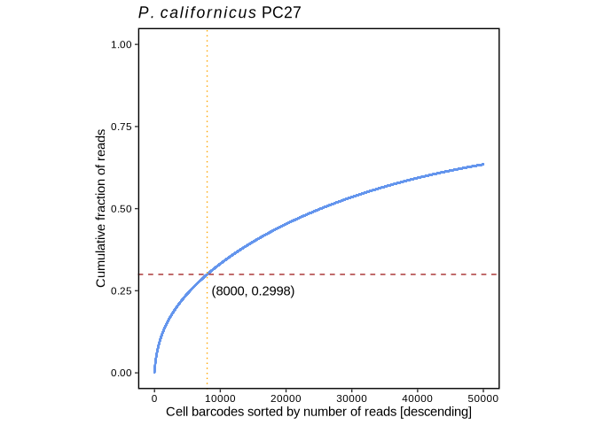

Single-cell RNA sequencing in *P. californicus*
================
Bulah Wu
July 11, 2024

## Drop-seq protocol

We generated the digital expression matrix using the Drop-seq protocol
developed by the McCarroll Lab
(<https://github.com/broadinstitute/Drop-seq>). Here are the list of
outputs:

    ## total 25G
    ## -rw------- 1 nguyen nguyen  16K Jul 10 17:52 rs_seurat_v5.R
    ## -rw------- 1 nguyen nguyen  15K Jul 10 15:53 rs_seurat_v4.R
    ## -rw------- 1 nguyen nguyen 111M Jul  8 22:40 pc27mito.e3045622
    ## -rw------- 1 nguyen nguyen  40M Jul  8 22:39 gmbd.txt.gz
    ## -rw------- 1 nguyen nguyen  28M Jul  5 16:39 cell_readcounts.txt.gz
    ## -rw------- 1 nguyen nguyen 1.4M Jul  5 16:27 dge_t20.summary.txt
    ## -rw------- 1 nguyen nguyen  15M Jul  5 16:27 dge_t20.txt.gz
    ## -rw------- 1 nguyen nguyen 246K Jul  5 15:48 dge_c10k.summary.txt
    ## -rw------- 1 nguyen nguyen 4.4M Jul  5 15:48 dge_c10k.txt.gz
    ## -rw------- 1 nguyen nguyen 8.7M Jul  5 15:24 final.bai
    ## -rw------- 1 nguyen nguyen  25G Jul  5 15:24 final.bam
    ## -rw------- 1 nguyen nguyen  12K Jul  5 05:53 pc27mito.o3045622
    ## -rw------- 1 nguyen nguyen  243 Jul  4 12:43 jobid
    ## -rw------- 1 nguyen nguyen 5.5K Jul  4 12:37 sh_dropseq_pc27mito.sh

## Knee-plot analysis

The y axis indicates the “Cumulative fraction of uniquely mapped reads.”

``` r
pc27=read.table("/media/nguyen/Data1/mao/scseq/dropseq/pc27mito/cell_readcounts.txt.gz", header=F, stringsAsFactors=F)
csum_pc27=cumsum(pc27$V1)
df_pc27 <- cbind.data.frame(xvalue=1:length(csum_pc27), yvalue=csum_pc27/max(csum_pc27))
ggplot(df_pc27, aes(xvalue, yvalue)) +
  geom_point(size=0.1, color="cornflowerblue") + scale_x_continuous(limits = c(0,50000))+
  #geom_hline(aes(yintercept=df_pc27 %>% filter(xvalue==10000) %>% pull(yvalue)), color="brown", linetype=2)+
  geom_hline(aes(yintercept=df_pc27 %>% filter(xvalue==8000) %>% pull(yvalue)), color="brown", linetype=2)+
  #geom_vline(aes(xintercept=10000), color="orange", linetype=3)+
  geom_vline(aes(xintercept=8000), color="orange", linetype=3)+
  labs(title=expression(italic(P.)~italic(californicus)~"testis (PC_27)"), x="Cell barcodes sorted by number of reads [descending]", y="Cumulative fraction of reads") +
  theme_bw() +
  theme(axis.line = element_blank(),
        axis.title = element_text(color="black"),
        axis.text = element_text(color="black"),
        panel.grid.major = element_blank(),
        panel.grid.minor = element_blank(),
        panel.background = element_blank(),
        panel.border = element_rect(linewidth = 1, color="black"), aspect.ratio = 1)
```

    ## Warning: Removed 10781382 rows containing missing values or values outside the scale
    ## range (`geom_point()`).

<!-- -->

## UMAP

This is an R Markdown document. Markdown is a simple formatting syntax
for authoring HTML, PDF, and MS Word documents. For more details on
using R Markdown see <http://rmarkdown.rstudio.com>.

When you click the **Knit** button a document will be generated that
includes both content as well as the output of any embedded R code
chunks within the document. You can embed an R code chunk like this:

``` r
mtx_pc27 <- read.table("/media/nguyen/Data1/mao/scseq/dropseq/pc27mito/dge_c10k.txt.gz", header = TRUE, row.names = 1, colClasses =c("character", rep("numeric", 10000)))
so_pc27 <- CreateSeuratObject(counts = mtx_pc27, min.cells = 3, min.features = 200, project = "pc27") %>%
           PercentageFeatureSet(pattern = "^agat|^rrn", col.name = "percent.mt") %>%
           SCTransform(vars.to.regress = "percent.mt") %>%
           RunPCA() %>%
           FindNeighbors(dims = 1:30) %>%
           RunUMAP(dims = 1:30) %>%
           FindClusters()
df_umap <- so_pc27@reductions$umap@cell.embeddings %>% as.data.frame() %>% cbind(color=so_pc27@meta.data$seurat_clusters)
my_color <- c(brewer.pal(name="Set2", n=8),brewer.pal(name="Dark2", n=8))[c(1,3,2,4,5:8,12,14,15)]
ggplot(df_umap) +
  geom_point(aes(x=umap_1, y=umap_2, color=color), size=0.8) +
  geom_text_repel(data=df_umap %>% group_by(color) %>% summarise(q1=quantile(umap_1, 0.5), q2=quantile(umap_2, 0.5)),
                  aes(x=q1, y=q2, label = LETTERS[1:11]), size=8) +
  labs(title=expression(italic(P.)~italic(californicus)~"testis (PC_27)"),
       x="UMAP_1",
       y="UMAP_2") +
  #scale_color_brewer(palette = "Set2", name="clusters", labels=LETTERS[1:11]) +
  scale_color_manual(values = my_color, name="clusters", labels=LETTERS[1:11]) +
  guides(color = guide_legend(override.aes = list(size = 5))) +
  theme_bw() +
  theme(axis.line = element_blank(),
        axis.title = element_text(color="black"),
        axis.text = element_text(color="black"),
        legend.title = element_text(size=10),
        legend.background=element_blank(),
        legend.justification=c(1, 0.85),
        panel.grid.major = element_blank(),
        panel.grid.minor = element_blank(),
        panel.background = element_blank(),
        panel.border = element_rect(linewidth = 1, color="black"), aspect.ratio = 1)
```

## Including Plots

You can also embed plots, for example:

<!-- -->

Note that the `echo = FALSE` parameter was added to the code chunk to
prevent printing of the R code that generated the plot.
