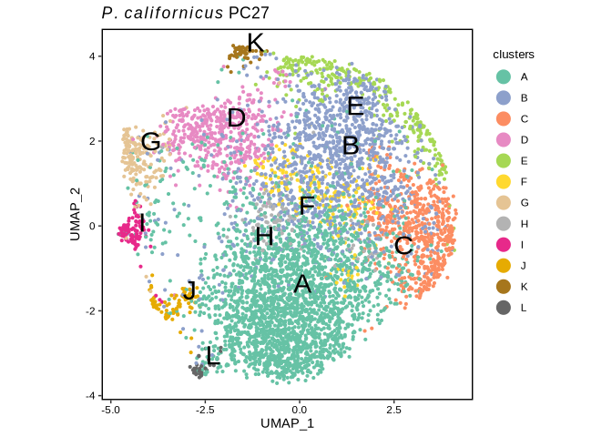

Single-cell RNA sequencing in *P. californicus*
================
Bulah Wu
July 11, 2024

## PC_27 (testis) sample

This is an R Markdown document. Markdown is a simple formatting syntax
for authoring HTML, PDF, and MS Word documents. For more details on
using R Markdown see <http://rmarkdown.rstudio.com>.

When you click the **Knit** button a document will be generated that
includes both content as well as the output of any embedded R code
chunks within the document. You can embed an R code chunk like this:

``` r
mtx_pc27 <- read.table("/media/nguyen/Data1/mao/scseq/dropseq/pc27mito/dge_c10k.txt.gz", header = TRUE, row.names = 1, colClasses =c("character", rep("numeric", 10000)))
so_pc27 <- CreateSeuratObject(counts = mtx_pc27, min.cells = 3, min.features = 200, project = "pc27") %>%
           PercentageFeatureSet(pattern = "^agat|^rrn", col.name = "percent.mt") %>%
           SCTransform(vars.to.regress = "percent.mt") %>%
           RunPCA() %>%
           FindNeighbors(dims = 1:30) %>%
           RunUMAP(dims = 1:30) %>%
           FindClusters()
```

    ## Warning: Data is of class data.frame. Coercing to dgCMatrix.

    ## Running SCTransform on assay: RNA

    ## Running SCTransform on layer: counts

    ## vst.flavor='v2' set. Using model with fixed slope and excluding poisson genes.

    ## Variance stabilizing transformation of count matrix of size 7198 by 8132

    ## Model formula is y ~ log_umi

    ## Get Negative Binomial regression parameters per gene

    ## Using 2000 genes, 5000 cells

    ## Found 292 outliers - those will be ignored in fitting/regularization step

    ## Second step: Get residuals using fitted parameters for 7198 genes

    ## Computing corrected count matrix for 7198 genes

    ## Calculating gene attributes

    ## Wall clock passed: Time difference of 9.855169 secs

    ## Determine variable features

    ## Regressing out percent.mt

    ## Centering data matrix

    ## Getting residuals for block 1(of 2) for counts dataset

    ## Getting residuals for block 2(of 2) for counts dataset

    ## Regressing out percent.mt

    ## Centering data matrix

    ## Finished calculating residuals for counts

    ## Set default assay to SCT

    ## PC_ 1 
    ## Positive:  g3155, g2094, g6920, g1964, g4193, g8306, g3342, g3576, g7429, g5533 
    ##     g555, g4988, g5745, g909, g1325, g10069, g3565, g7784, g8118, g10589 
    ##     g3672, g4282, g5147, g8785, g2312, g4966, g1213, g4042, g4152, g472 
    ## Negative:  g4390, g87, g9883, g7516, g2726, g9063, g11091, g2727, g5936, g5394 
    ##     g9461, g7372, g8857, g8050, g9143, g1076, g9462, g5552, g8903, g7775 
    ##     g383, g7898, g4473, g136, g8503, g3273, g5827, g3481, g11041, g8221 
    ## PC_ 2 
    ## Positive:  g9364, g1677, g9462, g7603, g5339, g7000, g7661, g9461, g2452, g4537 
    ##     g1809, g8050, g9362, g2094, g2896, g6722, g9218, g3748, g7862, g669 
    ##     g11112, g7745, g3565, g6673, g6796, g1617, g2606, g1524, g10409, g4488 
    ## Negative:  g9213, g3342, g4042, g6920, g802, g10636, g5530, g9779, g4177, g9143 
    ##     g2229, g3528, g9917, g3716, g8873, g8453, g1805, g1645, g4390, g3567 
    ##     g9927, g5140, g8558, g10896, g451, g2859, g6073, g7729, g751, g5708 
    ## PC_ 3 
    ## Positive:  g9364, g4537, g8306, g6920, g7603, g3565, g9362, g9218, g7661, g5838 
    ##     g9213, g2000, g2896, g2094, g9235, g11028, g887, g6464, g6883, g4591 
    ##     g9128, g4042, g3955, g10597, g5176, g7429, g8988, g9143, g4745, g3513 
    ## Negative:  g3155, g658, g668, g7729, g10589, g8118, g4988, g5576, g1853, g747 
    ##     g743, g10176, g1325, g4320, g8687, g7235, g10737, g4576, g6964, g2673 
    ##     g5299, g4171, g1397, g2030, g7045, g8867, g1173, g6249, g1068, g1969 
    ## PC_ 4 
    ## Positive:  g9364, g7603, g9218, g1677, g6478, g9362, g4537, g7661, g2896, g2000 
    ##     g658, g887, g743, g9128, g6883, g9735, g5838, g896, g1173, g6464 
    ##     g5576, g9235, g6972, g3513, g4576, g668, g9969, g5176, g10597, g7447 
    ## Negative:  g3576, g2094, g1964, g5533, g11243, g4193, g7784, g6929, g814, g8785 
    ##     g2312, g3194, g472, g573, g6800, g5745, g6665, g620, g2611, g10425 
    ##     g518, g2726, g4772, g6078, g6511, g8780, g2494, g87, g8857, g555 
    ## PC_ 5 
    ## Positive:  g5827, g6920, g3342, g9364, g4118, g9461, g7661, g9143, g2452, g4988 
    ##     g5622, g9462, g7603, g9213, g4042, g3567, g9362, g5339, g6144, g1809 
    ##     g3098, g4773, g6649, g4193, g5530, g9324, g5140, g898, g743, g5858 
    ## Negative:  g9218, g2094, g2896, g1677, g887, g9063, g9235, g10409, g87, g9128 
    ##     g4390, g9735, g11041, g6673, g9813, g9917, g6756, g10642, g1805, g8221 
    ##     g6101, g3955, g7516, g5877, g5898, g2201, g2727, g5859, g8306, g1173

    ## Computing nearest neighbor graph

    ## Computing SNN

    ## Warning: The default method for RunUMAP has changed from calling Python UMAP via reticulate to the R-native UWOT using the cosine metric
    ## To use Python UMAP via reticulate, set umap.method to 'umap-learn' and metric to 'correlation'
    ## This message will be shown once per session

    ## 16:05:21 UMAP embedding parameters a = 0.9922 b = 1.112

    ## 16:05:21 Read 8132 rows and found 30 numeric columns

    ## 16:05:21 Using Annoy for neighbor search, n_neighbors = 30

    ## 16:05:21 Building Annoy index with metric = cosine, n_trees = 50

    ## 0%   10   20   30   40   50   60   70   80   90   100%

    ## [----|----|----|----|----|----|----|----|----|----|

    ## **************************************************|
    ## 16:05:21 Writing NN index file to temp file /tmp/Rtmp7s06Di/file2ec46e9d0de5
    ## 16:05:21 Searching Annoy index using 1 thread, search_k = 3000
    ## 16:05:23 Annoy recall = 100%
    ## 16:05:23 Commencing smooth kNN distance calibration using 1 thread with target n_neighbors = 30
    ## 16:05:24 Initializing from normalized Laplacian + noise (using RSpectra)
    ## 16:05:24 Commencing optimization for 500 epochs, with 341956 positive edges
    ## 16:05:29 Optimization finished

    ## Modularity Optimizer version 1.3.0 by Ludo Waltman and Nees Jan van Eck
    ## 
    ## Number of nodes: 8132
    ## Number of edges: 192767
    ## 
    ## Running Louvain algorithm...
    ## Maximum modularity in 10 random starts: 0.7238
    ## Number of communities: 11
    ## Elapsed time: 0 seconds

``` r
df_umap <- so_pc27@reductions$umap@cell.embeddings %>% as.data.frame() %>% cbind(color=so_pc27@meta.data$seurat_clusters)
my_color <- c(brewer.pal(name="Set2", n=8),brewer.pal(name="Dark2", n=8))[c(1,3,2,4,5:8,12,14,15)]
ggplot(df_umap) +
  geom_point(aes(x=umap_1, y=umap_2, color=color), size=0.8) +
  geom_text_repel(data=df_umap %>% group_by(color) %>% summarise(q1=quantile(umap_1, 0.5), q2=quantile(umap_2, 0.5)),
                  aes(x=q1, y=q2, label = LETTERS[1:11]), size=8) +
  labs(title=expression(italic(P.)~italic(californicus)~"testis (PC_27)"),
       x="UMAP_1",
       y="UMAP_2") +
  #scale_color_brewer(palette = "Set2", name="clusters", labels=LETTERS[1:11]) +
  scale_color_manual(values = my_color, name="clusters", labels=LETTERS[1:11]) +
  guides(color = guide_legend(override.aes = list(size = 5))) +
  theme_bw() +
  theme(axis.line = element_blank(),
        axis.title = element_text(color="black"),
        axis.text = element_text(color="black"),
        legend.title = element_text(size=10),
        legend.background=element_blank(),
        legend.justification=c(1, 0.85),
        panel.grid.major = element_blank(),
        panel.grid.minor = element_blank(),
        panel.background = element_blank(),
        panel.border = element_rect(linewidth = 1, color="black"), aspect.ratio = 1)
```

<!-- -->

## Including Plots

You can also embed plots, for example:

<!-- -->

Note that the `echo = FALSE` parameter was added to the code chunk to
prevent printing of the R code that generated the plot.
