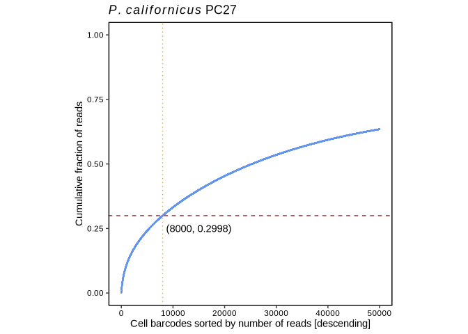
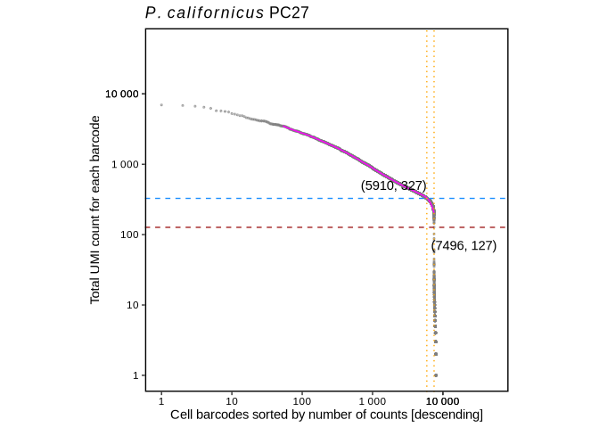
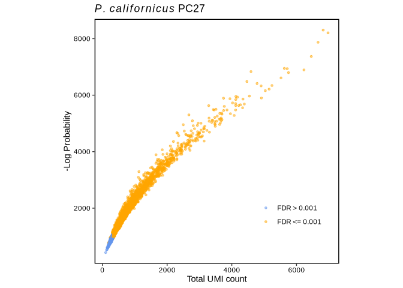
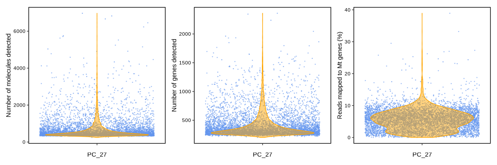
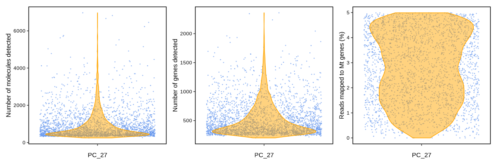
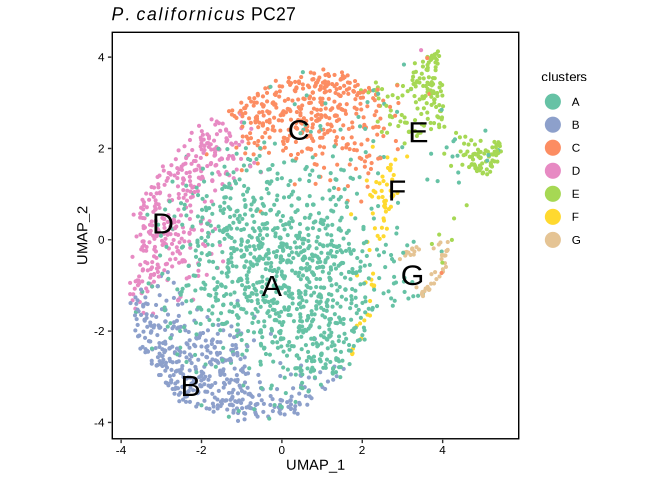
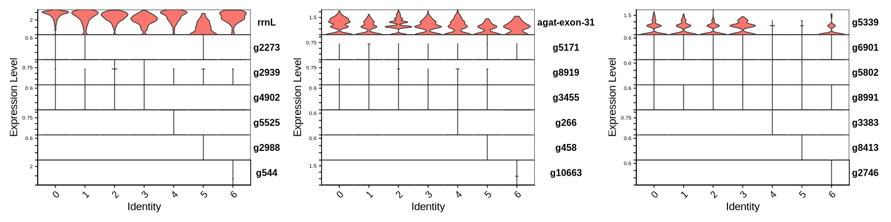
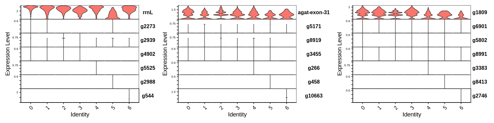

Single-cell RNA sequencing of *Phymatopus californicus* sample PC27:
discrepancy between the outputs
================
Andrea Elizabeth Acurio Armas, Bulah Wu, Petr Nguyen  
July 24, 2024

## Discrepancy between the ouputs of Drop-seq core computational protocol and STARsolo

A large number of cells in the STARsolo matrix were filtered because of
the high percentage of mitochondrial counts (\> 5%, see
[before](scRNAseq_Phymatopus_californicus_starsolo_files/figure-gfm/violin1-1.png)
and
[after](scRNAseq_Phymatopus_californicus_starsolo_files/figure-gfm/violin2-1.png)).
In the gene transfer format (GTF) file, two duplicate lines were
spotted. These two lines correspond to mitochondrial large ribosomal RNA
(rrnL) and mitochondrial small ribosomal RNA (rrnS). After removing line
380742 and 380746 from the gtf file, we re-ran the analysis with the
Drop-seq protocol.

    380742:c19455z  mitfi  exon        8649  9429   0.0  +  .  gene_id "rrnS"; transcript_id "transcript_rrnS"; ID "agat-exon-27"; Name "rrnS"; Parent "transcript_rrnS";
    380746:c19455z  mitfi  exon        9524  10813  0.0  +  .  gene_id "rrnL"; transcript_id "transcript_rrnL"; ID "agat-exon-29"; Name "rrnL"; Parent "transcript_rrnL";
    380850:c19455z  mitfi  ncRNA_gene  8649  9429   .    +  .  gene_id "rrnS"; ID "gene_rrnS"; Name "rrnS";
    380851:c19455z  mitfi  rRNA        8649  9429   .    +  .  gene_id "rrnS"; transcript_id "transcript_rrnS"; ID "transcript_rrnS"; Name "rrnS"; Parent "gene_rrnS";
    380852:c19455z  mitfi  exon        8649  9429   0.0  +  .  gene_id "rrnS"; transcript_id "transcript_rrnS"; ID "agat-exon-27"; Name "rrnS"; Parent "transcript_rrnS";
    380853:c19455z  mitfi  ncRNA_gene  9524  10813  .    +  .  gene_id "rrnL"; ID "gene_rrnL"; Name "rrnL";
    380854:c19455z  mitfi  rRNA        9524  10813  .    +  .  gene_id "rrnL"; transcript_id "transcript_rrnL"; ID "transcript_rrnL"; Name "rrnL"; Parent "gene_rrnL";
    380855:c19455z  mitfi  exon        9524  10813  0.0  +  .  gene_id "rrnL"; transcript_id "transcript_rrnL"; ID "agat-exon-29"; Name "rrnL"; Parent "transcript_rrnL";

## Knee-plot analysis

In the dot plot, the x-axis represents the cell barcodes (organized by
the number of reads, arranged from highest to lowest), and the y-axis
shows the cumulative fraction of uniquely mapped reads. The transition
from beads sampling cellular RNA to beads sampling ambient RNA is marked
by the inflection point ([Macosko et al.,
2015](http://dx.doi.org/10.1016/j.cell.2015.05.002)).

``` r
pc27=read.table("/media/nguyen/Data1/mao/scseq/dropseq/pc27mitonows26_gtf/cell_readcounts.txt.gz", header=F, stringsAsFactors=F)
csum_pc27=cumsum(pc27$V1)
df_pc27 <- cbind.data.frame(xvalue=1:length(csum_pc27), yvalue=csum_pc27/max(csum_pc27))
ggplot(df_pc27, aes(xvalue, yvalue)) +
  geom_point(size=0.1, color="cornflowerblue") + scale_x_continuous(limits = c(0,50000))+
  geom_hline(aes(yintercept=df_pc27 %>% filter(xvalue==8000) %>% pull(yvalue)), color="brown", linetype=2)+
  geom_vline(aes(xintercept=8000), color="orange", linetype=3)+
  annotate("text", x=15000, y=0.25, label="(8000, 0.2998)")+ # 0.2997816
  labs(title=expression(italic(P.)~italic(californicus)~"PC27"), x="Cell barcodes sorted by number of reads [descending]", y="Cumulative fraction of reads") +
  theme_bw() +
  theme(axis.line = element_blank(),
        axis.title = element_text(color="black"),
        axis.text = element_text(color="black"),
        panel.grid.major = element_blank(),
        panel.grid.minor = element_blank(),
        panel.background = element_blank(),
        panel.border = element_rect(linewidth = 1, color="black"), aspect.ratio = 1)
```

<!-- -->

The plot indicates the top 8000 cells contribute nearly 30% of the total
uniquely mapped reads.

## DropletUtils analysis

Here the x-axis indicates the cell barcodes (organized by the number of
reads, arranged from highest to lowest) and the y-axis the total UMI
count for each barcode.

``` r
mtx_pc27 <- read.table("/media/nguyen/Data1/mao/scseq/dropseq/pc27mitonows26_gtf/dge_c8k.txt.gz", header = TRUE, row.names = 1, colClasses =c("character", rep("numeric", 8000)))
br.out <- barcodeRanks(mtx_pc27)
o <- order(br.out$rank)
# metadata(br.out)$knee: 327
# metadata(br.out)$inflection : 127
# which(br.out$total==327)[1]
min_rank <- br.out$rank[which(br.out$total==327)[1]] # 5910
# which(br.out$total==127)[1]
max_rank <- br.out$rank[which(br.out$total==127)[1]] # 7496
ggplot()+
  geom_point(aes(x=br.out$rank, y=br.out$total+1), color="grey50", size=0.5, alpha=0.5)+
  geom_line(aes(x=br.out$rank[o],y=br.out$fitted[o]), color="magenta")+
  geom_hline(aes(yintercept=metadata(br.out)$knee), color="dodgerblue", linetype=2)+
  geom_hline(aes(yintercept=metadata(br.out)$inflection), color="brown", linetype=2)+
  geom_vline(aes(xintercept=min_rank), color="orange", linetype=3)+
  geom_vline(aes(xintercept=max_rank), color="orange", linetype=3)+
  annotate("text", x=2000, y=500, label="(5910, 327)")+
  annotate("text", x=20000, y=70, label="(7496, 127)")+
  scale_x_continuous(limits=c(1,50000), trans='log10', breaks = c(1,10,100,1000,10000,10000),labels = scales::number)+
  scale_y_continuous(limits=c(1,50000), trans='log10', breaks = c(1,10,100,1000,10000,10000),labels = scales::number)+
  labs(title=expression(italic(P.)~italic(californicus)~"PC27"),
       x="Cell barcodes sorted by number of counts [descending]",
       y="Total UMI count for each barcode") +
  theme_bw() +
  theme(axis.line = element_blank(),
        axis.title = element_text(color="black"),
        axis.text = element_text(color="black"),
        panel.grid.major = element_blank(),
        panel.grid.minor = element_blank(),
        panel.background = element_blank(),
        panel.border = element_rect(linewidth = 1, color="black"), aspect.ratio = 1)
```

<!-- -->

Cells below the knee point (5910) are considered empty droplets.

Subset the SingleCellExperiment object to discard the empty droplets.

``` r
set.seed(100)
e.out <- emptyDrops(mtx_pc27, niters=10000)
is.cell <- e.out$FDR <= 0.001
sum(is.cell, na.rm=TRUE)
```

    ## [1] 5943

In total 5943 cells are retained.

``` r
table(Limited=e.out$Limited, Significant=is.cell)
```

    ##        Significant
    ## Limited FALSE TRUE
    ##   FALSE  1554 5456
    ##   TRUE      0  487

The zero in the above table indicates no entry with false positives
frequency above the threshold 0.001 (Significant FALSE) can be achieved
by increasing the number of permutations (Limited TRUE). So the
parameter *niters=10000* is good.

``` r
mtx_pc27 <- mtx_pc27[,which(e.out$FDR<=0.001)]
ggplot(e.out %>% as.data.frame() %>% filter(!is.na(LogProb)) %>% mutate(FDR_fill=ifelse(FDR>0.001, "cornflowerblue", "orange")))+
  geom_point(aes(x=Total, y=-LogProb, color=FDR_fill), size=1, alpha=0.5)+
  scale_color_manual(values=c("cornflowerblue", "orange"), labels=c('FDR > 0.001', 'FDR <= 0.001'))+
  labs(title=expression(italic(P.)~italic(californicus)~"PC27"),
       x="Total UMI count",
       y="-Log Probability") +
  theme_bw() +
  theme(axis.line = element_blank(),
        axis.title = element_text(color="black"),
        axis.text = element_text(color="black"),
        legend.title = element_blank(),
        legend.position = "inside",
        legend.position.inside = c(0.8, 0.2),
        panel.grid.major = element_blank(),
        panel.grid.minor = element_blank(),
        panel.background = element_blank(),
        panel.border = element_rect(linewidth = 1, color="black"), aspect.ratio = 1)
```

<!-- -->

The retained droplets (orange color) should have large UMI counts and/or
large negative log probabilities.

## Analysis using Seurat

[Seurat v5](https://satijalab.org/seurat) was used to analyze the data.

First we filtered the data by dropping (1) features detected in less
than 3 cells or (2) cells with feature counts less than 200.

``` r
so_pc27_pre <- CreateSeuratObject(counts = mtx_pc27, min.cells = 3, min.features = 200, project = "pc27") %>%
               PercentageFeatureSet(pattern = "^agat|^rrn", col.name = "percent.mt")
```

The diagnostic plots below show the total number of unique molecules in
each cell (left), the total number of unique genes in each cell
(middle), and the percentage of reads mapped to the mitochondrial genome
(right).

<!-- -->

We further filtered cells (1) with feature counts larger than 2500 or
less than 200 or (2) with mitochondrial counts larger than 5%.

``` r
so_pc27 <- CreateSeuratObject(counts = mtx_pc27, min.cells = 3, min.features = 200, project = "pc27") %>%
           PercentageFeatureSet(pattern = "^agat|^rrn", col.name = "percent.mt") %>%
           subset(subset = nFeature_RNA > 200 & nFeature_RNA < 2500 & percent.mt < 5)
```

We checked the diagnostic plots after filtering.

<!-- -->

UMAP clustering of data from 2587 cells revealed 7 cell clusters.

``` r
so_pc27 <- CreateSeuratObject(counts = mtx_pc27, min.cells = 3, min.features = 200, project = "pc27") %>%
           PercentageFeatureSet(pattern = "^agat|^rrn", col.name = "percent.mt") %>%
           subset(subset = nFeature_RNA > 200 & nFeature_RNA < 2500 & percent.mt < 5) %>%
           SCTransform(vars.to.regress = "percent.mt") %>%
           RunPCA() %>%
           FindNeighbors(dims = 1:30) %>%
           RunUMAP(dims = 1:30) %>%
           FindClusters()
```

    ## Modularity Optimizer version 1.3.0 by Ludo Waltman and Nees Jan van Eck
    ## 
    ## Number of nodes: 2587
    ## Number of edges: 108934
    ## 
    ## Running Louvain algorithm...
    ## Maximum modularity in 10 random starts: 0.7186
    ## Number of communities: 7
    ## Elapsed time: 0 seconds

``` r
df_umap <- so_pc27@reductions$umap@cell.embeddings %>% as.data.frame() %>% cbind(color=so_pc27@meta.data$seurat_clusters)
#length(unique(df_umap$color))
my_color <- c(brewer.pal(name="Set2", n=8),brewer.pal(name="Dark2", n=8))[c(1,3,2,4,5,6,7)]

ggplot(df_umap) +
  geom_point(aes(x=umap_1, y=umap_2, color=color), size=0.8) +
  geom_text_repel(data=df_umap %>% group_by(color) %>% summarise(q1=quantile(umap_1, 0.5), q2=quantile(umap_2, 0.5)),
                  aes(x=q1, y=q2, label = LETTERS[1:7]), size=8) +
  labs(title=expression(italic(P.)~italic(californicus)~"PC27"),
       x="UMAP_1",
       y="UMAP_2") +
  scale_color_manual(values = my_color, name="clusters", labels=LETTERS[1:7]) +
  guides(color = guide_legend(override.aes = list(size = 5))) +
  theme_bw() +
  theme(axis.line = element_blank(),
        axis.title = element_text(color="black"),
        axis.text = element_text(color="black"),
        legend.title = element_text(size=10),
        legend.background=element_blank(),
        legend.justification=c(1, 0.85),
        panel.grid.major = element_blank(),
        panel.grid.minor = element_blank(),
        panel.background = element_blank(),
        panel.border = element_rect(linewidth = 1, color="black"), aspect.ratio = 1)
```

<!-- -->

Genes differentially expressed among each cluster were selected as
marker genes.

``` r
so_pc27.markers <- FindAllMarkers(so_pc27, only.pos = TRUE, logfc.threshold = 0.25)
so_pc27.markers %>% arrange(desc(avg_log2FC)) %>% group_by(cluster) %>% dplyr::slice(1:3) %>% as.data.frame()
```

    ##           p_val avg_log2FC pct.1 pct.2    p_val_adj cluster         gene
    ## 1  1.628286e-50  0.4794511 0.987 0.942 1.097302e-46       0         rrnL
    ## 2  1.822494e-13  0.4254225 0.694 0.637 1.228179e-09       0 agat-exon-31
    ## 3  5.721889e-03  0.3386904 0.445 0.406 1.000000e+00       0        g5339
    ## 4  1.927113e-06  3.0435564 0.021 0.002 1.298682e-02       1        g2273
    ## 5  5.189913e-14  2.3967886 0.074 0.013 3.497483e-10       1        g5171
    ## 6  5.249113e-06  2.2134814 0.032 0.007 3.537377e-02       1        g6901
    ## 7  1.567681e-46  2.6286600 0.240 0.040 1.056460e-42       2        g2939
    ## 8  6.290512e-19  2.3435993 0.119 0.025 4.239176e-15       2        g8919
    ## 9  1.071948e-08  2.2555593 0.052 0.011 7.223854e-05       2        g5802
    ## 10 6.283671e-07  2.2214795 0.043 0.009 4.234566e-03       3        g4902
    ## 11 6.180604e-06  2.1663379 0.037 0.008 4.165109e-02       3        g3455
    ## 12 1.006759e-10  1.9529906 0.089 0.023 6.784550e-07       3        g8991
    ## 13 2.806480e-13  6.4132086 0.023 0.000 1.891287e-09       4        g5525
    ## 14 2.806411e-13  5.9981711 0.023 0.000 1.891240e-09       4         g266
    ## 15 1.561558e-08  5.7351367 0.014 0.000 1.052334e-04       4        g3383
    ## 16 4.204149e-18  6.8180813 0.030 0.000 2.833176e-14       5        g2988
    ## 17 4.204149e-18  6.8180813 0.030 0.000 2.833176e-14       5         g458
    ## 18 4.204149e-18  6.8180813 0.030 0.000 2.833176e-14       5        g8413
    ## 19 5.576306e-49 10.0779520 0.085 0.000 3.757873e-45       6         g544
    ## 20 8.445546e-61  9.2154555 0.106 0.000 5.691453e-57       6       g10663
    ## 21 1.277865e-72  8.5633789 0.128 0.000 8.611534e-69       6        g2746

The above table shows, in each cluster, three genes with largest average
log2 fold-change value (avg_log2FC). We can visualize the marker gene
expression (from left to right: top1, top2, top3; from top to bottom:
cluster 0, 1, 2, 3, 4, 5, 6 and 7).

<!-- -->

We noticed only one marker gene (g5339 in cluster 0) on the list with
the high adjusted *P*-value (p_val_adj), so we filtered genes with
p_val_adj \>= 0.05

``` r
so_pc27.markers %>% filter(p_val_adj < 0.05) %>% arrange(desc(avg_log2FC)) %>% group_by(cluster) %>% dplyr::slice(1:3) %>% as.data.frame()
```

    ##           p_val avg_log2FC pct.1 pct.2    p_val_adj cluster         gene
    ## 1  1.628286e-50  0.4794511 0.987 0.942 1.097302e-46       0         rrnL
    ## 2  1.822494e-13  0.4254225 0.694 0.637 1.228179e-09       0 agat-exon-31
    ## 3  1.918097e-08  0.3006779 0.766 0.743 1.292606e-04       0        g1809
    ## 4  1.927113e-06  3.0435564 0.021 0.002 1.298682e-02       1        g2273
    ## 5  5.189913e-14  2.3967886 0.074 0.013 3.497483e-10       1        g5171
    ## 6  5.249113e-06  2.2134814 0.032 0.007 3.537377e-02       1        g6901
    ## 7  1.567681e-46  2.6286600 0.240 0.040 1.056460e-42       2        g2939
    ## 8  6.290512e-19  2.3435993 0.119 0.025 4.239176e-15       2        g8919
    ## 9  1.071948e-08  2.2555593 0.052 0.011 7.223854e-05       2        g5802
    ## 10 6.283671e-07  2.2214795 0.043 0.009 4.234566e-03       3        g4902
    ## 11 6.180604e-06  2.1663379 0.037 0.008 4.165109e-02       3        g3455
    ## 12 1.006759e-10  1.9529906 0.089 0.023 6.784550e-07       3        g8991
    ## 13 2.806480e-13  6.4132086 0.023 0.000 1.891287e-09       4        g5525
    ## 14 2.806411e-13  5.9981711 0.023 0.000 1.891240e-09       4         g266
    ## 15 1.561558e-08  5.7351367 0.014 0.000 1.052334e-04       4        g3383
    ## 16 4.204149e-18  6.8180813 0.030 0.000 2.833176e-14       5        g2988
    ## 17 4.204149e-18  6.8180813 0.030 0.000 2.833176e-14       5         g458
    ## 18 4.204149e-18  6.8180813 0.030 0.000 2.833176e-14       5        g8413
    ## 19 5.576306e-49 10.0779520 0.085 0.000 3.757873e-45       6         g544
    ## 20 8.445546e-61  9.2154555 0.106 0.000 5.691453e-57       6       g10663
    ## 21 1.277865e-72  8.5633789 0.128 0.000 8.611534e-69       6        g2746

We can visualize the marker gene expression with filtered data.

<!-- -->

The below table shows top10 marker genes in each cluster with inferred
gene names derived from annotated reference genomes *Bombyx mori*,
*Danaus plexippus*, and *Plutella xylostella*.

``` r
selected_markers <- so_pc27.markers %>% filter(p_val_adj < 0.05) %>% arrange(desc(avg_log2FC)) %>% group_by(cluster) %>% dplyr::slice(1:10)
gene_name <- read.delim("/media/nguyen/Data1/mao/braker3/phymatopus_californicus/genome_mao/annotation/gene_name/anno_combo_mito", header = F)
selected_markers %>% inner_join(gene_name, by=join_by(gene == V1)) %>% select(!c(V2,V3,V5,V6,V7,V8)) %>% rename(V4="Bombyx_mori") %>% as.data.frame()
```

    ##            p_val avg_log2FC pct.1 pct.2     p_val_adj cluster         gene
    ## 1   1.628286e-50  0.4794511 0.987 0.942  1.097302e-46       0         rrnL
    ## 2   1.822494e-13  0.4254225 0.694 0.637  1.228179e-09       0 agat-exon-31
    ## 3   1.918097e-08  0.3006779 0.766 0.743  1.292606e-04       0        g1809
    ## 4   1.885498e-06  0.2620691 0.845 0.861  1.270637e-02       0        g5827
    ## 5   1.927113e-06  3.0435564 0.021 0.002  1.298682e-02       1        g2273
    ## 6   5.189913e-14  2.3967886 0.074 0.013  3.497483e-10       1        g5171
    ## 7   5.249113e-06  2.2134814 0.032 0.007  3.537377e-02       1        g6901
    ## 8   1.832373e-06  2.0841984 0.039 0.009  1.234836e-02       1        g4945
    ## 9   6.883829e-07  2.0435564 0.044 0.011  4.639012e-03       1        g3535
    ## 10  6.671578e-06  1.9529538 0.039 0.010  4.495976e-02       1        g5865
    ## 11  1.072778e-06  1.9440207 0.046 0.012  7.229450e-03       1         g178
    ## 12  3.465617e-25  1.8321490 0.225 0.067  2.335479e-21       1        g2270
    ## 13  1.230733e-23  1.7709943 0.223 0.069  8.293913e-20       1        g7146
    ## 14  1.560446e-06  1.7622703 0.053 0.016  1.051585e-02       1        g3041
    ## 15  1.567681e-46  2.6286600 0.240 0.040  1.056460e-42       2        g2939
    ## 16  6.290512e-19  2.3435993 0.119 0.025  4.239176e-15       2        g8919
    ## 17  1.071948e-08  2.2555593 0.052 0.011  7.223854e-05       2        g5802
    ## 18  2.169273e-19  2.1999165 0.134 0.030  1.461873e-15       2       g10007
    ## 19  1.496447e-15  2.1714950 0.103 0.023  1.008456e-11       2        g1267
    ## 20  8.267073e-15  2.1367296 0.101 0.023  5.571180e-11       2        g9286
    ## 21  3.229972e-07  2.1111694 0.047 0.011  2.176678e-03       2        g4389
    ## 22  7.882842e-11  2.1027078 0.080 0.020  5.312247e-07       2        g8927
    ## 23  1.604798e-30  2.0399720 0.240 0.061  1.081473e-26       2        g9698
    ## 24  4.391553e-08  2.0306600 0.057 0.014  2.959468e-04       2        g4124
    ## 25  6.283671e-07  2.2214795 0.043 0.009  4.234566e-03       3        g4902
    ## 26  6.180604e-06  2.1663379 0.037 0.008  4.165109e-02       3        g3455
    ## 27  1.006759e-10  1.9529906 0.089 0.023  6.784550e-07       3        g8991
    ## 28  3.667533e-08  1.9439455 0.066 0.017  2.471551e-04       3         g196
    ## 29  6.033035e-06  1.7549117 0.054 0.017  4.065662e-02       3        g2430
    ## 30  4.291189e-09  1.7460061 0.092 0.028  2.891832e-05       3        g5296
    ## 31  1.574419e-10  1.6809111 0.109 0.034  1.061001e-06       3        g4258
    ## 32  8.107051e-08  1.6570644 0.083 0.027  5.463342e-04       3        g7057
    ## 33  2.471520e-07  1.6553760 0.077 0.025  1.665557e-03       3        g2772
    ## 34  9.452170e-07  1.5778176 0.074 0.025  6.369817e-03       3       g10080
    ## 35  2.806480e-13  6.4132086 0.023 0.000  1.891287e-09       4        g5525
    ## 36  2.806411e-13  5.9981711 0.023 0.000  1.891240e-09       4         g266
    ## 37  1.561558e-08  5.7351367 0.014 0.000  1.052334e-04       4        g3383
    ## 38  1.561550e-08  5.4132086 0.014 0.000  1.052329e-04       4        g2806
    ## 39  1.561550e-08  5.4132086 0.014 0.000  1.052329e-04       4        g4073
    ## 40  1.160350e-08  4.7351367 0.018 0.000  7.819602e-05       4        g2455
    ## 41 4.942207e-148  4.5545645 0.527 0.039 3.330553e-144       4        g3576
    ## 42  4.454776e-68  4.5507121 0.221 0.012  3.002074e-64       4        g8953
    ## 43  2.087661e-06  4.4132086 0.014 0.000  1.406874e-02       4        g2757
    ## 44  2.087661e-06  4.4132086 0.014 0.000  1.406874e-02       4        g7210
    ## 45  4.204149e-18  6.8180813 0.030 0.000  2.833176e-14       5        g2988
    ## 46  4.204149e-18  6.8180813 0.030 0.000  2.833176e-14       5         g458
    ## 47  4.204149e-18  6.8180813 0.030 0.000  2.833176e-14       5        g8413
    ## 48  4.204149e-18  6.8180813 0.030 0.000  2.833176e-14       5        g9194
    ## 49  8.764531e-10  6.2331188 0.015 0.000  5.906417e-06       5       g10195
    ## 50  8.764531e-10  6.2331188 0.015 0.000  5.906417e-06       5       g10215
    ## 51  8.764531e-10  6.2331188 0.015 0.000  5.906417e-06       5       g10280
    ## 52  8.764531e-10  6.2331188 0.015 0.000  5.906417e-06       5       g10337
    ## 53  8.764531e-10  6.2331188 0.015 0.000  5.906417e-06       5       g10352
    ## 54  8.764531e-10  6.2331188 0.015 0.000  5.906417e-06       5       g10392
    ## 55  5.576306e-49 10.0779520 0.085 0.000  3.757873e-45       6         g544
    ## 56  8.445546e-61  9.2154555 0.106 0.000  5.691453e-57       6       g10663
    ## 57  1.277865e-72  8.5633789 0.128 0.000  8.611534e-69       6        g2746
    ## 58  8.445546e-61  8.5633789 0.106 0.000  5.691453e-57       6        g1560
    ## 59  5.575898e-49  8.0779520 0.085 0.000  3.757598e-45       6        g7581
    ## 60  2.575811e-25  8.0779520 0.043 0.000  1.735839e-21       6        g6181
    ## 61  3.721236e-37  7.7560239 0.064 0.000  2.507741e-33       6        g8228
    ## 62  3.721236e-37  7.7560239 0.064 0.000  2.507741e-33       6        g8887
    ## 63  2.575811e-25  7.7560239 0.043 0.000  1.735839e-21       6         g273
    ## 64  2.575811e-25  7.7560239 0.043 0.000  1.735839e-21       6        g7018
    ##                                                                                            Bombyx_mori
    ## 1                                                                                                 rrnL
    ## 2                                                                                               nad1_0
    ## 3                                                                 glutathione peroxidase [Bombyx mori]
    ## 4                                               jupiter microtubule associated homolog 1 [Bombyx mori]
    ## 5                                  ubiquitin carboxyl-terminal hydrolase MINDY-3 homolog [Bombyx mori]
    ## 6                                                      kinesin-like protein a isoform X4 [Bombyx mori]
    ## 7                                    ubiquitin carboxyl-terminal hydrolase 20 isoform X1 [Bombyx mori]
    ## 8                                        uncharacterized protein LOC101738425 isoform X1 [Bombyx mori]
    ## 9                                  mitochondrial import receptor subunit TOM40 homolog 1 [Bombyx mori]
    ## 10                                                           TBC1 domain family member 5 [Bombyx mori]
    ## 11                                              phenol UDP-glucosyltransferase precursor [Bombyx mori]
    ## 12                                       uncharacterized protein LOC101745679 isoform X9 [Bombyx mori]
    ## 13 Golgi-specific brefeldin A-resistance guanine nucleotide exchange factor 1 isoform X2 [Bombyx mori]
    ## 14                        peroxisomal N(1)-acetyl-spermine/spermidine oxidase isoform X1 [Bombyx mori]
    ## 15                                methionine aminopeptidase 1D, mitochondrial isoform X1 [Bombyx mori]
    ## 16                                                                         protein Daple [Bombyx mori]
    ## 17                                                 cleavage stimulation factor subunit 1 [Bombyx mori]
    ## 18                                                                   obscurin isoform X1 [Bombyx mori]
    ## 19                                                                        protein abrupt [Bombyx mori]
    ## 20                                                               zinc finger protein 184 [Bombyx mori]
    ## 21                                                           exocyst complex component 2 [Bombyx mori]
    ## 22                                      E3 ubiquitin-protein ligase Mdm2-like isoform X1 [Bombyx mori]
    ## 23                                                                                               NoHit
    ## 24                                                                   protein grindelwald [Bombyx mori]
    ## 25                                                  uncharacterized protein LOC101740212 [Bombyx mori]
    ## 26                                          tRNA-uridine aminocarboxypropyltransferase 1 [Bombyx mori]
    ## 27                                                                        5-oxoprolinase [Bombyx mori]
    ## 28                                                               zinc finger protein 208 [Bombyx mori]
    ## 29                                             ragulator complex protein LAMTOR3 homolog [Bombyx mori]
    ## 30                                 ATP-binding cassette sub-family G member 1 isoform X2 [Bombyx mori]
    ## 31                                                    inositol polyphosphate multikinase [Bombyx mori]
    ## 32                  major facilitator superfamily domain-containing protein 9 isoform X1 [Bombyx mori]
    ## 33                                                             probable serine hydrolase [Bombyx mori]
    ## 34                                mediator of RNA polymerase II transcription subunit 18 [Bombyx mori]
    ## 35                                                    leucyl aminopeptidase-like protein [Bombyx mori]
    ## 36                                                 DNA replication licensing factor Mcm6 [Bombyx mori]
    ## 37                                                 tumor susceptibility gene 101 protein [Bombyx mori]
    ## 38                                                  protein unc-13 homolog 4B isoform X5 [Bombyx mori]
    ## 39                                                  uncharacterized protein LOC105842582 [Bombyx mori]
    ## 40                                         proliferating cell nuclear antigen isoform X1 [Bombyx mori]
    ## 41                                                                                               NoHit
    ## 42                                                  uncharacterized protein LOC101741592 [Bombyx mori]
    ## 43                                                         beta-galactosidase isoform X1 [Bombyx mori]
    ## 44                                    ribonucleoside-diphosphate reductase large subunit [Bombyx mori]
    ## 45                             phosphoinositide 3-kinase regulatory subunit 4 isoform X1 [Bombyx mori]
    ## 46                                                adhesion G protein-coupled receptor A3 [Bombyx mori]
    ## 47                                                  cytoplasmic FMR1-interacting protein [Bombyx mori]
    ## 48                                                    homeobox protein PKNOX2 isoform X4 [Bombyx mori]
    ## 49                                                  G protein alpha subunit Go isoform 1 [Bombyx mori]
    ## 50                                                            sorting nexin-2 isoform X2 [Bombyx mori]
    ## 51                                                                          sulfiredoxin [Bombyx mori]
    ## 52                                                                  calpain-D isoform X2 [Bombyx mori]
    ## 53                                         rho GTPase-activating protein Graf isoform X1 [Bombyx mori]
    ## 54                                                              heat shock protein 70 A1 [Bombyx mori]
    ## 55                                         basic juvenile hormone-suppressible protein 2 [Bombyx mori]
    ## 56                                                                             connectin [Bombyx mori]
    ## 57                                                 delta(24)-sterol reductase isoform X2 [Bombyx mori]
    ## 58                                                  uncharacterized protein LOC101737413 [Bombyx mori]
    ## 59                                                                  toll-like receptor 6 [Bombyx mori]
    ## 60                                        uncharacterized protein LOC100307012 precursor [Bombyx mori]
    ## 61                                             glutaryl-CoA dehydrogenase, mitochondrial [Bombyx mori]
    ## 62                                                                  cytochrome P450 6ae2 [Bombyx mori]
    ## 63                                              clip domain serine protease 11 precursor [Bombyx mori]
    ## 64                                                                                               NoHit

## Note

The edited gtf file was tested together with STARsolo, and the yielded
output is identical to [that using the flawed gtf
file](scRNAseq_Phymatopus_californicus_starsolo.md).

## Session info

    ## R version 4.3.3 (2024-02-29)
    ## Platform: x86_64-conda-linux-gnu (64-bit)
    ## Running under: Ubuntu 22.04.4 LTS
    ## 
    ## Matrix products: default
    ## BLAS/LAPACK: /home/nguyen/miniforge-pypy3/envs/seurat510/lib/libopenblasp-r0.3.27.so;  LAPACK version 3.12.0
    ## 
    ## locale:
    ##  [1] LC_CTYPE=en_US.UTF-8       LC_NUMERIC=C              
    ##  [3] LC_TIME=en_GB.UTF-8        LC_COLLATE=en_US.UTF-8    
    ##  [5] LC_MONETARY=en_GB.UTF-8    LC_MESSAGES=en_US.UTF-8   
    ##  [7] LC_PAPER=en_GB.UTF-8       LC_NAME=C                 
    ##  [9] LC_ADDRESS=C               LC_TELEPHONE=C            
    ## [11] LC_MEASUREMENT=en_GB.UTF-8 LC_IDENTIFICATION=C       
    ## 
    ## time zone: Europe/Prague
    ## tzcode source: system (glibc)
    ## 
    ## attached base packages:
    ## [1] stats4    stats     graphics  grDevices utils     datasets  methods  
    ## [8] base     
    ## 
    ## other attached packages:
    ##  [1] RColorBrewer_1.1-3          patchwork_1.2.0            
    ##  [3] DropletUtils_1.22.0         SingleCellExperiment_1.24.0
    ##  [5] SummarizedExperiment_1.32.0 Biobase_2.62.0             
    ##  [7] GenomicRanges_1.54.1        GenomeInfoDb_1.38.8        
    ##  [9] IRanges_2.36.0              S4Vectors_0.40.2           
    ## [11] BiocGenerics_0.48.1         MatrixGenerics_1.14.0      
    ## [13] matrixStats_1.3.0           rmarkdown_2.27             
    ## [15] Seurat_5.1.0                SeuratObject_5.0.2         
    ## [17] sp_2.1-4                    dplyr_1.1.4                
    ## [19] tidyr_1.3.1                 ggrepel_0.9.5              
    ## [21] ggplot2_3.5.1              
    ## 
    ## loaded via a namespace (and not attached):
    ##   [1] RcppAnnoy_0.0.22          splines_4.3.3            
    ##   [3] later_1.3.2               bitops_1.0-7             
    ##   [5] tibble_3.2.1              R.oo_1.26.0              
    ##   [7] polyclip_1.10-7           fastDummies_1.7.3        
    ##   [9] lifecycle_1.0.4           edgeR_4.0.16             
    ##  [11] globals_0.16.3            lattice_0.22-6           
    ##  [13] MASS_7.3-60               magrittr_2.0.3           
    ##  [15] limma_3.58.1              plotly_4.10.4            
    ##  [17] yaml_2.3.9                httpuv_1.6.15            
    ##  [19] glmGamPoi_1.14.3          sctransform_0.4.1        
    ##  [21] spam_2.10-0               spatstat.sparse_3.1-0    
    ##  [23] reticulate_1.38.0         cowplot_1.1.3            
    ##  [25] pbapply_1.7-2             abind_1.4-5              
    ##  [27] zlibbioc_1.48.2           Rtsne_0.17               
    ##  [29] purrr_1.0.2               R.utils_2.12.3           
    ##  [31] RCurl_1.98-1.16           GenomeInfoDbData_1.2.11  
    ##  [33] irlba_2.3.5.1             listenv_0.9.1            
    ##  [35] spatstat.utils_3.0-5      goftest_1.2-3            
    ##  [37] RSpectra_0.16-2           spatstat.random_3.3-1    
    ##  [39] dqrng_0.4.1               fitdistrplus_1.2-1       
    ##  [41] parallelly_1.37.1         DelayedMatrixStats_1.24.0
    ##  [43] leiden_0.4.3.1            codetools_0.2-20         
    ##  [45] DelayedArray_0.28.0       scuttle_1.12.0           
    ##  [47] tidyselect_1.2.1          farver_2.1.2             
    ##  [49] spatstat.explore_3.3-1    jsonlite_1.8.8           
    ##  [51] progressr_0.14.0          ggridges_0.5.6           
    ##  [53] survival_3.7-0            tools_4.3.3              
    ##  [55] ica_1.0-3                 Rcpp_1.0.13              
    ##  [57] glue_1.7.0                gridExtra_2.3            
    ##  [59] SparseArray_1.2.4         xfun_0.46                
    ##  [61] HDF5Array_1.30.1          withr_3.0.0              
    ##  [63] fastmap_1.2.0             rhdf5filters_1.14.1      
    ##  [65] fansi_1.0.6               digest_0.6.36            
    ##  [67] R6_2.5.1                  mime_0.12                
    ##  [69] colorspace_2.1-0          scattermore_1.2          
    ##  [71] tensor_1.5                spatstat.data_3.1-2      
    ##  [73] R.methodsS3_1.8.2         utf8_1.2.4               
    ##  [75] generics_0.1.3            data.table_1.15.4        
    ##  [77] httr_1.4.7                htmlwidgets_1.6.4        
    ##  [79] S4Arrays_1.2.1            uwot_0.2.2               
    ##  [81] pkgconfig_2.0.3           gtable_0.3.5             
    ##  [83] lmtest_0.9-40             XVector_0.42.0           
    ##  [85] htmltools_0.5.8.1         dotCall64_1.1-1          
    ##  [87] scales_1.3.0              png_0.1-8                
    ##  [89] spatstat.univar_3.0-0     knitr_1.48               
    ##  [91] rstudioapi_0.16.0         reshape2_1.4.4           
    ##  [93] nlme_3.1-165              zoo_1.8-12               
    ##  [95] rhdf5_2.46.1              stringr_1.5.1            
    ##  [97] KernSmooth_2.23-24        parallel_4.3.3           
    ##  [99] miniUI_0.1.1.1            pillar_1.9.0             
    ## [101] grid_4.3.3                vctrs_0.6.5              
    ## [103] RANN_2.6.1                promises_1.3.0           
    ## [105] beachmat_2.18.1           xtable_1.8-4             
    ## [107] cluster_2.1.6             evaluate_0.24.0          
    ## [109] cli_3.6.3                 locfit_1.5-9.10          
    ## [111] compiler_4.3.3            rlang_1.1.4              
    ## [113] crayon_1.5.3              future.apply_1.11.2      
    ## [115] labeling_0.4.3            plyr_1.8.9               
    ## [117] stringi_1.8.4             viridisLite_0.4.2        
    ## [119] deldir_2.0-4              BiocParallel_1.36.0      
    ## [121] munsell_0.5.1             lazyeval_0.2.2           
    ## [123] spatstat.geom_3.3-2       Matrix_1.6-5             
    ## [125] RcppHNSW_0.6.0            sparseMatrixStats_1.14.0 
    ## [127] future_1.33.2             Rhdf5lib_1.24.2          
    ## [129] statmod_1.5.0             shiny_1.8.1.1            
    ## [131] highr_0.11                ROCR_1.0-11              
    ## [133] igraph_2.0.3
