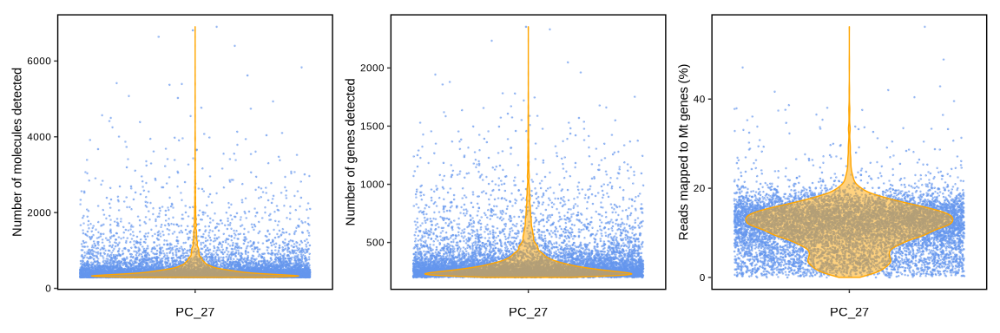

Single-cell RNA sequencing of *Phymatopus californicus* sample PC27 with
STARsolo
================
Andrea Elizabeth Acurio Armas, Bulah Wu, Petr Nguyen  
July 24, 2024

## STARsolo

Another way to compile the digital expression matrix is using
[STARsolo](https://github.com/alexdobin/STAR/blob/master/docs/STARsolo.md).
We ran STARsolo with the parameters to best match the output of 10x
Genomics
[CellRanger](https://www.10xgenomics.com/support/software/cell-ranger/latest).

    #!/bin/bash
    #PBS -N starsolo_nows26_pc27_8k
    #PBS -l select=1:ncpus=16:mem=140gb:scratch_ssd=500gb
    #PBS -l walltime=8:00:00
    #PBS -m ae

    #export TMPDIR=$SCRATCHDIR
    DATADIR=/auto/plzen1/home/bulah/mao/scseq/starsolo
    echo "||| $HOSTNAME $SCRATCHDIR ||| (starsolo_nows26_pc27_8k) ||| ssh $HOSTNAME \"scp -rp bulah@$HOSTNAME:$SCRATCHDIR/* \$HOSTNAME:\$SCRATCHDIR\" |||" >> $DATADIR/jobid

    module add star

    export ID=nows26_pc27_8k
    export ASSEMBLY=/auto/plzen1/home/bulah/mao/braker3/phymatopus_californicus/genome_mao/repeatmodeler/phycal_genome_masked2.fa
    export ANNOTATION=/auto/plzen1/home/bulah/mao/braker3/phymatopus_californicus/genome_mao/braker3/phycal_mito.gtf
    export READ1=/auto/plzen1/home/bulah/mao/scseq/X201SC24042690-Z01-F001/remove_2nt_wobble_bases/nows26_pc27_1.fq.gz
    export READ2=/auto/plzen1/home/bulah/mao/scseq/X201SC24042690-Z01-F001/X201SC24042690-Z01-F001/01.RawData/PC_27/PC_27_2.fq.gz

    mkdir -p $SCRATCHDIR/{genome,raw,tmp}
    export GENOMEDIR=$SCRATCHDIR/genome
    export TMPDIR=$SCRATCHDIR/tmp
    export RAWDIR=$SCRATCHDIR/raw

    if [ ! -f "$GENOMEDIR"/genome.fa ]; then
      cp -rp $ASSEMBLY $GENOMEDIR/genome.fa
      cp -rp $ANNOTATION $GENOMEDIR/genome.gtf
      STAR --runMode genomeGenerate --genomeDir $GENOMEDIR --genomeFastaFiles $GENOMEDIR/genome.fa --sjdbGTFfile $GENOMEDIR/genome.gtf --genomeSAindexNbases 13 --runThreadN $PBS_NCPUS
    fi

    cp -rp $READ1 $RAWDIR/read1.fq.gz
    cp -rp $READ2 $RAWDIR/read2.fq.gz

    cd $SCRATCHDIR

    STAR \
    --runThreadN $PBS_NCPUS \
    --genomeDir $GENOMEDIR \
    --readFilesIn $RAWDIR/read2.fq.gz $RAWDIR/read1.fq.gz \
    --readFilesCommand zcat \
    --outFileNamePrefix $ID/ \
    --twopassMode Basic \
    --outSAMtype BAM SortedByCoordinate \
    --soloType CB_UMI_Simple \
    --soloCBwhitelist None \
    --soloCBstart 1 \
    --soloCBlen 12 \
    --soloUMIstart 13 \
    --soloUMIlen 14 \
    --outSAMattributes NH HI nM AS CR UR CB UB GX GN sS sQ sM \
    --soloCellFilter EmptyDrops_CR 8000 0.99 10 45000 90000 500 0.01 20000 0.01 10000 \
    --clipAdapterType CellRanger4 --outFilterScoreMin 30 --soloCBmatchWLtype 1MM_multi_Nbase_pseudocounts --soloUMIfiltering MultiGeneUMI_CR --soloUMIdedup 1MM_CR

Cell filtering is implemented in STARsolo, so the output is a filtered
matrix.

``` r
mtx_pc27 <- ReadSTARsolo("/media/nguyen/Data1/mao/scseq/starsolo/nows26_pc27_8k/Solo.out/Gene/filtered")
str(mtx_pc27)
```

    ## Formal class 'dgCMatrix' [package "Matrix"] with 6 slots
    ##   ..@ i       : int [1:3183820] 33 47 59 83 86 135 149 239 280 337 ...
    ##   ..@ p       : int [1:9342] 0 304 533 785 1020 1231 1647 1872 2091 2362 ...
    ##   ..@ Dim     : int [1:2] 11319 9341
    ##   ..@ Dimnames:List of 2
    ##   .. ..$ : chr [1:11319] "g1" "g2" "g3" "g4" ...
    ##   .. ..$ : chr [1:9341] "AAAAAACTTGGG" "AAAAACTTAAGA" "AAAAAGAGTTTC" "AAAAAGTCTGAC" ...
    ##   ..@ x       : num [1:3183820] 1 1 1 1 2 1 1 1 1 1 ...
    ##   ..@ factors : list()

In total 9341 cells are retained.

## Analysis using Seurat

[Seurat v5](https://satijalab.org/seurat) was used to analyze the data.

First we filtered the data by dropping (1) features detected in less
than 3 cells or (2) cells with feature counts less than 200.

``` r
so_pc27_pre <- CreateSeuratObject(counts = mtx_pc27, min.cells = 3, min.features = 200, project = "pc27") %>%
               PercentageFeatureSet(pattern = "^agat|^rrn", col.name = "percent.mt")
```

The diagnostic plots below show the total number of unique molecules in
each cell (left), the total number of unique genes in each cell
(middle), and the percentage of reads mapped to the mitochondrial genome
(right).

<!-- -->

We further filtered cells (1) with feature counts larger than 2500 or
less than 200 or (2) with mitochondrial counts larger than 5%.

``` r
so_pc27 <- CreateSeuratObject(counts = mtx_pc27, min.cells = 3, min.features = 200, project = "pc27") %>%
           PercentageFeatureSet(pattern = "^agat|^rrn", col.name = "percent.mt") %>%
           subset(subset = nFeature_RNA > 200 & nFeature_RNA < 2500 & percent.mt < 5)
```

We checked the diagnostic plots after filtering.

<!-- -->

UMAP clustering of data from 1333 cells revealed 5 cell clusters.

``` r
so_pc27 <- CreateSeuratObject(counts = mtx_pc27, min.cells = 3, min.features = 200, project = "pc27") %>%
           PercentageFeatureSet(pattern = "^agat|^rrn", col.name = "percent.mt") %>%
           subset(subset = nFeature_RNA > 200 & nFeature_RNA < 2500 & percent.mt < 5) %>%
           SCTransform(vars.to.regress = "percent.mt") %>%
           RunPCA() %>%
           FindNeighbors(dims = 1:30) %>%
           RunUMAP(dims = 1:30) %>%
           FindClusters()
```

    ## Modularity Optimizer version 1.3.0 by Ludo Waltman and Nees Jan van Eck
    ## 
    ## Number of nodes: 1333
    ## Number of edges: 68421
    ## 
    ## Running Louvain algorithm...
    ## Maximum modularity in 10 random starts: 0.6669
    ## Number of communities: 5
    ## Elapsed time: 0 seconds

``` r
df_umap <- so_pc27@reductions$umap@cell.embeddings %>% as.data.frame() %>% cbind(color=so_pc27@meta.data$seurat_clusters)
#length(unique(df_umap$color))
my_color <- c(brewer.pal(name="Set2", n=8),brewer.pal(name="Dark2", n=8))[c(1,3,2,4,5)]

ggplot(df_umap) +
  geom_point(aes(x=umap_1, y=umap_2, color=color), size=0.8) +
  geom_text_repel(data=df_umap %>% group_by(color) %>% summarise(q1=quantile(umap_1, 0.5), q2=quantile(umap_2, 0.5)),
                  aes(x=q1, y=q2, label = LETTERS[1:5]), size=8) +
  labs(title=expression(italic(P.)~italic(californicus)~"PC27"),
       x="UMAP_1",
       y="UMAP_2") +
  scale_color_manual(values = my_color, name="clusters", labels=LETTERS[1:5]) +
  guides(color = guide_legend(override.aes = list(size = 5))) +
  theme_bw() +
  theme(axis.line = element_blank(),
        axis.title = element_text(color="black"),
        axis.text = element_text(color="black"),
        legend.title = element_text(size=10),
        legend.background=element_blank(),
        legend.justification=c(1, 0.85),
        panel.grid.major = element_blank(),
        panel.grid.minor = element_blank(),
        panel.background = element_blank(),
        panel.border = element_rect(linewidth = 1, color="black"), aspect.ratio = 1)
```

<!-- -->

Genes differentially expressed among each cluster were selected as
marker genes.

``` r
so_pc27.markers <- FindAllMarkers(so_pc27, only.pos = TRUE, logfc.threshold = 0.25)
so_pc27.markers %>% arrange(desc(avg_log2FC)) %>% group_by(cluster) %>% dplyr::slice(1:3) %>% as.data.frame()
```

    ##           p_val avg_log2FC pct.1 pct.2    p_val_adj cluster   gene
    ## 1  5.535236e-04   3.203598 0.016 0.001 1.000000e+00       0  g5762
    ## 2  2.175749e-03   2.981206 0.014 0.001 1.000000e+00       0  g1493
    ## 3  6.215883e-05   2.855675 0.027 0.003 3.958896e-01       0  g9315
    ## 4  3.544959e-05   2.583037 0.034 0.005 2.257785e-01       1  g8659
    ## 5  7.067905e-03   2.467559 0.014 0.002 1.000000e+00       1  g2600
    ## 6  3.198743e-03   1.982133 0.025 0.006 1.000000e+00       1  g3797
    ## 7  5.160620e-06   2.938863 0.038 0.005 3.286799e-02       2  g7219
    ## 8  1.765301e-03   2.938863 0.017 0.002 1.000000e+00       2  g1816
    ## 9  3.575273e-07   2.687324 0.055 0.008 2.277092e-03       2  g6782
    ## 10 1.235385e-06   2.854005 0.047 0.006 7.868167e-03       3 g10291
    ## 11 1.241530e-03   2.394573 0.028 0.005 1.000000e+00       3  g2578
    ## 12 7.938114e-16   2.297276 0.183 0.038 5.055785e-12       3  g3231
    ## 13 6.625362e-08   5.185768 0.025 0.000 4.219693e-04       4  g7581
    ## 14 1.359459e-04   5.185768 0.012 0.000 8.658394e-01       4  g6181
    ## 15 7.381074e-16   5.086232 0.068 0.002 4.701006e-12       4  g1204

The above table shows, in each cluster, three genes with largest average
log2 fold-change value (avg_log2FC). We can visualize the marker gene
expression (from left to right: top1, top2, top3; from top to bottom:
cluster 0, 1, 2, 3, 4).

<!-- -->

We noticed the high adjusted *P*-value (p_val_adj) for marker genes in
all clusters, so we filtered genes with p_val_adj \>= 0.05

``` r
so_pc27.markers %>% filter(p_val_adj < 0.05) %>% arrange(desc(avg_log2FC)) %>% group_by(cluster) %>% dplyr::slice(1:3) %>% as.data.frame()
```

    ##           p_val avg_log2FC pct.1 pct.2    p_val_adj cluster   gene
    ## 1  1.412450e-07  2.1667613 0.074 0.017 8.995895e-04       0 g10996
    ## 2  5.477981e-13  2.0447708 0.144 0.035 3.488926e-09       0  g4905
    ## 3  2.751383e-07  1.9108163 0.076 0.019 1.752356e-03       0  g3302
    ## 4  1.974232e-11  0.4121379 0.983 0.896 1.257388e-07       1  g9143
    ## 5  5.160620e-06  2.9388630 0.038 0.005 3.286799e-02       2  g7219
    ## 6  3.575273e-07  2.6873242 0.055 0.008 2.277092e-03       2  g6782
    ## 7  6.051399e-23  2.5644675 0.210 0.035 3.854136e-19       2  g2939
    ## 8  1.235385e-06  2.8540050 0.047 0.006 7.868167e-03       3 g10291
    ## 9  7.938114e-16  2.2972762 0.183 0.038 5.055785e-12       3  g3231
    ## 10 5.930621e-09  2.0384296 0.113 0.027 3.777213e-05       3  g5171
    ## 11 6.625362e-08  5.1857681 0.025 0.000 4.219693e-04       4  g7581
    ## 12 7.381074e-16  5.0862324 0.068 0.002 4.701006e-12       4  g1204
    ## 13 5.889639e-69  5.0593908 0.385 0.022 3.751111e-65       4  g3576

We can visualize the marker gene expression with filtered data. Note
that cluster 1 only has one marker gene that meets this filtering
criterion.

<!-- -->

The below table shows top10 marker genes in each cluster with inferred
gene names derived from annotated reference genomes *Bombyx mori*,
*Danaus plexippus*, and *Plutella xylostella*.

``` r
selected_markers <- so_pc27.markers %>% filter(p_val_adj < 0.05) %>% arrange(desc(avg_log2FC)) %>% group_by(cluster) %>% dplyr::slice(1:10)
gene_name <- read.delim("/media/nguyen/Data1/mao/braker3/phymatopus_californicus/genome_mao/annotation/gene_name/anno_combo_mito", header = F)
selected_markers %>% inner_join(gene_name, by=join_by(gene == V1)) %>% select(!c(V2,V3,V5,V6,V7,V8)) %>% rename(V4="Bombyx_mori") %>% as.data.frame()
```

    ##           p_val avg_log2FC pct.1 pct.2    p_val_adj cluster   gene
    ## 1  1.412450e-07  2.1667613 0.074 0.017 8.995895e-04       0 g10996
    ## 2  5.477981e-13  2.0447708 0.144 0.035 3.488926e-09       0  g4905
    ## 3  2.751383e-07  1.9108163 0.076 0.019 1.752356e-03       0  g3302
    ## 4  4.870103e-06  1.9032031 0.068 0.019 3.101768e-02       0  g1879
    ## 5  6.041019e-08  1.8816700 0.093 0.025 3.847525e-04       0  g8950
    ## 6  3.831238e-07  1.8816700 0.087 0.025 2.440115e-03       0  g8216
    ## 7  1.481732e-06  1.8816700 0.074 0.020 9.437150e-03       0  g9017
    ## 8  6.221233e-09  1.8469045 0.109 0.030 3.962303e-05       0  g5649
    ## 9  2.070235e-08  1.8469045 0.104 0.029 1.318532e-04       0  g5296
    ## 10 3.855241e-06  1.8292025 0.071 0.020 2.455403e-02       0  g3726
    ## 11 1.974232e-11  0.4121379 0.983 0.896 1.257388e-07       1  g9143
    ## 12 5.160620e-06  2.9388630 0.038 0.005 3.286799e-02       2  g7219
    ## 13 3.575273e-07  2.6873242 0.055 0.008 2.277092e-03       2  g6782
    ## 14 6.051399e-23  2.5644675 0.210 0.035 3.854136e-19       2  g2939
    ## 15 4.620245e-10  2.5389324 0.092 0.016 2.942634e-06       2   g672
    ## 16 3.348870e-13  2.5238255 0.122 0.021 2.132896e-09       2  g1267
    ## 17 4.921303e-12  2.4470099 0.122 0.024 3.134378e-08       2  g8919
    ## 18 1.311605e-09  2.3863220 0.097 0.019 8.353609e-06       2  g2992
    ## 19 6.849829e-06  2.3088126 0.055 0.011 4.362656e-02       2  g8268
    ## 20 3.233303e-07  2.2758980 0.076 0.016 2.059290e-03       2  g7924
    ## 21 7.227198e-06  2.2018974 0.059 0.013 4.603002e-02       2  g1996
    ## 22 1.235385e-06  2.8540050 0.047 0.006 7.868167e-03       3 g10291
    ## 23 7.938114e-16  2.2972762 0.183 0.038 5.055785e-12       3  g3231
    ## 24 5.930621e-09  2.0384296 0.113 0.027 3.777213e-05       3  g5171
    ## 25 2.045091e-08  2.0075503 0.113 0.029 1.302519e-04       3  g4244
    ## 26 3.673483e-11  1.8640587 0.211 0.071 2.339641e-07       3 g10722
    ## 27 7.351290e-17  1.8141123 0.343 0.122 4.682037e-13       3  g1138
    ## 28 9.217908e-15  1.7936694 0.235 0.066 5.870886e-11       3 g11133
    ## 29 8.765243e-17  1.7756636 0.291 0.089 5.582583e-13       3  g4458
    ## 30 2.930143e-16  1.7441578 0.296 0.095 1.866208e-12       3  g2270
    ## 31 9.631030e-07  1.7231961 0.117 0.038 6.134003e-03       3  g4345
    ## 32 6.625362e-08  5.1857681 0.025 0.000 4.219693e-04       4  g7581
    ## 33 7.381074e-16  5.0862324 0.068 0.002 4.701006e-12       4  g1204
    ## 34 5.889639e-69  5.0593908 0.385 0.022 3.751111e-65       4  g3576
    ## 35 5.882586e-21  4.9342293 0.099 0.003 3.746619e-17       4  g7818
    ## 36 5.709581e-83  4.9191224 0.522 0.044 3.636432e-79       4  g2094
    ## 37 2.934508e-06  4.8638400 0.019 0.000 1.868988e-02       4  g2746
    ## 38 2.934508e-06  4.8638400 0.019 0.000 1.868988e-02       4 g11213
    ## 39 6.066865e-39  4.7813778 0.186 0.006 3.863986e-35       4  g4065
    ## 40 4.610965e-26  4.7483628 0.155 0.010 2.936724e-22       4  g9235
    ## 41 8.786735e-32  4.6869622 0.180 0.010 5.596271e-28       4 g11028
    ##                                                                  Bombyx_mori
    ## 1                                                  protein JTB [Bombyx mori]
    ## 2                                            DNA polymerase nu [Bombyx mori]
    ## 3  NADH dehydrogenase [ubiquinone] 1 beta subcomplex subunit 3 [Bombyx mori]
    ## 4                         uncharacterized protein LOC101740127 [Bombyx mori]
    ## 5                                alpha-methylacyl-CoA racemase [Bombyx mori]
    ## 6                         uncharacterized protein LOC119628842 [Bombyx mori]
    ## 7                                        glucosidase precursor [Bombyx mori]
    ## 8                 sodium-coupled monocarboxylate transporter 2 [Bombyx mori]
    ## 9        ATP-binding cassette sub-family G member 1 isoform X2 [Bombyx mori]
    ## 10          telomerase Cajal body protein 1 homolog isoform X1 [Bombyx mori]
    ## 11             uncharacterized protein LOC101737490 isoform X1 [Bombyx mori]
    ## 12                        uncharacterized protein LOC101740452 [Bombyx mori]
    ## 13                                   protein tiptop isoform X1 [Bombyx mori]
    ## 14      methionine aminopeptidase 1D, mitochondrial isoform X1 [Bombyx mori]
    ## 15                          tRNA pseudouridine(38/39) synthase [Bombyx mori]
    ## 16                                              protein abrupt [Bombyx mori]
    ## 17                                               protein Daple [Bombyx mori]
    ## 18                       peptidyl-prolyl cis-trans isomerase H [Bombyx mori]
    ## 19                 zinc finger HIT domain-containing protein 1 [Bombyx mori]
    ## 20                       peptidyl-prolyl cis-trans isomerase D [Bombyx mori]
    ## 21               armadillo segment polarity protein isoform X2 [Bombyx mori]
    ## 22                                                                     NoHit
    ## 23                                         SCY1-like protein 2 [Bombyx mori]
    ## 24                           kinesin-like protein a isoform X4 [Bombyx mori]
    ## 25              dynein regulatory complex subunit 7 isoform X2 [Bombyx mori]
    ## 26                                        twitchin isoform X24 [Bombyx mori]
    ## 27             uncharacterized protein LOC101742525 isoform X2 [Bombyx mori]
    ## 28                                                 importin-11 [Bombyx mori]
    ## 29                                 phosphate transport protein [Bombyx mori]
    ## 30             uncharacterized protein LOC101745679 isoform X9 [Bombyx mori]
    ## 31                                            sesquipedalian-1 [Bombyx mori]
    ## 32                                        toll-like receptor 6 [Bombyx mori]
    ## 33         sodium/potassium-transporting ATPase subunit beta-2 [Bombyx mori]
    ## 34                                                                     NoHit
    ## 35             uncharacterized protein LOC101741429 isoform X1 [Bombyx mori]
    ## 36                               high mobility group protein A [Bombyx mori]
    ## 37                       delta(24)-sterol reductase isoform X2 [Bombyx mori]
    ## 38                                     laminin subunit gamma-1 [Bombyx mori]
    ## 39                                              protein FAM76A [Bombyx mori]
    ## 40                                            protein windpipe [Bombyx mori]
    ## 41                          chorion b-ZIP transcription factor [Bombyx mori]

## Session info

    ## R version 4.3.3 (2024-02-29)
    ## Platform: x86_64-conda-linux-gnu (64-bit)
    ## Running under: Ubuntu 22.04.4 LTS
    ## 
    ## Matrix products: default
    ## BLAS/LAPACK: /home/nguyen/miniforge-pypy3/envs/seurat510/lib/libopenblasp-r0.3.27.so;  LAPACK version 3.12.0
    ## 
    ## locale:
    ##  [1] LC_CTYPE=en_US.UTF-8       LC_NUMERIC=C              
    ##  [3] LC_TIME=en_GB.UTF-8        LC_COLLATE=en_US.UTF-8    
    ##  [5] LC_MONETARY=en_GB.UTF-8    LC_MESSAGES=en_US.UTF-8   
    ##  [7] LC_PAPER=en_GB.UTF-8       LC_NAME=C                 
    ##  [9] LC_ADDRESS=C               LC_TELEPHONE=C            
    ## [11] LC_MEASUREMENT=en_GB.UTF-8 LC_IDENTIFICATION=C       
    ## 
    ## time zone: Europe/Prague
    ## tzcode source: system (glibc)
    ## 
    ## attached base packages:
    ## [1] stats4    stats     graphics  grDevices utils     datasets  methods  
    ## [8] base     
    ## 
    ## other attached packages:
    ##  [1] RColorBrewer_1.1-3          patchwork_1.2.0            
    ##  [3] DropletUtils_1.22.0         SingleCellExperiment_1.24.0
    ##  [5] SummarizedExperiment_1.32.0 Biobase_2.62.0             
    ##  [7] GenomicRanges_1.54.1        GenomeInfoDb_1.38.8        
    ##  [9] IRanges_2.36.0              S4Vectors_0.40.2           
    ## [11] BiocGenerics_0.48.1         MatrixGenerics_1.14.0      
    ## [13] matrixStats_1.3.0           rmarkdown_2.27             
    ## [15] Seurat_5.1.0                SeuratObject_5.0.2         
    ## [17] sp_2.1-4                    dplyr_1.1.4                
    ## [19] tidyr_1.3.1                 ggrepel_0.9.5              
    ## [21] ggplot2_3.5.1              
    ## 
    ## loaded via a namespace (and not attached):
    ##   [1] RcppAnnoy_0.0.22          splines_4.3.3            
    ##   [3] later_1.3.2               bitops_1.0-7             
    ##   [5] tibble_3.2.1              R.oo_1.26.0              
    ##   [7] polyclip_1.10-7           fastDummies_1.7.3        
    ##   [9] lifecycle_1.0.4           edgeR_4.0.16             
    ##  [11] globals_0.16.3            lattice_0.22-6           
    ##  [13] MASS_7.3-60               magrittr_2.0.3           
    ##  [15] limma_3.58.1              plotly_4.10.4            
    ##  [17] yaml_2.3.9                httpuv_1.6.15            
    ##  [19] glmGamPoi_1.14.3          sctransform_0.4.1        
    ##  [21] spam_2.10-0               spatstat.sparse_3.1-0    
    ##  [23] reticulate_1.38.0         cowplot_1.1.3            
    ##  [25] pbapply_1.7-2             abind_1.4-5              
    ##  [27] zlibbioc_1.48.2           Rtsne_0.17               
    ##  [29] purrr_1.0.2               R.utils_2.12.3           
    ##  [31] RCurl_1.98-1.16           GenomeInfoDbData_1.2.11  
    ##  [33] irlba_2.3.5.1             listenv_0.9.1            
    ##  [35] spatstat.utils_3.0-5      goftest_1.2-3            
    ##  [37] RSpectra_0.16-2           spatstat.random_3.3-1    
    ##  [39] dqrng_0.4.1               fitdistrplus_1.2-1       
    ##  [41] parallelly_1.37.1         DelayedMatrixStats_1.24.0
    ##  [43] leiden_0.4.3.1            codetools_0.2-20         
    ##  [45] DelayedArray_0.28.0       scuttle_1.12.0           
    ##  [47] tidyselect_1.2.1          farver_2.1.2             
    ##  [49] spatstat.explore_3.3-1    jsonlite_1.8.8           
    ##  [51] progressr_0.14.0          ggridges_0.5.6           
    ##  [53] survival_3.7-0            tools_4.3.3              
    ##  [55] ica_1.0-3                 Rcpp_1.0.13              
    ##  [57] glue_1.7.0                gridExtra_2.3            
    ##  [59] SparseArray_1.2.4         xfun_0.46                
    ##  [61] HDF5Array_1.30.1          withr_3.0.0              
    ##  [63] fastmap_1.2.0             rhdf5filters_1.14.1      
    ##  [65] fansi_1.0.6               digest_0.6.36            
    ##  [67] R6_2.5.1                  mime_0.12                
    ##  [69] colorspace_2.1-0          scattermore_1.2          
    ##  [71] tensor_1.5                spatstat.data_3.1-2      
    ##  [73] R.methodsS3_1.8.2         utf8_1.2.4               
    ##  [75] generics_0.1.3            data.table_1.15.4        
    ##  [77] httr_1.4.7                htmlwidgets_1.6.4        
    ##  [79] S4Arrays_1.2.1            uwot_0.2.2               
    ##  [81] pkgconfig_2.0.3           gtable_0.3.5             
    ##  [83] lmtest_0.9-40             XVector_0.42.0           
    ##  [85] htmltools_0.5.8.1         dotCall64_1.1-1          
    ##  [87] scales_1.3.0              png_0.1-8                
    ##  [89] spatstat.univar_3.0-0     knitr_1.48               
    ##  [91] rstudioapi_0.16.0         reshape2_1.4.4           
    ##  [93] nlme_3.1-165              zoo_1.8-12               
    ##  [95] rhdf5_2.46.1              stringr_1.5.1            
    ##  [97] KernSmooth_2.23-24        parallel_4.3.3           
    ##  [99] miniUI_0.1.1.1            pillar_1.9.0             
    ## [101] grid_4.3.3                vctrs_0.6.5              
    ## [103] RANN_2.6.1                promises_1.3.0           
    ## [105] beachmat_2.18.1           xtable_1.8-4             
    ## [107] cluster_2.1.6             evaluate_0.24.0          
    ## [109] cli_3.6.3                 locfit_1.5-9.10          
    ## [111] compiler_4.3.3            rlang_1.1.4              
    ## [113] crayon_1.5.3              future.apply_1.11.2      
    ## [115] labeling_0.4.3            plyr_1.8.9               
    ## [117] stringi_1.8.4             viridisLite_0.4.2        
    ## [119] deldir_2.0-4              BiocParallel_1.36.0      
    ## [121] munsell_0.5.1             lazyeval_0.2.2           
    ## [123] spatstat.geom_3.3-2       Matrix_1.6-5             
    ## [125] RcppHNSW_0.6.0            sparseMatrixStats_1.14.0 
    ## [127] future_1.33.2             Rhdf5lib_1.24.2          
    ## [129] statmod_1.5.0             shiny_1.8.1.1            
    ## [131] highr_0.11                ROCR_1.0-11              
    ## [133] igraph_2.0.3
